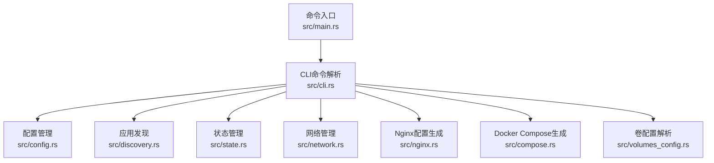
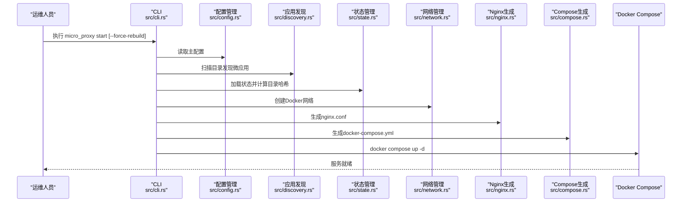
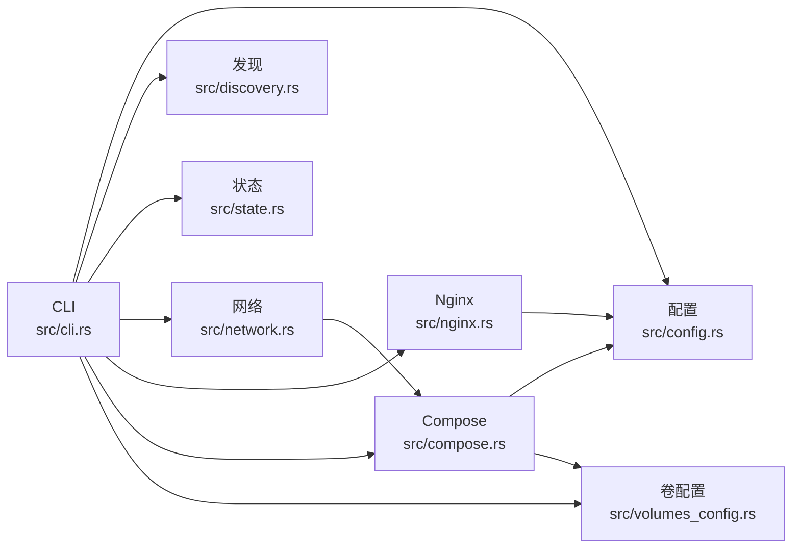

# 部署运维

<cite>
**本文引用的文件**
- [README.md](file://README.md)
- [Cargo.toml](file://Cargo.toml)
- [proxy-config.yml.example](file://proxy-config.yml.example)
- [deploy_to_local.sh](file://deploy_to_local.sh)
- [upload.sh](file://upload.sh)
- [src/main.rs](file://src/main.rs)
- [src/lib.rs](file://src/lib.rs)
- [src/cli.rs](file://src/cli.rs)
- [src/config.rs](file://src/config.rs)
- [src/discovery.rs](file://src/discovery.rs)
- [src/compose.rs](file://src/compose.rs)
- [src/network.rs](file://src/network.rs)
- [src/nginx.rs](file://src/nginx.rs)
- [src/state.rs](file://src/state.rs)
- [src/volumes_config.rs](file://src/volumes_config.rs)
</cite>

## 目录
1. [引言](#引言)
2. [项目结构](#项目结构)
3. [核心组件](#核心组件)
4. [架构总览](#架构总览)
5. [详细组件分析](#详细组件分析)
6. [依赖关系分析](#依赖关系分析)
7. [性能考虑](#性能考虑)
8. [故障排查指南](#故障排查指南)
9. [结论](#结论)
10. [附录](#附录)

## 引言
本指南面向运维工程师与平台团队，围绕 micro_proxy 的生产级部署与日常运维展开，涵盖环境配置策略、容器编排与集群管理、监控与日志、性能优化、备份与恢复、故障排查、自动化脚本、安全加固与访问控制、版本升级与回滚、容量规划与扩缩容等主题。文档严格依据仓库源码与示例配置文件进行分析与总结，确保可操作性与准确性。

## 项目结构
micro_proxy 采用 Rust 语言实现，围绕“配置驱动 + 自动化编排”的思想，提供 CLI 工具以完成微应用的发现、镜像构建、容器编排、Nginx 反向代理生成与网络地址清单输出。核心模块职责清晰，耦合度低，便于在不同环境中复用与扩展。

图表来源
- [src/main.rs:1-25](file://src/main.rs#L1-L25)
- [src/cli.rs:1-669](file://src/cli.rs#L1-L669)
- [src/config.rs:1-842](file://src/config.rs#L1-L842)
- [src/discovery.rs:1-721](file://src/discovery.rs#L1-L721)
- [src/state.rs:1-311](file://src/state.rs#L1-L311)
- [src/network.rs:1-397](file://src/network.rs#L1-L397)
- [src/nginx.rs:1-1101](file://src/nginx.rs#L1-L1101)
- [src/compose.rs:1-905](file://src/compose.rs#L1-L905)
- [src/volumes_config.rs:1-426](file://src/volumes_config.rs#L1-L426)

章节来源
- [README.md:421-441](file://README.md#L421-L441)
- [src/lib.rs:1-26](file://src/lib.rs#L1-L26)

## 核心组件
- CLI 与命令流：负责解析参数、初始化日志、加载配置、执行 start/stop/clean/status/network 等子命令。
- 配置管理：解析主配置与动态生成的应用配置，校验有效性。
- 应用发现：扫描目录，发现包含 micro-app.yml 与 Dockerfile 的微应用，生成唯一名称与容器名校验。
- 状态管理：基于目录哈希判断是否需要重新构建，记录镜像存在状态与最后构建时间。
- 网络管理：创建/删除 Docker 网络，生成网络地址清单，支持内部服务与外部访问。
- Nginx 配置：根据应用类型与路由生成反向代理配置，支持 HTTP/HTTPS、ACME 验证、Gzip、动态 DNS 解析。
- Compose 生成：生成 docker-compose.yml，包含网络外部化、服务依赖、健康检查、卷挂载与用户运行配置。
- 卷配置：解析 micro-app.volumes.yml，支持权限初始化脚本与 Docker Compose volumes 格式转换。

章节来源
- [src/cli.rs:78-116](file://src/cli.rs#L78-L116)
- [src/config.rs:125-367](file://src/config.rs#L125-L367)
- [src/discovery.rs:235-352](file://src/discovery.rs#L235-L352)
- [src/state.rs:40-186](file://src/state.rs#L40-L186)
- [src/network.rs:15-119](file://src/network.rs#L15-L119)
- [src/nginx.rs:26-92](file://src/nginx.rs#L26-L92)
- [src/compose.rs:31-119](file://src/compose.rs#L31-L119)
- [src/volumes_config.rs:55-205](file://src/volumes_config.rs#L55-L205)

## 架构总览
下图展示一次“启动”命令的端到端流程：从 CLI 解析到最终通过 docker-compose 启动容器，并生成 Nginx 与网络清单。

图表来源
- [src/cli.rs:296-463](file://src/cli.rs#L296-L463)
- [src/config.rs:178-218](file://src/config.rs#L178-L218)
- [src/discovery.rs:235-352](file://src/discovery.rs#L235-L352)
- [src/state.rs:62-177](file://src/state.rs#L62-L177)
- [src/network.rs:15-47](file://src/network.rs#L15-L47)
- [src/nginx.rs:26-92](file://src/nginx.rs#L26-L92)
- [src/compose.rs:31-119](file://src/compose.rs#L31-L119)

## 详细组件分析

### CLI 与命令流
- 支持 start/stop/clean/status/network 子命令；verbose 参数开启详细日志；--config 指定配置文件。
- 执行流程：加载配置 → 应用发现 → 验证配置 → 创建网络 → 状态管理 → 生成 Nginx 与 Compose → 启停容器。
- 容器编排命令兼容 docker compose 与 docker-compose 两种形态，自动降级。

章节来源
- [src/cli.rs:21-69](file://src/cli.rs#L21-L69)
- [src/cli.rs:78-116](file://src/cli.rs#L78-L116)
- [src/cli.rs:296-463](file://src/cli.rs#L296-L463)
- [src/cli.rs:118-170](file://src/cli.rs#L118-L170)

### 配置管理
- 主配置 proxy-config.yml：扫描目录、输出路径、网络名、端口、Web 根目录、证书目录、域名等。
- 动态应用配置 apps-config.yml：由工具自动生成，包含应用名称、容器名、端口、类型、路由、卷与运行用户等。
- 校验规则：扫描目录非空、应用名唯一、Static/API 路由非空、Internal 路径存在且包含 Dockerfile、忽略 Internal 的路由与额外 Nginx 配置。

章节来源
- [src/config.rs:125-367](file://src/config.rs#L125-L367)
- [proxy-config.yml.example:5-53](file://proxy-config.yml.example#L5-L53)

### 应用发现与命名
- 扫描 scan_dirs，仅包含 micro-app.yml 与 Dockerfile 的目录视为微应用。
- 唯一名称生成：基于 scan_dir 相对路径与应用目录名，避免重复。
- 容器名去重：确保所有应用 container_name 全局唯一。
- 内部服务 Internal：可指定 path，不参与 Nginx 代理。

章节来源
- [src/discovery.rs:235-352](file://src/discovery.rs#L235-L352)
- [src/discovery.rs:147-222](file://src/discovery.rs#L147-L222)

### 状态管理与增量构建
- 目录哈希：遍历目录（排除 .git），对文件名与内容进行 SHA-256 计算，作为变更判定依据。
- 状态文件：记录应用名、哈希、最后构建时间、镜像存在状态；needs_rebuild 用于决定是否强制重建。
- 强制重建：--force-rebuild 传入 no_cache，确保完全重建。

章节来源
- [src/state.rs:188-233](file://src/state.rs#L188-L233)
- [src/state.rs:40-186](file://src/state.rs#L40-L186)
- [src/cli.rs:296-400](file://src/cli.rs#L296-L400)

### 网络管理与地址清单
- 网络：创建/删除 Docker 网络；compose 生成时将网络标记为 external=true，避免重复创建。
- 地址清单：生成 network-addresses.txt，包含应用名、容器名、网络地址、容器端口与可访问 URL（Internal 类型为空）。
- 微应用间通信示例：在同一网络内通过容器名作为主机名访问。

章节来源
- [src/network.rs:15-119](file://src/network.rs#L15-L119)
- [src/network.rs:209-274](file://src/network.rs#L209-L274)
- [src/compose.rs:54-69](file://src/compose.rs#L54-L69)

### Nginx 配置生成
- 动态 DNS：使用 Docker 内部 DNS 解析器，支持服务动态上线/下线。
- HTTP/HTTPS：若配置域名且证书存在则启用 HTTPS，否则仅 HTTP；HTTP 块包含 ACME 验证 location。
- 路由与重写：静态应用支持子路径重写，API 应用保留完整 URI；location 按路径长度降序排序，保证匹配优先级。
- 性能优化：Gzip、缓存头、超时设置、SSL 优化参数。

章节来源
- [src/nginx.rs:26-92](file://src/nginx.rs#L26-L92)
- [src/nginx.rs:284-416](file://src/nginx.rs#L284-L416)
- [src/nginx.rs:418-536](file://src/nginx.rs#L418-L536)

### Docker Compose 生成
- 网络：外部网络，避免项目名前缀；nginx 仅依赖非 Internal 应用。
- 服务：nginx 与各应用服务；应用服务包含健康检查、env_file、volumes、user 等。
- 证书：若检测到证书与密钥，自动映射 HTTPS 端口。

章节来源
- [src/compose.rs:31-119](file://src/compose.rs#L31-L119)
- [src/compose.rs:160-266](file://src/compose.rs#L160-L266)
- [src/compose.rs:268-424](file://src/compose.rs#L268-L424)

### 卷配置与权限初始化
- micro-app.volumes.yml：定义 volumes 列表与 run_as_user；支持权限递归设置。
- 权限初始化脚本：可生成 chown 命令，容器启动时执行以修正宿主机权限。
- Compose 转换：将卷配置转换为 “源:目标” 格式。

章节来源
- [src/volumes_config.rs:55-205](file://src/volumes_config.rs#L55-L205)
- [src/volumes_config.rs:145-196](file://src/volumes_config.rs#L145-L196)

## 依赖关系分析
- 外部依赖：Docker、docker compose、Nginx（容器内）、acme.sh（证书申请）。
- 内部模块：CLI 依赖配置、发现、状态、网络、Nginx、Compose、卷配置模块。
- 关键耦合点：compose 依赖 config 与 volumes_config；nginx 依赖 config；network 与 compose 共享网络名。

图表来源
- [src/cli.rs:6-19](file://src/cli.rs#L6-L19)
- [src/compose.rs:6](file://src/compose.rs#L6)
- [src/nginx.rs:7](file://src/nginx.rs#L7)
- [src/network.rs:5](file://src/network.rs#L5)

章节来源
- [Cargo.toml:13-52](file://Cargo.toml#L13-L52)

## 性能考虑
- Nginx 层
  - 使用 Docker 内部 DNS 解析器，减少解析延迟与 IPv6 干扰。
  - 启用 Gzip、静态资源缓存头、合理超时设置。
  - HTTPS 仅在证书存在时启用，避免不必要的加密开销。
- 容器层
  - 健康检查：Static/API 应用添加健康检查，提升编排稳定性。
  - 端口映射：宿主机端口由 docker-compose 控制，容器内部固定为 80/443。
- 构建层
  - 增量构建：基于目录哈希判断是否需要重建，减少镜像构建时间。
  - 强制重建：--force-rebuild 传入 no_cache，确保一致性但增加耗时。

章节来源
- [src/nginx.rs:187-190](file://src/nginx.rs#L187-L190)
- [src/compose.rs:358-421](file://src/compose.rs#L358-L421)
- [src/state.rs:188-233](file://src/state.rs#L188-L233)

## 故障排查指南
- 日志定位
  - CLI 启动时输出详细日志；容器日志可通过 docker logs 查看。
  - 常用命令：micro_proxy start -v、docker logs <container>、docker logs proxy-nginx。
- 端口冲突
  - 检查宿主机端口占用，修改 proxy-config.yml 的 nginx_host_port。
- 网络与连通性
  - 生成网络地址清单，核对容器名、端口与可访问 URL。
  - 使用 docker network ls 与 docker inspect 核对网络与挂载。
- 证书与 HTTPS
  - 检查证书与密钥文件是否存在；验证 Nginx 配置语法；使用 curl -k 测试 HTTPS。
- 配置问题
  - 校验 micro-app.yml 与 Dockerfile 是否存在；确认 container_name 唯一；检查 routes 配置。

章节来源
- [README.md:330-420](file://README.md#L330-L420)
- [src/network.rs:209-274](file://src/network.rs#L209-L274)
- [src/nginx.rs:94-131](file://src/nginx.rs#L94-L131)

## 结论
micro_proxy 提供了从配置到编排的一体化能力，适合在多环境（开发/测试/生产）中复用。通过严格的配置校验、增量构建与外部化网络，可实现稳定高效的微服务统一入口与内部服务互联。结合本文的运维策略与最佳实践，可进一步提升系统的可靠性、可观测性与安全性。

## 附录

### 环境配置策略与注意事项
- 开发环境
  - 使用较低端口（如 8080）避免权限问题；关闭 HTTPS，简化本地联调。
  - 通过 .env 注入环境变量；必要时使用 volumes 映射本地代码热更新。
- 测试环境
  - 与生产相近的网络与端口策略；启用健康检查与日志采集。
  - 使用独立的证书目录与域名，模拟真实 HTTPS。
- 生产环境
  - 固定 nginx_host_port 与网络名；启用 HTTPS 与 ACME 验证目录。
  - 严格校验 routes 与 container_name 唯一性；限制 Internal 应用暴露。

章节来源
- [proxy-config.yml.example:30-53](file://proxy-config.yml.example#L30-L53)
- [src/config.rs:220-347](file://src/config.rs#L220-L347)

### 容器编排与集群管理策略
- 单机编排：使用 docker compose 管理多服务；网络 external=true，避免重复创建。
- 集群管理：可将 compose 产物迁移到 Swarm/Kubernetes 管理，注意网络与存储的适配。
- 服务依赖：nginx 仅依赖非 Internal 应用，确保上游服务可用后再启动代理。

章节来源
- [src/compose.rs:54-69](file://src/compose.rs#L54-L69)
- [src/compose.rs:236-257](file://src/compose.rs#L236-L257)

### 监控与日志收集
- Nginx 日志：access_log 与 error_log 已内置；可挂载到宿主机或集中采集。
- 应用日志：容器标准输出/错误输出；建议接入集中式日志系统（如 ELK/Fluentd）。
- 健康检查：Static/API 应用已内置健康检查，可用于编排层面的存活/就绪探测。

章节来源
- [src/nginx.rs:164-169](file://src/nginx.rs#L164-L169)
- [src/compose.rs:358-421](file://src/compose.rs#L358-L421)

### 性能优化与资源管理
- Nginx：Gzip、静态缓存、合理超时；避免 IPv6 解析。
- 镜像与构建：增量构建、--force-rebuild 仅在必要时使用。
- 网络：统一网络名，减少跨网络通信；内部服务避免暴露公网端口。

章节来源
- [src/nginx.rs:177-185](file://src/nginx.rs#L177-L185)
- [src/state.rs:188-233](file://src/state.rs#L188-L233)
- [src/network.rs:15-47](file://src/network.rs#L15-L47)

### 备份与恢复策略
- 配置备份：定期备份 proxy-config.yml、apps-config.yml、nginx.conf、docker-compose.yml。
- 数据持久化：通过 volumes 映射实现数据卷；对关键数据定期快照或导出。
- 恢复流程：恢复配置文件 → 重新生成 nginx.conf 与 docker-compose.yml → docker compose up -d → 校验服务状态。

章节来源
- [src/compose.rs:426-448](file://src/compose.rs#L426-L448)
- [src/nginx.rs:538-556](file://src/nginx.rs#L538-L556)

### 运维自动化脚本使用指南
- 本地部署脚本 deploy_to_local.sh
  - 功能：编译 release、复制到用户 bin 目录、设置执行权限、检查 PATH、验证版本。
  - 使用：在项目根目录执行，确保 cargo 可用。
- 远程同步脚本 upload.sh
  - 功能：使用 rsync 同步项目文件到远端，排除 .git/target/*.log/node_modules/Cargo.lock 等。
  - 使用：./upload.sh <地址> <用户名>，随后 ssh 登录远端执行部署。

章节来源
- [deploy_to_local.sh:1-119](file://deploy_to_local.sh#L1-L119)
- [upload.sh:1-51](file://upload.sh#L1-L51)

### 安全加固与访问控制
- 证书与 HTTPS：启用 HTTPS 与 ACME 验证；证书与密钥文件权限最小化。
- 权限与用户：run_as_user 指定非 root 用户；卷权限初始化脚本避免 root 权限滥用。
- 网络隔离：Internal 应用不暴露公网端口；通过 Docker 网络隔离服务。
- 访问控制：在 Nginx 层添加认证或 WAF；限制 ACME 验证目录权限。

章节来源
- [src/nginx.rs:309-326](file://src/nginx.rs#L309-L326)
- [src/volumes_config.rs:117-142](file://src/volumes_config.rs#L117-L142)
- [src/compose.rs:325-332](file://src/compose.rs#L325-L332)

### 版本升级与回滚
- 升级流程
  - 备份当前配置与状态文件 → 下载新版本 → 运行 micro_proxy start（可选择 --force-rebuild）→ 验证服务。
- 回滚流程
  - 停止服务 → 恢复备份的配置与状态 → 运行 micro_proxy start → 验证服务。
- 注意事项：升级前后对比 nginx.conf 与 docker-compose.yml 的差异，确保兼容性。

章节来源
- [src/cli.rs:476-548](file://src/cli.rs#L476-L548)
- [src/state.rs:62-113](file://src/state.rs#L62-L113)

### 容量规划与扩缩容
- 容量规划
  - 评估每应用的 CPU/内存/IO 需求；Nginx 作为统一入口，需预留并发与缓存空间。
  - 卷 I/O：对高写入场景评估宿主机磁盘与 IOPS。
- 扩缩容
  - 单机：通过 docker-compose scale（受单机资源限制）。
  - 集群：迁移至 Swarm/Kubernetes，利用副本数与水平扩展。
  - 网络与存储：确保跨节点网络连通与共享存储策略。

章节来源
- [src/compose.rs:236-257](file://src/compose.rs#L236-L257)
- [src/network.rs:209-274](file://src/network.rs#L209-L274)