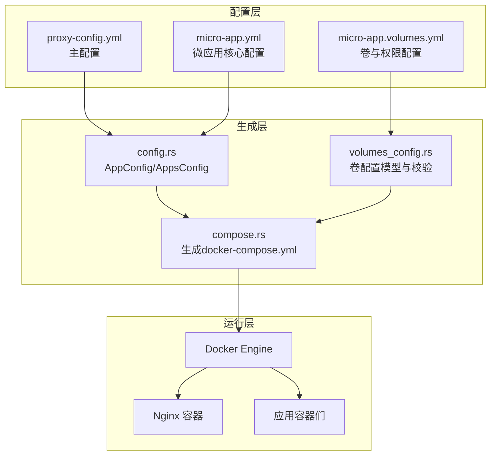
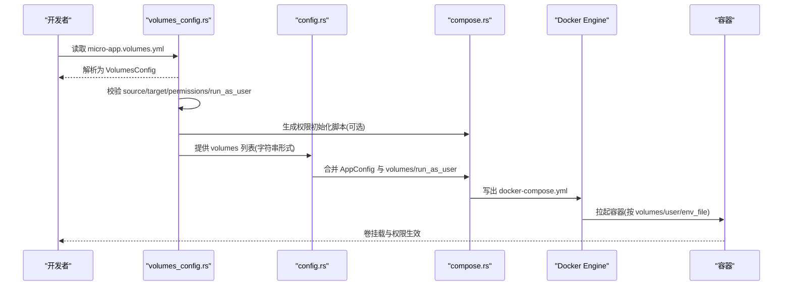
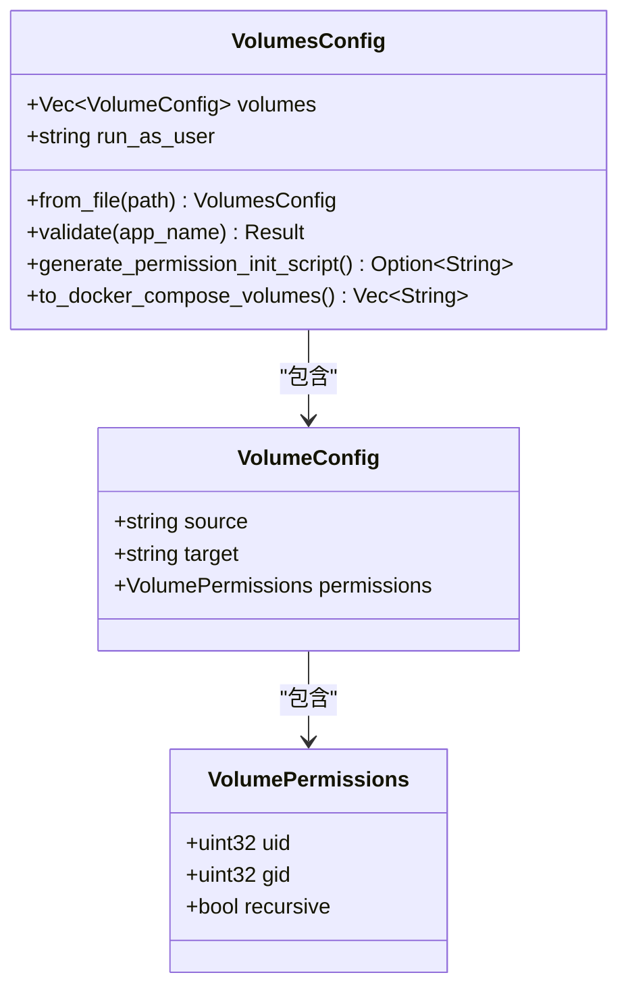
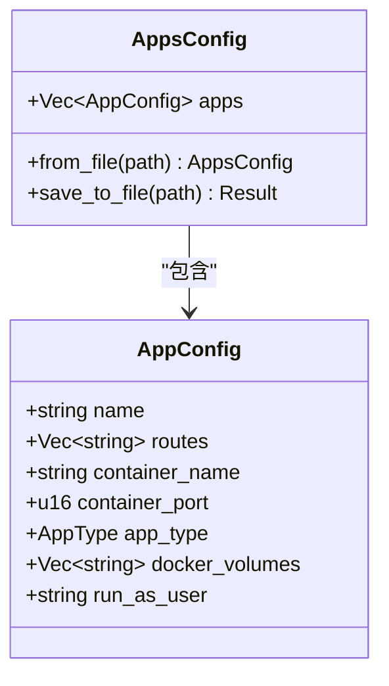
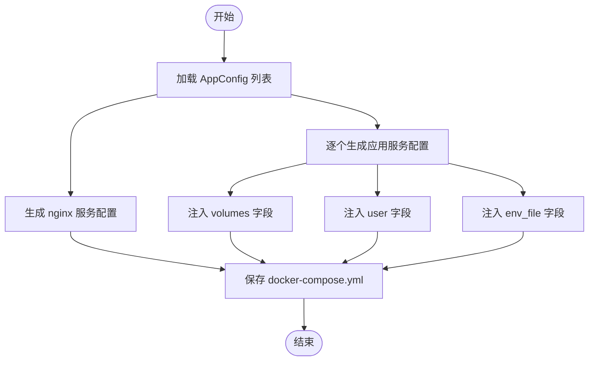
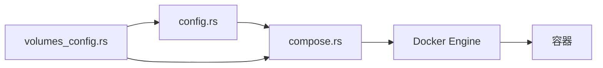

# Volumns映射配置

<cite>
**本文引用的文件**
- [volumes_config.rs](file://src/volumes_config.rs)
- [compose.rs](file://src/compose.rs)
- [config.rs](file://src/config.rs)
- [micro_app_config.rs](file://src/micro_app_config.rs)
- [container.rs](file://src/container.rs)
- [proxy-config.yml.example](file://proxy-config.yml.example)
- [README.md](file://README.md)
- [micro-app-development.md](file://docs/micro-app-development.md)
- [micro-app-volumes-refactor-plan.md](file://docs/micro-app-volumes-refactor-plan.md)
</cite>

## 目录
1. [简介](#简介)
2. [项目结构](#项目结构)
3. [核心组件](#核心组件)
4. [架构总览](#架构总览)
5. [详细组件分析](#详细组件分析)
6. [依赖关系分析](#依赖关系分析)
7. [性能考虑](#性能考虑)
8. [故障排查指南](#故障排查指南)
9. [结论](#结论)
10. [附录](#附录)

## 简介
本文件系统性阐述 Volumns（卷）映射配置在本项目中的工作机制与使用方法，重点包括：
- 数据持久化配置的工作原理与配置语法
- 各种 Volumns 映射格式（本地路径映射、命名卷、临时卷）的使用方法
- 权限设置、用户映射与安全配置的最佳实践
- 常见 Volumns 配置场景与故障排查
- Volumns 配置与 Docker 容器的关系与影响
- 性能优化与存储管理建议

## 项目结构
本项目围绕“微应用”与“Docker Compose”生成两条主线展开，其中 Volumns 映射配置通过独立的 micro-app.volumes.yml 文件进行管理，并在生成 docker-compose.yml 时被转换为 Compose 的 volumes 字段，最终由 Docker 容器挂载。

图表来源
- [config.rs:24-68](file://src/config.rs#L24-L68)
- [volumes_config.rs:44-53](file://src/volumes_config.rs#L44-L53)
- [compose.rs:31-119](file://src/compose.rs#L31-L119)

章节来源
- [README.md:164-235](file://README.md#L164-L235)
- [proxy-config.yml.example:1-53](file://proxy-config.yml.example#L1-L53)

## 核心组件
- 卷配置模型与校验：负责解析 micro-app.volumes.yml，校验 source/target/permissions/run_as_user，生成权限初始化脚本，以及转换为 Compose 的 volumes 字符串列表。
- 应用配置模型：负责解析 micro-app.yml，合并来自 volumes 的 docker_volumes 与 run_as_user，供 Compose 生成阶段使用。
- Compose 生成器：将应用配置转换为 docker-compose.yml，注入 volumes、user、env_file 等字段。
- 容器管理：提供容器生命周期操作，便于验证卷挂载与权限生效后的运行状态。

章节来源
- [volumes_config.rs:29-53](file://src/volumes_config.rs#L29-L53)
- [config.rs:24-68](file://src/config.rs#L24-L68)
- [compose.rs:277-424](file://src/compose.rs#L277-L424)
- [container.rs:19-176](file://src/container.rs#L19-L176)

## 架构总览
下面的时序图展示了从 micro-app.volumes.yml 到 docker-compose.yml，再到容器运行的完整流程。

图表来源
- [volumes_config.rs:57-82](file://src/volumes_config.rs#L57-L82)
- [volumes_config.rs:85-143](file://src/volumes_config.rs#L85-L143)
- [volumes_config.rs:146-196](file://src/volumes_config.rs#L146-L196)
- [volumes_config.rs:199-204](file://src/volumes_config.rs#L199-L204)
- [config.rs:24-68](file://src/config.rs#L24-L68)
- [compose.rs:277-424](file://src/compose.rs#L277-L424)

## 详细组件分析

### 卷配置模型与校验（volumes_config.rs）
- 数据结构
  - VolumePermissions：包含 uid、gid、recursive 三个字段，用于控制宿主机目录的权限设置。
  - VolumeConfig：包含 source、target、permissions 三个字段，分别对应宿主机路径、容器内路径与权限配置。
  - VolumesConfig：包含 volumes 列表与 run_as_user 字段，用于整体卷配置与容器运行用户设置。
- 关键能力
  - 从文件加载：若 micro-app.volumes.yml 不存在，返回空配置；存在则解析 YAML 并校验。
  - 校验规则：source/target 不能为空；permissions 中 uid/gid 为 0 时发出安全告警；run_as_user 不能为空字符串。
  - 权限初始化脚本：当存在权限配置时，生成 chown 命令集合，支持递归与非递归两种模式。
  - Compose 转换：将 volumes 转换为 Compose 的字符串列表，形如 "./src:/dst" 或 "./src:/dst:ro"。

图表来源
- [volumes_config.rs:11-22](file://src/volumes_config.rs#L11-L22)
- [volumes_config.rs:30-41](file://src/volumes_config.rs#L30-L41)
- [volumes_config.rs:44-53](file://src/volumes_config.rs#L44-L53)

章节来源
- [volumes_config.rs:57-82](file://src/volumes_config.rs#L57-L82)
- [volumes_config.rs:85-143](file://src/volumes_config.rs#L85-L143)
- [volumes_config.rs:146-196](file://src/volumes_config.rs#L146-L196)
- [volumes_config.rs:199-204](file://src/volumes_config.rs#L199-L204)

### 应用配置模型（config.rs）
- AppConfig：承载应用的核心元数据，其中 docker_volumes 与 run_as_user 字段由 micro-app.volumes.yml 合并而来。
- AppsConfig：动态生成的 apps-config.yml 的结构，用于保存/加载应用配置。
- 配置验证：对 docker_volumes 与 run_as_user 进行调试级记录，便于定位问题。

图表来源
- [config.rs:24-68](file://src/config.rs#L24-L68)
- [config.rs:72-123](file://src/config.rs#L72-L123)

章节来源
- [config.rs:24-68](file://src/config.rs#L24-L68)
- [config.rs:326-341](file://src/config.rs#L326-L341)

### Compose 生成器（compose.rs）
- 生成 nginx 服务：挂载 nginx.conf、web_root、cert_dir；依赖非 Internal 类型应用。
- 生成应用服务：注入 volumes、user、env_file、healthcheck 等字段。
- 保存 docker-compose.yml：将生成的 YAML 写入磁盘。

图表来源
- [compose.rs:31-119](file://src/compose.rs#L31-L119)
- [compose.rs:172-266](file://src/compose.rs#L172-L266)
- [compose.rs:277-424](file://src/compose.rs#L277-L424)

章节来源
- [compose.rs:31-119](file://src/compose.rs#L31-L119)
- [compose.rs:277-424](file://src/compose.rs#L277-L424)

### 容器管理（container.rs）
- 提供容器生命周期操作：创建、启动、停止、删除、状态查询。
- 与卷配置的关系：通过 docker-compose.yml 中的 volumes 字段，容器启动后即可看到挂载点；若权限不匹配，可通过权限初始化脚本或 run_as_user 解决。

章节来源
- [container.rs:19-176](file://src/container.rs#L19-L176)

## 依赖关系分析
- volumes_config.rs 与 config.rs：前者提供 volumes 列表与 run_as_user，后者将其合并到 AppConfig 中，供 compose.rs 使用。
- compose.rs 依赖 config.rs 的 AppConfig 与 volumes_config.rs 的 VolumesConfig。
- container.rs 依赖 Docker 引擎，用于验证卷挂载与权限生效。

图表来源
- [volumes_config.rs:57-82](file://src/volumes_config.rs#L57-L82)
- [config.rs:24-68](file://src/config.rs#L24-L68)
- [compose.rs:277-424](file://src/compose.rs#L277-L424)

章节来源
- [volumes_config.rs:57-82](file://src/volumes_config.rs#L57-L82)
- [config.rs:24-68](file://src/config.rs#L24-L68)
- [compose.rs:277-424](file://src/compose.rs#L277-L424)

## 性能考虑
- 递归权限设置的成本：recursive=true 会对大量子目录进行 chown，建议仅在必要时开启，或在生产环境预先设置好权限。
- 卷挂载类型选择：本地路径映射（bind mount）适合开发与小规模部署；命名卷（named volumes）更利于跨主机迁移与备份。
- I/O 路径：尽量将热数据放在 SSD 上，冷数据放在 HDD 上；避免在同一个卷上放置大量小文件。
- 容器内用户与宿主机权限一致性：通过 run_as_user 与 permissions 配置，减少容器内进程因权限不足导致的重试与失败。

## 故障排查指南
- 卷挂载失败
  - 检查宿主机路径是否存在与可访问
  - 检查容器内挂载点是否正确
  - 使用 docker inspect 查看 Mounts 详情
- 权限不足
  - 若容器内进程无法写入挂载目录，检查 permissions 配置与 run_as_user
  - 可通过权限初始化脚本或手动 chown 解决
- Compose 生成异常
  - 确认 micro-app.volumes.yml 格式正确
  - 确认 AppConfig 中 docker_volumes 与 run_as_user 已正确合并
- 容器状态异常
  - 使用 container.rs 提供的状态查询与启动/停止命令辅助诊断

章节来源
- [README.md:374-420](file://README.md#L374-L420)
- [container.rs:185-242](file://src/container.rs#L185-L242)

## 结论
本项目通过将卷与权限配置从 micro-app.yml 中剥离至 micro-app.volumes.yml，实现了职责分离与更好的可维护性。结合 Compose 生成器与容器管理模块，能够稳定地将宿主机目录挂载到容器中，并通过用户映射与权限初始化保障数据持久化与运行安全。遵循本文的最佳实践与故障排查建议，可显著降低卷配置带来的运维复杂度与风险。

## 附录

### 配置语法与字段说明
- micro-app.volumes.yml
  - volumes：卷列表，每项包含 source、target、permissions
  - permissions：uid、gid、recursive
  - run_as_user：容器运行用户，格式为 "uid:gid" 或 "username"
- docker-compose.yml（由 micro-proxy 生成）
  - services.<name>.volumes：挂载列表，支持只读挂载
  - services.<name>.user：容器运行用户
  - services.<name>.env_file：环境变量文件路径

章节来源
- [micro-app-development.md:90-142](file://docs/micro-app-development.md#L90-L142)
- [compose.rs:334-355](file://src/compose.rs#L334-L355)
- [compose.rs:325-332](file://src/compose.rs#L325-L332)

### 常见配置场景
- 数据持久化（Redis/MongoDB）
  - 将容器内数据目录挂载到宿主机，设置 run_as_user 与 permissions
- 配置文件共享（应用配置）
  - 将宿主机配置目录挂载到容器内，避免每次构建时复制
- 日志输出（容器日志）
  - 将容器内日志目录挂载到宿主机，便于收集与分析

章节来源
- [micro-app-development.md:143-174](file://docs/micro-app-development.md#L143-L174)

### 最佳实践
- 权限设置
  - 优先使用 run_as_user 指定容器内用户，再配合 permissions 设置宿主机目录权限
  - 避免使用 root（uid/gid=0）进行生产环境挂载
- 用户映射
  - run_as_user 与 permissions 的 uid/gid 应保持一致，确保容器内进程可读写
- 安全配置
  - 生产环境禁用递归权限设置，改为一次性设置关键目录权限
  - 限制卷挂载路径范围，避免挂载系统关键目录
- 性能优化
  - 使用命名卷进行生产环境的数据持久化
  - 将热数据与冷数据分离，合理规划存储介质

章节来源
- [volumes_config.rs:118-126](file://src/volumes_config.rs#L118-L126)
- [micro-app-volumes-refactor-plan.md:1-17](file://docs/micro-app-volumes-refactor-plan.md#L1-L17)