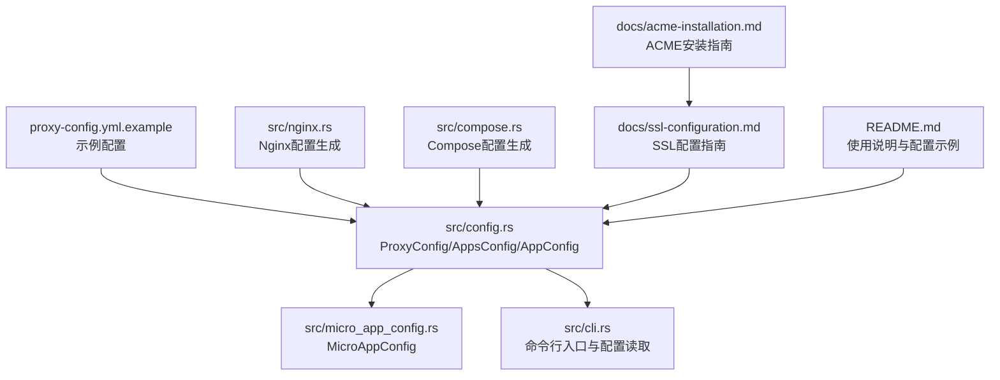
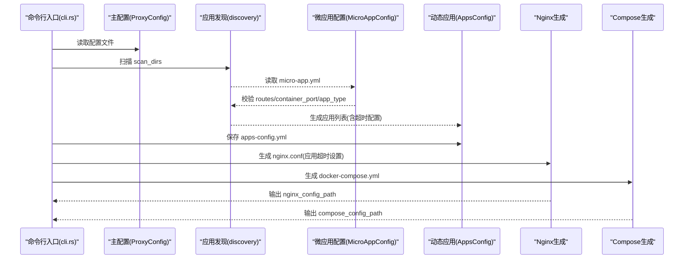
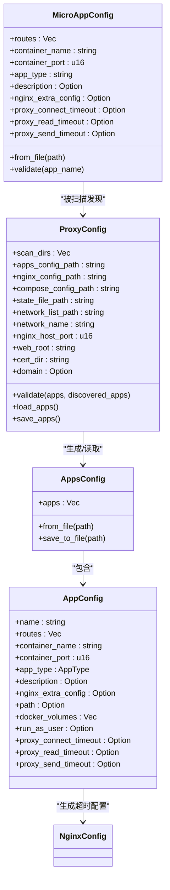

# 主配置文件

<cite>
**本文引用的文件**
- [proxy-config.yml.example](file://proxy-config.yml.example)
- [README.md](file://README.md)
- [docs/ssl-configuration.md](file://docs/ssl-configuration.md)
- [docs/acme-installation.md](file://docs/acme-installation.md)
- [src/config.rs](file://src/config.rs)
- [src/micro_app_config.rs](file://src/micro_app_config.rs)
- [src/error.rs](file://src/error.rs)
- [src/cli.rs](file://src/cli.rs)
- [src/nginx.rs](file://src/nginx.rs)
- [src/compose.rs](file://src/compose.rs)
</cite>

## 更新摘要
**所做更改**
- 新增代理超时配置字段的详细说明
- 更新 AppConfig 结构体中的超时配置字段文档
- 增强 Nginx 配置生成中超时设置的说明
- 补充超时配置的最佳实践和使用场景

## 目录
1. [简介](#简介)
2. [项目结构](#项目结构)
3. [核心组件](#核心组件)
4. [架构总览](#架构总览)
5. [详细组件分析](#详细组件分析)
6. [依赖关系分析](#依赖关系分析)
7. [性能考量](#性能考量)
8. [故障排查指南](#故障排查指南)
9. [结论](#结论)
10. [附录](#附录)

## 简介
本指南聚焦于主配置文件 proxy-config.yml 的完整配置说明，涵盖所有配置项的含义、数据类型、默认值、使用场景与最佳实践。文档还解释扫描目录、文件路径、网络端口、Web根目录与证书目录等关键配置项之间的依赖关系与约束条件，并提供配置验证规则、常见错误排查方法以及不同部署环境下的配置模板与性能优化建议。

**更新** 新增代理超时配置功能，提供统一的超时配置管理能力，支持连接超时、读取超时和发送超时的精细化控制。

## 项目结构
主配置文件位于仓库根目录，示例文件为 proxy-config.yml.example；核心配置解析逻辑在 src/config.rs 中定义；微应用配置解析在 src/micro_app_config.rs 中；SSL 证书相关说明在 docs/ssl-configuration.md 与 docs/acme-installation.md 中；命令行入口与配置读取在 src/cli.rs 中。



**图表来源**
- [proxy-config.yml.example:1-53](file://proxy-config.yml.example#L1-L53)
- [src/config.rs:125-176](file://src/config.rs#L125-L176)
- [src/micro_app_config.rs:10-40](file://src/micro_app_config.rs#L10-L40)
- [src/cli.rs:21-39](file://src/cli.rs#L21-L39)
- [src/nginx.rs:26-92](file://src/nginx.rs#L26-L92)
- [src/compose.rs:31-119](file://src/compose.rs#L31-L119)
- [docs/ssl-configuration.md:45-179](file://docs/ssl-configuration.md#L45-L179)
- [docs/acme-installation.md:1-332](file://docs/acme-installation.md#L1-L332)
- [README.md:164-236](file://README.md#L164-L236)

**章节来源**
- [proxy-config.yml.example:1-53](file://proxy-config.yml.example#L1-L53)
- [README.md:164-236](file://README.md#L164-L236)

## 核心组件
- 主配置 ProxyConfig：定义扫描目录、输出路径、网络、端口、Web根目录、证书目录与域名等。
- 应用配置 AppsConfig/AppConfig：动态生成的微应用集合，包含应用类型、路由、容器端口、Docker卷映射、代理超时配置等。
- 微应用配置 MicroAppConfig：每个微应用目录下的 micro-app.yml，定义 routes、container_name、container_port、app_type 等。
- 错误类型 Error：集中定义配置、IO、YAML、Docker、脚本、网络、发现、构建、容器、状态、Dockerfile、Nginx、Compose 等错误类型。

**更新** AppConfig 结构体现已包含代理超时配置字段，提供统一的超时管理能力。

**章节来源**
- [src/config.rs:24-80](file://src/config.rs#L24-L80)
- [src/config.rs:70-123](file://src/config.rs#L70-L123)
- [src/micro_app_config.rs:10-40](file://src/micro_app_config.rs#L10-L40)
- [src/error.rs:5-46](file://src/error.rs#L5-L46)

## 架构总览
主配置文件驱动应用发现与生成流程：CLI 读取 proxy-config.yml，扫描 scan_dirs 下的微应用，校验 micro-app.yml，生成 apps-config.yml，再生成 nginx.conf 与 docker-compose.yml，并按需挂载 web_root 与 cert_dir。



**图表来源**
- [src/cli.rs:78-116](file://src/cli.rs#L78-L116)
- [src/config.rs:178-220](file://src/config.rs#L178-L220)
- [src/micro_app_config.rs:35-106](file://src/micro_app_config.rs#L35-L106)
- [src/nginx.rs:425-540](file://src/nginx.rs#L425-L540)
- [src/compose.rs:31-119](file://src/compose.rs#L31-L119)

## 详细组件分析

### 主配置项详解（proxy-config.yml）
- scan_dirs
  - 类型：数组（字符串）
  - 作用：指定扫描微应用的目录列表，仅扫描一级目录，需同时包含 micro-app.yml 与 Dockerfile 才会被识别为微应用
  - 默认值：无（必须显式配置）
  - 约束：不能为空；应用名称需全局唯一
  - 使用场景：多微应用分目录管理，按目录自动发现
  - 参考：[README.md 扫描目录说明:291-299](file://README.md#L291-L299)

- apps_config_path
  - 类型：字符串（路径）
  - 作用：动态生成的 apps 配置文件输出路径，由 micro_proxy 自动生成，禁止手动修改
  - 默认值：无（必须显式配置）
  - 使用场景：保存扫描与校验后的应用清单
  - 参考：[proxy-config.yml.example 第13行:12-13](file://proxy-config.yml.example#L12-L13)

- nginx_config_path
  - 类型：字符串（路径）
  - 作用：Nginx 配置文件输出路径
  - 默认值：无（必须显式配置）
  - 使用场景：生成统一入口的反向代理配置
  - 参考：[proxy-config.yml.example 第16行:15-16](file://proxy-config.yml.example#L15-L16)

- compose_config_path
  - 类型：字符串（路径）
  - 作用：Docker Compose 配置文件输出路径
  - 默认值：无（必须显式配置）
  - 使用场景：生成容器编排文件
  - 参考：[proxy-config.yml.example 第19行:18-19](file://proxy-config.yml.example#L18-L19)

- state_file_path
  - 类型：字符串（路径）
  - 作用：状态文件路径，用于基于目录哈希判断是否需要重新构建
  - 默认值：无（必须显式配置）
  - 使用场景：增量构建与缓存控制
  - 参考：[proxy-config.yml.example 第22行:21-22](file://proxy-config.yml.example#L21-L22)

- network_list_path
  - 类型：字符串（路径）
  - 作用：网络地址列表输出路径，便于排查连通性
  - 默认值：无（必须显式配置）
  - 使用场景：网络连通性诊断
  - 参考：[proxy-config.yml.example 第25行:24-25](file://proxy-config.yml.example#L24-L25)

- network_name
  - 类型：字符串
  - 作用：Docker 网络名称
  - 默认值：无（必须显式配置）
  - 使用场景：统一管理微应用间通信
  - 参考：[proxy-config.yml.example 第28行:27-28](file://proxy-config.yml.example#L27-L28)

- nginx_host_port
  - 类型：整数（u16）
  - 作用：Nginx 监听的主机端口（统一入口）
  - 默认值：无（必须显式配置）
  - 约束：HTTP 固定为 80；HTTPS 固定为 443；若被占用需修改
  - 使用场景：用户访问入口
  - 参考：[README.md 端口配置说明:277-289](file://README.md#L277-L289)

- web_root
  - 类型：字符串（路径）
  - 作用：用于存放 ACME 验证文件的目录，支持 Let's Encrypt 证书申请
  - 默认值：/var/www/html（可通过 default_web_root 提供）
  - 约束：建议使用绝对路径；需可写
  - 使用场景：HTTP-01 挑战验证与证书申请
  - 参考：[proxy-config.yml.example 第36-38行:33-38](file://proxy-config.yml.example#L33-L38)、[docs/ssl-configuration.md 第49-L85:49-85](file://docs/ssl-configuration.md#L49-L85)

- cert_dir
  - 类型：字符串（路径）
  - 作用：主机上存放 SSL 证书与私钥的目录，会挂载到 Nginx 容器
  - 默认值：/etc/nginx/certs（可通过 default_cert_dir 提供）
  - 约束：建议使用绝对路径；需可写
  - 使用场景：证书持久化与自动续期
  - 参考：[proxy-config.yml.example 第43-45行:40-45](file://proxy-config.yml.example#L40-L45)、[docs/ssl-configuration.md 第99-L146:99-146](file://docs/ssl-configuration.md#L99-L146)

- domain
  - 类型：字符串（可选）
  - 作用：域名，用于推导证书文件路径与 Nginx server_name；配置后且证书存在时启用 HTTPS
  - 默认值：无（可选）
  - 约束：与 web_root、cert_dir 配合使用；证书命名需满足 {domain}.cer/{domain}.crt 与 {domain}.key
  - 使用场景：启用 HTTPS 与 HTTP 自动跳转
  - 参考：[proxy-config.yml.example 第49-L52行:47-52](file://proxy-config.yml.example#L47-L52)、[docs/ssl-configuration.md 第147-L178:147-L178)

**章节来源**
- [proxy-config.yml.example:5-53](file://proxy-config.yml.example#L5-L53)
- [src/config.rs:125-176](file://src/config.rs#L125-L176)
- [README.md:277-289](file://README.md#L277-L289)
- [docs/ssl-configuration.md:49-178](file://docs/ssl-configuration.md#L49-L178)

### 应用配置项（apps-config.yml 与 micro-app.yml）
- apps-config.yml（动态生成）
  - 作用：保存扫描与校验后的应用清单，由 micro_proxy 自动生成
  - 结构：包含 apps 数组，元素为 AppConfig
  - 参考：[src/config.rs AppsConfig:70-123](file://src/config.rs#L70-L123)

- micro-app.yml（微应用配置）
  - routes：静态/接口类型必需，内部服务类型忽略
  - container_name：容器名称（全局唯一）
  - container_port：容器内部端口（>0）
  - app_type：static、api、internal
  - description、nginx_extra_config、docker_volumes、run_as_user 等
  - **代理超时配置**：proxy_connect_timeout、proxy_read_timeout、proxy_send_timeout（可选）
  - 参考：[src/micro_app_config.rs:10-40](file://src/micro_app_config.rs#L10-L40)

**更新** 微应用配置现已支持代理超时配置字段，可在 micro-app.yml 中为每个应用单独配置超时参数。

**章节来源**
- [src/config.rs:70-123](file://src/config.rs#L70-L123)
- [src/micro_app_config.rs:10-40](file://src/micro_app_config.rs#L10-L40)

### 代理超时配置详解
**新增功能** AppConfig 结构体现已包含代理超时配置字段，提供统一的超时管理能力：

- proxy_connect_timeout
  - 类型：可选无符号64位整数（秒）
  - 作用：Nginx 连接上游服务器的超时时间
  - 默认值：60 秒
  - 使用场景：控制与后端应用建立连接的时间限制
  - 参考：[src/nginx.rs 位置:496](file://src/nginx.rs#L496)

- proxy_read_timeout
  - 类型：可选无符号64位整数（秒）
  - 作用：Nginx 从上游服务器读取响应的超时时间
  - 默认值：60 秒
  - 使用场景：控制从后端应用读取数据的超时限制
  - 参考：[src/nginx.rs 位置:498](file://src/nginx.rs#L498)

- proxy_send_timeout
  - 类型：可选无符号64位整数（秒）
  - 作用：Nginx 向上游服务器发送请求的超时时间
  - 默认值：60 秒
  - 使用场景：控制向后端应用发送数据的超时限制
  - 参考：[src/nginx.rs 位置:497](file://src/nginx.rs#L497)

**超时配置应用机制**：
- 在 Nginx 配置生成过程中，API 类型的应用会根据配置的超时值生成相应的 proxy_connect_timeout、proxy_send_timeout 和 proxy_read_timeout 指令
- 如果未配置超时值，默认使用 60 秒
- 超时配置仅对 API 类型的应用生效，静态资源应用不适用

**章节来源**
- [src/config.rs:69-80](file://src/config.rs#L69-L80)
- [src/micro_app_config.rs:35-39](file://src/micro_app_config.rs#L35-L39)
- [src/nginx.rs:496-518](file://src/nginx.rs#L496-L518)

### 配置验证规则与约束
- 主配置验证
  - scan_dirs 不能为空
  - 应用名称必须全局唯一
  - Static/Api 类型：routes 必须非空；应用需在扫描结果中找到
  - Internal 类型：必须提供 path；path 必须存在且包含 Dockerfile；routes 与 nginx_extra_config 将被忽略
  - **代理超时配置验证**：超时值必须为正整数，单位为秒
  - 参考：[src/config.rs validate:220-359](file://src/config.rs#L220-L359)

- 微应用配置验证
  - container_name 非空
  - container_port > 0
  - app_type 必须为 static、api 或 internal
  - static/api 类型 routes 必须非空；internal 类型 routes 将被忽略
  - **代理超时配置验证**：超时值必须为正整数，单位为秒
  - 参考：[src/micro_app_config.rs validate:63-113](file://src/micro_app_config.rs#L63-L113)

**更新** 新增代理超时配置的验证规则，确保超时值的有效性和合理性。

**章节来源**
- [src/config.rs:220-359](file://src/config.rs#L220-L359)
- [src/micro_app_config.rs:63-113](file://src/micro_app_config.rs#L63-L113)

### 配置项依赖关系与约束
- 扫描与生成
  - scan_dirs 决定发现范围；发现的微应用将生成 apps-config.yml
- 端口与代理
  - nginx_host_port 决定用户访问端口；HTTP 固定 80，HTTPS 固定 443
- SSL 与证书
  - domain + web_root + cert_dir 共同决定 HTTPS 启用与证书路径
  - 证书文件命名需满足 {domain}.cer/{domain}.crt 与 {domain}.key
- 输出路径
  - nginx_config_path、compose_config_path、state_file_path、network_list_path 必须可写且存在父目录
- **代理超时配置**
  - 仅对 API 类型应用生效
  - 默认值为 60 秒
  - 需要在 micro-app.yml 中配置，主配置文件不直接支持超时配置

**更新** 新增代理超时配置的依赖关系说明。

**章节来源**
- [README.md:277-289](file://README.md#L277-L289)
- [docs/ssl-configuration.md:116-178](file://docs/ssl-configuration.md#L116-L178)
- [src/config.rs:220-359](file://src/config.rs#L220-L359)

### 配置示例与最佳实践
- 最小配置（仅 HTTP）
  - 参考：[docs/ssl-configuration.md 最小配置:432-449](file://docs/ssl-configuration.md#L432-L449)
- 标准 HTTPS 配置
  - 参考：[docs/ssl-configuration.md 标准 HTTPS 配置:451-472](file://docs/ssl-configuration.md#L451-L472)
- 完整生产环境配置
  - 参考：[docs/ssl-configuration.md 完整生产环境配置:474-520](file://docs/ssl-configuration.md#L474-L520)
- **代理超时配置示例**
  - 在 micro-app.yml 中配置超时参数：
    ```yaml
    routes: ["/api"]
    container_name: "api-app"
    container_port: 3000
    app_type: "api"
    proxy_connect_timeout: 30
    proxy_read_timeout: 120
    proxy_send_timeout: 60
    ```
  - 参考：[src/micro_app_config.rs:35-39](file://src/micro_app_config.rs#L35-L39)
- 配置模板
  - 参考：[proxy-config.yml.example:1-53](file://proxy-config.yml.example#L1-L53)

**更新** 新增代理超时配置的实际使用示例。

**章节来源**
- [docs/ssl-configuration.md:432-520](file://docs/ssl-configuration.md#L432-L520)
- [proxy-config.yml.example:1-53](file://proxy-config.yml.example#L1-L53)

### 不同部署环境下的配置模板
- 开发环境
  - 使用本地目录作为 web_root 与 cert_dir，nginx_host_port 设为 8080
  - 可使用较短的超时值（如 30 秒）进行快速测试
  - 参考：[README.md 快速开始:70-112](file://README.md#L70-L112)
- 生产环境
  - 使用绝对路径与只读挂载；HTTPS 固定 443；启用 domain 与证书
  - 建议为 API 应用配置合理的超时值（连接超时 30-60 秒，读取超时 120-300 秒）
  - 参考：[docs/ssl-configuration.md 完整生产环境配置:474-520](file://docs/ssl-configuration.md#L474-L520)
- 多域名
  - 通过 nginx_extra_config 配置多个 server_name；证书以第一个域名命名
  - 参考：[docs/ssl-configuration.md 多域名支持:171-178](file://docs/ssl-configuration.md#L171-L178)

**更新** 新增生产环境中代理超时配置的建议。

**章节来源**
- [README.md:70-112](file://README.md#L70-L112)
- [docs/ssl-configuration.md:474-520](file://docs/ssl-configuration.md#L474-L520)

## 依赖关系分析
- 配置文件到代码的映射
  - proxy-config.yml → ProxyConfig（src/config.rs）
  - micro-app.yml → MicroAppConfig（src/micro_app_config.rs）
  - CLI 读取配置并驱动后续流程（src/cli.rs）
  - **Nginx 配置生成** → 应用超时配置（src/nginx.rs）



**更新** 新增 AppConfig 与 NginxConfig 之间的依赖关系。

**图表来源**
- [src/config.rs:125-176](file://src/config.rs#L125-L176)
- [src/config.rs:24-80](file://src/config.rs#L24-L80)
- [src/micro_app_config.rs:10-40](file://src/micro_app_config.rs#L10-L40)
- [src/nginx.rs:425-540](file://src/nginx.rs#L425-L540)

**章节来源**
- [src/config.rs:125-176](file://src/config.rs#L125-L176)
- [src/config.rs:24-80](file://src/config.rs#L24-L80)
- [src/micro_app_config.rs:10-40](file://src/micro_app_config.rs#L10-L40)

## 性能考量
- 扫描范围控制：合理设置 scan_dirs，避免扫描过多层级与无关目录
- 端口复用：尽量使用标准端口（80/443），减少端口冲突与转发开销
- 证书缓存：cert_dir 与 web_root 使用绝对路径，避免路径解析开销
- 卷挂载：使用只读挂载保护私钥，减少不必要的写操作
- 日志级别：在生产环境适当降低日志级别，减少磁盘 IO
- **代理超时优化**：
  - 根据应用响应时间合理设置超时值，避免过短导致频繁超时或过长影响用户体验
  - API 类型应用建议配置较长的读取超时，以适应大数据传输场景
  - 连接超时应小于读取超时，确保连接建立失败时能及时释放资源

**更新** 新增代理超时配置的性能优化建议。

## 故障排查指南
- 配置错误
  - scan_dirs 为空：检查配置文件路径与权限
  - 应用名称重复：确保所有应用名称唯一
  - routes 为空：为 Static/Api 类型补充路由
  - Internal 缺少 path：提供有效路径并包含 Dockerfile
  - **代理超时配置错误**：检查超时值是否为正整数，单位是否为秒
  - 参考：[src/config.rs validate:220-359](file://src/config.rs#L220-L359)

- SSL 证书相关
  - 证书文件不存在：确认 domain、web_root、cert_dir 配置正确，使用 acme.sh 申请并部署
  - 权限问题：确保 web_root 与 cert_dir 对运行用户可写
  - 网络问题：80 端口开放，域名解析正确
  - 参考：[docs/ssl-configuration.md 故障排查:524-627](file://docs/ssl-configuration.md#L524-L627)、[docs/acme-installation.md 故障排除:265-325](file://docs/acme-installation.md#L265-L325)

- 端口冲突
  - 检查宿主机端口占用，修改 nginx_host_port
  - 参考：[README.md 端口冲突问题:363-372](file://README.md#L363-L372)

- Docker 与卷挂载
  - 检查卷挂载路径一致性与 SELinux/AppArmor 限制
  - 参考：[docs/ssl-configuration.md Docker 问题:392-426](file://docs/ssl-configuration.md#L392-L426)

- **代理超时相关问题**
  - **超时频繁发生**：检查后端应用响应时间，适当增加超时值
  - **连接超时过短**：对于网络延迟较大的环境，适当增加 proxy_connect_timeout
  - **读取超时不足**：对于大数据传输或复杂查询，增加 proxy_read_timeout
  - **发送超时异常**：检查客户端网络状况和后端应用处理能力

**更新** 新增代理超时配置相关的故障排查指导。

**章节来源**
- [src/config.rs:220-359](file://src/config.rs#L220-L359)
- [docs/ssl-configuration.md:524-627](file://docs/ssl-configuration.md#L524-L627)
- [docs/acme-installation.md:265-325](file://docs/acme-installation.md#L265-L325)
- [README.md:363-372](file://README.md#L363-L372)

## 结论
proxy-config.yml 是 micro_proxy 的核心配置枢纽，直接影响应用发现、生成与运行。正确配置 scan_dirs、输出路径、网络与端口，以及 SSL 相关的 web_root、cert_dir、domain，是稳定运行的关键。**新增的代理超时配置功能提供了更精细的控制能力，通过统一的超时管理机制，可以针对不同应用场景优化代理性能。** 遵循本文提供的验证规则、依赖关系与最佳实践，可显著提升配置可靠性与运维效率。

**更新** 强调代理超时配置功能的重要性和统一管理优势。

## 附录
- 命令行参数
  - -c/--config：指定配置文件路径（默认 ./proxy-config.yml）
  - --force-rebuild：强制重新构建镜像
  - 参考：[src/cli.rs 命令行定义:21-69](file://src/cli.rs#L21-L69)

- 错误类型
  - 配置错误、IO 错误、YAML 解析错误、Docker 错误、脚本执行错误、网络错误、发现错误、构建错误、容器错误、状态错误、Dockerfile 解析错误、Nginx 配置错误、Compose 配置错误
  - 参考：[src/error.rs:5-46](file://src/error.rs#L5-L46)

- **代理超时配置参考**
  - 默认超时值：60 秒
  - 配置位置：micro-app.yml 文件中的 proxy_connect_timeout、proxy_read_timeout、proxy_send_timeout 字段
  - 应用范围：仅对 API 类型应用生效
  - 参考：[src/nginx.rs 位置:496-518](file://src/nginx.rs#L496-L518)

**更新** 新增代理超时配置的参考信息。

**章节来源**
- [src/cli.rs:21-69](file://src/cli.rs#L21-L69)
- [src/error.rs:5-46](file://src/error.rs#L5-L46)
- [src/nginx.rs:496-518](file://src/nginx.rs#L496-L518)