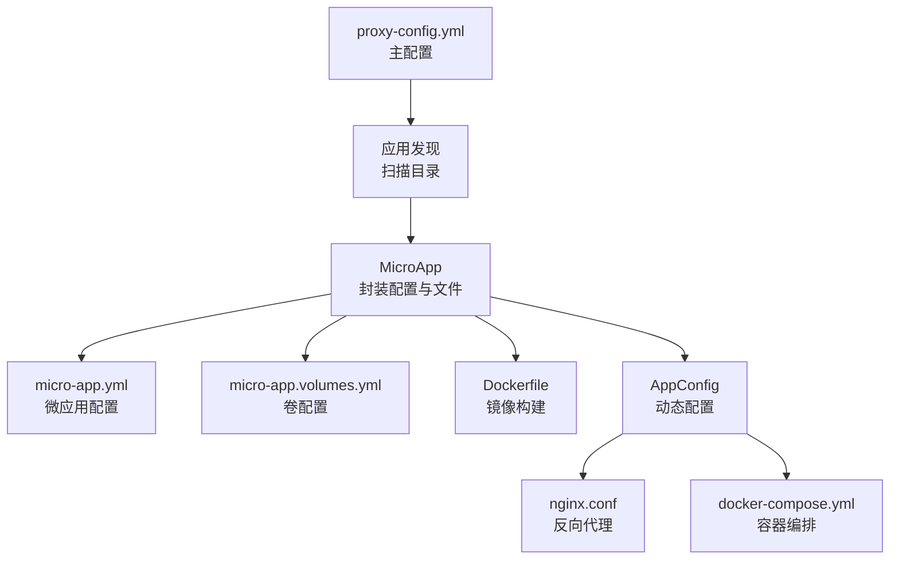
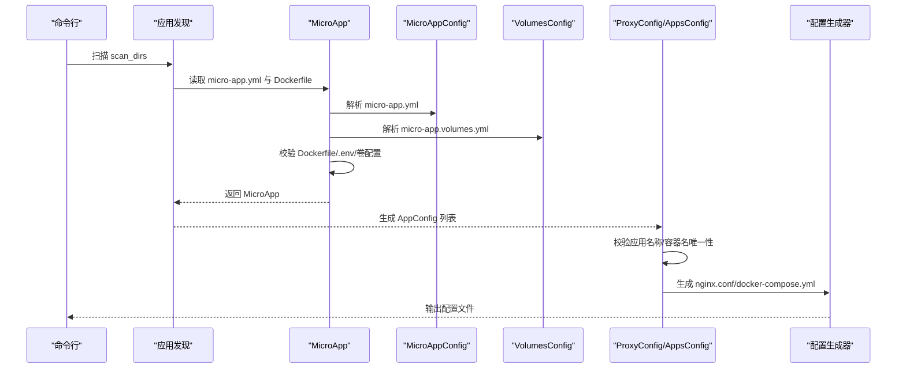
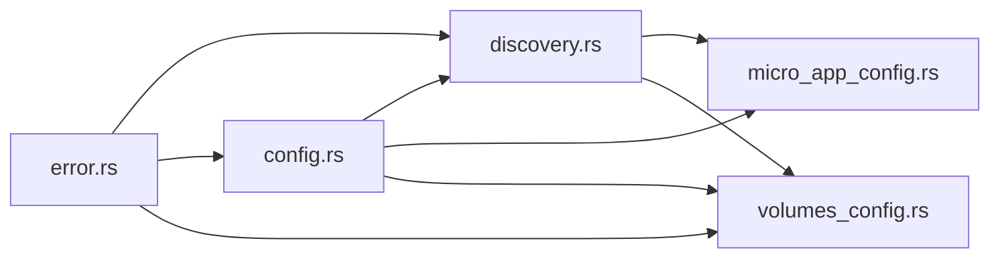

# 微应用配置

<cite>
**本文引用的文件**
- [micro_app_config.rs](file://src/micro_app_config.rs)
- [config.rs](file://src/config.rs)
- [discovery.rs](file://src/discovery.rs)
- [volumes_config.rs](file://src/volumes_config.rs)
- [proxy-config.yml.example](file://proxy-config.yml.example)
- [README.md](file://README.md)
- [docs/micro-app-development.md](file://docs/micro-app-development.md)
- [error.rs](file://src/error.rs)
- [Cargo.toml](file://Cargo.toml)
</cite>

## 目录
1. [简介](#简介)
2. [项目结构](#项目结构)
3. [核心组件](#核心组件)
4. [架构总览](#架构总览)
5. [详细组件分析](#详细组件分析)
6. [依赖关系分析](#依赖关系分析)
7. [性能考量](#性能考量)
8. [故障排查指南](#故障排查指南)
9. [结论](#结论)
10. [附录](#附录)

## 简介
本指南面向使用 micro_proxy 的开发者与运维人员，系统讲解微应用配置文件 micro-app.yml 的完整配置方法与最佳实践。重点涵盖三类应用类型（Static、API、Internal）的配置差异、路由与容器配置、卷映射与权限、以及应用发现与配置解析流程。文档同时提供配置验证规则、常见问题与解决方案，帮助你高效、安全地搭建与维护微服务集群。

## 项目结构
micro_proxy 通过“主配置文件 + 微应用配置文件 + 卷配置文件”的分层设计，实现对多微应用的自动化发现、校验、生成与部署。核心文件与职责如下：
- 主配置文件 proxy-config.yml：定义扫描目录、输出路径、网络与端口等全局参数
- 微应用配置 micro-app.yml：定义单个微应用的路由、容器、类型、描述与额外 Nginx 配置
- 卷配置 micro-app.volumes.yml：定义卷映射与运行用户，独立于 micro-app.yml
- 动态配置 apps-config.yml：由 micro_proxy 自动生成，汇总扫描到的微应用完整配置

图表来源
- [discovery.rs:224-352](file://src/discovery.rs#L224-L352)
- [micro_app_config.rs:37-53](file://src/micro_app_config.rs#L37-L53)
- [volumes_config.rs:56-82](file://src/volumes_config.rs#L56-L82)
- [config.rs:76-123](file://src/config.rs#L76-L123)

章节来源
- [README.md: 配置说明:164-235](file://README.md#L164-L235)
- [docs/micro-app-development.md: 配置文件总览:25-55](file://docs/micro-app-development.md#L25-L55)

## 核心组件
- 微应用配置模型（MicroAppConfig）：负责解析 micro-app.yml，提供基础字段与验证
- 应用配置模型（AppConfig）：负责将 MicroAppConfig 转换为动态配置，补充路径、卷与运行用户
- 应用发现（discover_micro_apps）：扫描目录，收集有效微应用并做去重与校验
- 卷配置模型（VolumesConfig）：解析 micro-app.volumes.yml，生成权限初始化脚本与 Docker Compose 卷格式
- 错误类型（Error）：统一错误分类，便于定位与处理

章节来源
- [micro_app_config.rs: MicroAppConfig:10-107](file://src/micro_app_config.rs#L10-L107)
- [config.rs: AppConfig/AppType:11-68](file://src/config.rs#L11-L68)
- [discovery.rs: MicroApp/discover_micro_apps:12-352](file://src/discovery.rs#L12-L352)
- [volumes_config.rs: VolumesConfig:43-205](file://src/volumes_config.rs#L43-L205)
- [error.rs: 错误类型:6-46](file://src/error.rs#L6-L46)

## 架构总览
下面的时序图展示了从扫描到生成配置的完整流程，以及配置验证与生成 Nginx/Compose 的关键节点。

图表来源
- [discovery.rs: MicroApp::from_directory:49-91](file://src/discovery.rs#L49-L91)
- [discovery.rs: MicroApp::validate:94-119](file://src/discovery.rs#L94-L119)
- [discovery.rs: to_app_configs:365-374](file://src/discovery.rs#L365-L374)
- [config.rs: ProxyConfig::validate:220-347](file://src/config.rs#L220-L347)
- [config.rs: AppsConfig::save_to_file:101-122](file://src/config.rs#L101-L122)

## 详细组件分析

### 微应用配置模型（MicroAppConfig）
- 字段与约束
  - routes：数组，Static/API 类型必需；Internal 类型忽略（可为空）
  - container_name：字符串，全局唯一，不可为空
  - container_port：u16，不可为 0
  - app_type：字符串，取值限定为 static、api、internal
  - description：可选
  - nginx_extra_config：可选，仅对 Static/API 有效
- 解析与验证
  - 从文件读取 YAML 并反序列化
  - 运行时校验：名称、端口、类型、路由与 Internal 类型的特殊规则
- 用途
  - 作为 discovery 阶段的基础输入
  - 作为 AppConfig 的来源之一

章节来源
- [micro_app_config.rs: 结构体与验证:10-107](file://src/micro_app_config.rs#L10-L107)

### 应用配置模型（AppConfig）
- 字段与约束
  - name：动态生成的唯一标识
  - routes：静态/API 类型必需；Internal 类型可为空
  - container_name/container_port：来自 micro-app.yml
  - app_type：枚举（Static/Api/Internal）
  - description/nginx_extra_config：可选
  - path：微应用绝对路径（动态生成）
  - docker_volumes：从 micro-app.volumes.yml 转换而来
  - run_as_user：从 micro-app.volumes.yml 加载
- 生成逻辑
  - discovery 阶段将 MicroApp 转换为 AppConfig
  - name 生成规则：基于 scan_dir 相对路径与最后一级目录名组合
  - docker_volumes 转换：volumes 列表转为 “source:target” 字符串
- 校验规则
  - 所有应用名称唯一
  - Static/API：必须存在于扫描结果中，且 routes 非空
  - Internal：必须提供 path，且该路径存在 Dockerfile；routes/nginx_extra_config 将被忽略

章节来源
- [config.rs: AppConfig/AppType:11-68](file://src/config.rs#L11-L68)
- [config.rs: ProxyConfig::validate:220-347](file://src/config.rs#L220-L347)
- [discovery.rs: MicroApp::to_app_config:121-144](file://src/discovery.rs#L121-L144)

### 应用发现与名称生成
- 发现规则
  - 遍历 scan_dirs 的直接子目录
  - 目录必须同时包含 micro-app.yml 与 Dockerfile
  - 生成唯一 name：若为直接子目录仅用目录名；否则用“相对路径_目录名”
- 去重与校验
  - 名称去重
  - 容器名去重
  - Dockerfile 存在性与 .env 存在性告警
- 转换为 AppConfig
  - 将 MicroAppConfig/AppType/卷配置转换为 AppConfig

章节来源
- [discovery.rs: discover_micro_apps:235-352](file://src/discovery.rs#L235-L352)
- [discovery.rs: generate_unique_app_name:147-222](file://src/discovery.rs#L147-L222)
- [discovery.rs: MicroApp::from_directory:49-91](file://src/discovery.rs#L49-L91)

### 卷配置模型（VolumesConfig）
- 字段与约束
  - volumes：列表，每项包含 source/target/permissions
  - run_as_user：可选，格式为 “uid:gid” 或用户名
- 校验规则
  - source/target 非空
  - uid/gid 为 0 时发出安全风险警告
  - run_as_user 非空字符串
- 功能
  - 生成权限初始化脚本（chown）
  - 转换为 Docker Compose 卷格式（“source:target”）

章节来源
- [volumes_config.rs: VolumesConfig:43-205](file://src/volumes_config.rs#L43-L205)

### 应用类型详解与配置差异
- Static（静态/前端）
  - 对外暴露，需要 Nginx 反向代理
  - routes 必须配置，nginx_extra_config 可选
  - 建议配合 SPA 的 nginx.conf 与权限配置
- API（后端服务）
  - 对外暴露，请求路径完整透传
  - routes 必须配置，nginx_extra_config 可选（常用于 CORS/预检）
- Internal（内部服务）
  - 不对外暴露，仅用于微服务间通信
  - routes 必须为空；nginx_extra_config 无效
  - 必须提供 path，且该路径存在 Dockerfile

章节来源
- [docs/micro-app-development.md: 类型选择速查表:46-54](file://docs/micro-app-development.md#L46-L54)
- [config.rs: ProxyConfig::validate Internal 校验:273-322](file://src/config.rs#L273-L322)

### 路由配置（routes）
- Static/API：必须提供至少一个路由前缀
- Internal：必须为空数组
- 生成的 Nginx 配置将把请求转发到对应容器的 container_port

章节来源
- [micro_app_config.rs: routes 验证:87-94](file://src/micro_app_config.rs#L87-L94)
- [config.rs: ProxyConfig::validate Static/API 校验:250-272](file://src/config.rs#L250-L272)

### 容器配置（container_name、container_port）
- container_name：全局唯一，避免冲突
- container_port：不可为 0，需与容器内监听端口一致
- 生成的 Compose/Nginx 将使用这些值进行端口映射与上游配置

章节来源
- [micro_app_config.rs: container_name/container_port 验证:59-75](file://src/micro_app_config.rs#L59-L75)
- [config.rs: ProxyConfig::validate:220-347](file://src/config.rs#L220-L347)

### Nginx 额外配置（nginx_extra_config）
- 仅对 Static/API 有效
- 支持自定义响应头、CORS、特殊路径转发等
- Internal 类型忽略该字段

章节来源
- [micro_app_config.rs: nginx_extra_config 字段:30-32](file://src/micro_app_config.rs#L30-L32)
- [config.rs: AppConfig 描述:48-51](file://src/config.rs#L48-L51)

### 卷映射与权限（docker_volumes/run_as_user）
- docker_volumes：从 micro-app.volumes.yml 的 volumes 列表转换而来
- run_as_user：从 micro-app.volumes.yml 直接加载
- 权限初始化：在容器启动前执行 chown（可选递归）
- 安全建议：避免使用 root 权限（uid/gid=0），尽量使用非特权用户

章节来源
- [volumes_config.rs: generate_permission_init_script:145-196](file://src/volumes_config.rs#L145-L196)
- [volumes_config.rs: to_docker_compose_volumes:198-204](file://src/volumes_config.rs#L198-L204)
- [docs/micro-app-development.md: 卷配置文件:90-180](file://docs/micro-app-development.md#L90-L180)

### 配置解析与生成流程
- 主配置 proxy-config.yml：定义扫描目录、输出路径、网络与端口
- 应用发现：扫描目录，收集包含 micro-app.yml 与 Dockerfile 的微应用
- 配置转换：MicroAppConfig → AppConfig，补充 path、卷与运行用户
- 校验：名称/容器名唯一性、Static/API 的路由存在性、Internal 的路径与 Dockerfile
- 生成：apps-config.yml、nginx.conf、docker-compose.yml

章节来源
- [proxy-config.yml.example:5-31](file://proxy-config.yml.example#L5-L31)
- [discovery.rs: discover_micro_apps:235-352](file://src/discovery.rs#L235-L352)
- [config.rs: AppsConfig::from_file/save_to_file:76-123](file://src/config.rs#L76-L123)
- [config.rs: ProxyConfig::load_apps/save_apps:205-218](file://src/config.rs#L205-L218)

## 依赖关系分析
- 模块耦合
  - discovery 依赖 micro_app_config 与 volumes_config
  - config 依赖 discovery 生成的 AppConfig
  - volumes_config 与 micro_app_config 独立，通过 discovery 组合
- 外部依赖
  - YAML 解析（serde_yaml）
  - 日志（log/dumbo_log）
  - 命令行（clap）
  - 异步运行时（tokio）
  - 文件系统与路径处理（fs_extra/pathdiff）

图表来源
- [discovery.rs:6-8](file://src/discovery.rs#L6-L8)
- [config.rs:6-9](file://src/config.rs#L6-L9)
- [volumes_config.rs:6-8](file://src/volumes_config.rs#L6-L8)
- [error.rs:3-4](file://src/error.rs#L3-L4)

章节来源
- [Cargo.toml: 依赖列表:13-52](file://Cargo.toml#L13-L52)

## 性能考量
- 扫描复杂度：O(N) 遍历 scan_dirs 的直接子目录，N 为目录数量
- 解析与校验：YAML 解析与字段校验为 O(k)（k 为配置项数），整体开销较小
- I/O 优化：批量读取与缓存（如路径哈希）减少重复构建
- 建议
  - 控制 scan_dirs 数量与层级，避免过多目录导致扫描时间增长
  - 合理拆分微应用，避免单个应用体积过大影响构建与启动

## 故障排查指南
- 常见错误类型
  - 配置错误（Config）：字段缺失、取值非法、重复名称/容器名
  - 发现错误（Discovery）：缺少 Dockerfile、相对路径计算失败
  - YAML 解析错误（Yaml）：语法错误或类型不匹配
- 典型问题与解决
  - routes 为空：Static/API 类型必须提供至少一个路由
  - container_name 重复：确保全局唯一
  - Internal 缺少 path/Dockerfile：Internal 类型必须提供有效路径与 Dockerfile
  - 卷权限为 root：避免 uid/gid=0，改用非特权用户
  - nginx_extra_config 无效：仅对 Static/API 生效
- 排查步骤
  - 查看日志：启用详细日志模式
  - 检查 apps-config.yml：确认动态配置生成是否成功
  - 验证 Dockerfile 与 .env 是否存在
  - 使用状态/网络命令辅助定位

章节来源
- [error.rs: 错误类型:6-46](file://src/error.rs#L6-L46)
- [README.md: 故障排查:328-420](file://README.md#L328-L420)
- [config.rs: ProxyConfig::validate:220-347](file://src/config.rs#L220-L347)
- [volumes_config.rs: validate:84-143](file://src/volumes_config.rs#L84-L143)

## 结论
micro-app.yml 提供了清晰、可扩展的微应用配置能力。通过严格的字段校验、灵活的卷与权限配置、以及完善的发现与生成流程，micro_proxy 能够稳定地支撑多微服务的统一入口与内部通信。遵循本文的配置规范与最佳实践，可显著降低配置成本与运维风险。

## 附录

### 配置项总览与取值范围
- routes
  - 类型：数组（字符串）
  - 取值：任意非空路径前缀
  - 限制：Static/API 必须提供；Internal 必须为空
- container_name
  - 类型：字符串
  - 取值：任意非空字符串，全局唯一
- container_port
  - 类型：u16
  - 取值：1–65535，不可为 0
- app_type
  - 类型：字符串
  - 取值：static、api、internal
- description
  - 类型：字符串（可选）
- nginx_extra_config
  - 类型：字符串（可选，仅 Static/API）
- docker_volumes
  - 类型：数组（字符串，由 micro-app.volumes.yml 转换）
  - 格式：source:target
- run_as_user
  - 类型：字符串（可选，格式：uid:gid 或用户名）

章节来源
- [micro_app_config.rs: 字段定义:10-33](file://src/micro_app_config.rs#L10-L33)
- [config.rs: AppConfig 字段:24-68](file://src/config.rs#L24-L68)
- [volumes_config.rs: VolumesConfig 字段:43-53](file://src/volumes_config.rs#L43-L53)

### 应用类型配置示例与最佳实践
- Static 示例
  - routes：["/"]
  - container_name：唯一容器名
  - container_port：80
  - nginx_extra_config：可选，用于缓存与安全头
- API 示例
  - routes：["/api"]
  - container_name：唯一容器名
  - container_port：后端监听端口
  - nginx_extra_config：可选，用于 CORS/预检
- Internal 示例
  - routes：[]
  - container_name：唯一容器名
  - container_port：内部服务端口（如 6379）
  - path：包含 Dockerfile 的宿主机路径

章节来源
- [docs/micro-app-development.md: Static/API/Internal 示例:271-486](file://docs/micro-app-development.md#L271-L486)
- [README.md: 微应用配置示例:205-233](file://README.md#L205-L233)

### 应用发现机制与配置解析过程
- 发现：扫描 scan_dirs，过滤包含 micro-app.yml 与 Dockerfile 的目录
- 名称生成：基于相对路径与目录名生成唯一 name
- 校验：名称/容器名唯一性、Static/API 路由存在性、Internal 路径与 Dockerfile
- 转换：MicroAppConfig → AppConfig，补充 path、卷与运行用户
- 生成：apps-config.yml、nginx.conf、docker-compose.yml

章节来源
- [discovery.rs: discover_micro_apps:235-352](file://src/discovery.rs#L235-L352)
- [discovery.rs: generate_unique_app_name:147-222](file://src/discovery.rs#L147-L222)
- [config.rs: AppsConfig::from_file/save_to_file:76-123](file://src/config.rs#L76-L123)