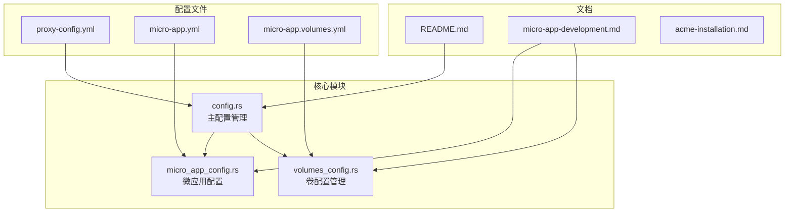
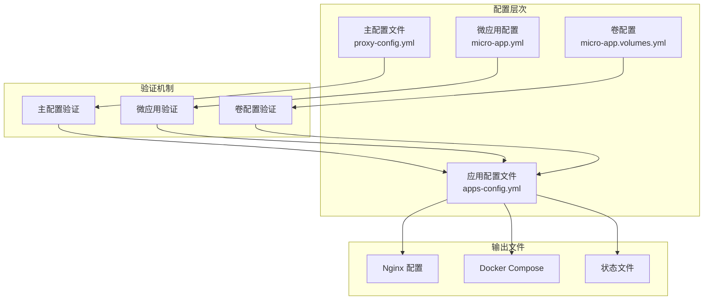
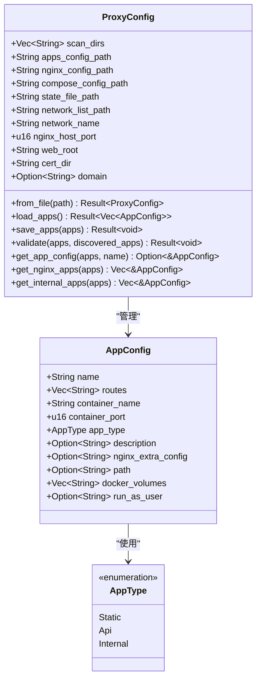
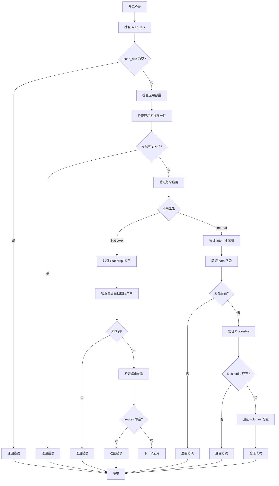
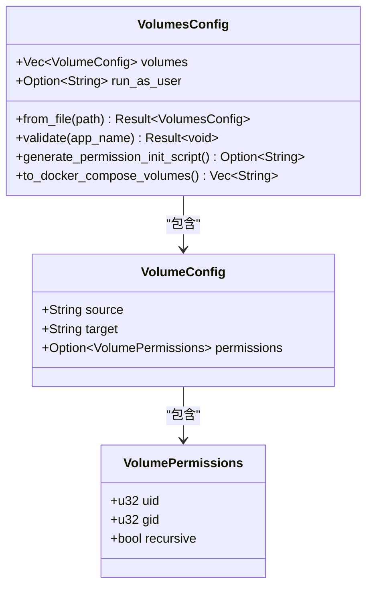
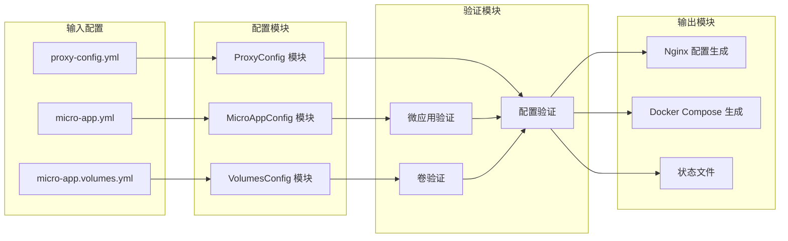

# 配置指南

<cite>
**本文档引用的文件**
- [proxy-config.yml.example](file://proxy-config.yml.example)
- [README.md](file://README.md)
- [config.rs](file://src/config.rs)
- [micro_app_config.rs](file://src/micro_app_config.rs)
- [volumes_config.rs](file://src/volumes_config.rs)
- [micro-app-development.md](file://docs/micro-app-development.md)
- [acme-installation.md](file://docs/acme-installation.md)
- [Cargo.toml](file://Cargo.toml)
</cite>

## 目录
1. [简介](#简介)
2. [项目结构](#项目结构)
3. [核心组件](#核心组件)
4. [架构概览](#架构概览)
5. [详细组件分析](#详细组件分析)
6. [依赖关系分析](#依赖关系分析)
7. [性能考虑](#性能考虑)
8. [故障排查指南](#故障排查指南)
9. [结论](#结论)
10. [附录](#附录)

## 简介

micro_proxy 是一个用于管理微应用的工具，支持 Docker 镜像构建、容器管理、Nginx 反向代理配置等功能。本文档提供了完整的配置指南，涵盖主配置文件 proxy-config.yml 和微应用配置文件 micro-app.yml 的所有配置项。

## 项目结构

micro_proxy 项目采用模块化的 Rust 代码结构，主要配置相关文件分布如下：



**图表来源**
- [config.rs:125-164](file://src/config.rs#L125-L164)
- [micro_app_config.rs:10-33](file://src/micro_app_config.rs#L10-L33)
- [volumes_config.rs:43-53](file://src/volumes_config.rs#L43-L53)

**章节来源**
- [Cargo.toml:1-55](file://Cargo.toml#L1-L55)

## 核心组件

### 主配置文件 (proxy-config.yml)

主配置文件是 micro_proxy 的核心配置文件，定义了整个系统的运行参数和行为。

#### 基本配置项

| 配置项 | 类型 | 默认值 | 描述 |
|--------|------|--------|------|
| `scan_dirs` | 数组 | - | 扫描目录列表，用于自动发现微应用 |
| `apps_config_path` | 字符串 | "./apps-config.yml" | 动态生成的应用配置存储路径 |
| `nginx_config_path` | 字符串 | "./nginx.conf" | Nginx 配置文件输出路径 |
| `compose_config_path` | 字符串 | "./docker-compose.yml" | Docker Compose 配置文件输出路径 |
| `state_file_path` | 字符串 | "./proxy-config.state" | 状态文件路径 |
| `network_list_path` | 字符串 | "./network-addresses.txt" | 网络地址列表输出路径 |
| `network_name` | 字符串 | "proxy-network" | Docker 网络名称 |
| `nginx_host_port` | 整数 | 8080 | Nginx 监听的主机端口 |

#### SSL 证书配置

| 配置项 | 类型 | 默认值 | 描述 |
|--------|------|--------|------|
| `web_root` | 字符串 | "/var/www/html" | ACME 验证文件存放目录 |
| `cert_dir` | 字符串 | "/etc/nginx/certs" | SSL 证书存放目录 |
| `domain` | 字符串 | - | 域名配置，用于 HTTPS |

**章节来源**
- [proxy-config.yml.example:1-53](file://proxy-config.yml.example#L1-L53)
- [config.rs:125-164](file://src/config.rs#L125-L164)

### 微应用配置文件 (micro-app.yml)

每个微应用目录下的配置文件，定义了单个微应用的具体属性。

#### 基本配置项

| 配置项 | 类型 | 必需 | 描述 |
|--------|------|------|------|
| `routes` | 数组 | 条件 | 访问路径，static/api 类型必需 |
| `container_name` | 字符串 | ✅ | 容器名称，全局唯一 |
| `container_port` | 整数 | ✅ | 容器内部端口 |
| `app_type` | 字符串 | ✅ | 应用类型：static, api, internal |
| `description` | 字符串 | ❌ | 应用描述 |
| `nginx_extra_config` | 字符串 | ❌ | 额外的 Nginx 配置 |

#### 卷配置文件 (micro-app.volumes.yml)

用于定义 Docker 卷挂载和权限设置。

| 配置项 | 类型 | 必需 | 描述 |
|--------|------|------|------|
| `volumes` | 数组 | ❌ | 卷列表 |
| `run_as_user` | 字符串 | ❌ | 容器运行用户 |

**章节来源**
- [micro_app_config.rs:10-33](file://src/micro_app_config.rs#L10-L33)
- [volumes_config.rs:43-53](file://src/volumes_config.rs#L43-L53)

## 架构概览

micro_proxy 的配置架构采用分层设计，确保配置的灵活性和可维护性：



**图表来源**
- [config.rs:220-347](file://src/config.rs#L220-L347)
- [micro_app_config.rs:55-106](file://src/micro_app_config.rs#L55-L106)
- [volumes_config.rs:84-143](file://src/volumes_config.rs#L84-L143)

## 详细组件分析

### 主配置管理 (ProxyConfig)

主配置管理模块负责处理主配置文件的所有逻辑。

#### 配置结构



**图表来源**
- [config.rs:11-68](file://src/config.rs#L11-L68)
- [config.rs:125-164](file://src/config.rs#L125-L164)

#### 配置验证机制

主配置验证确保所有配置项的有效性和一致性：



**图表来源**
- [config.rs:220-347](file://src/config.rs#L220-L347)

**章节来源**
- [config.rs:178-367](file://src/config.rs#L178-L367)

### 微应用配置管理 (MicroAppConfig)

微应用配置管理模块处理单个微应用的配置文件。

#### 配置验证规则

微应用配置验证确保每个微应用的配置符合要求：

| 验证规则 | 验证条件 | 错误信息 |
|----------|----------|----------|
| 容器名称验证 | `container_name` 不能为空 | "container_name 不能为空" |
| 容器端口验证 | `container_port` 不能为 0 | "container_port 不能为 0" |
| 应用类型验证 | 必须是 "static"、"api" 或 "internal" | "app_type 无效" |
| 路由配置验证 | static/api 类型 routes 不能为空 | "routes 不能为空" |
| Internal 类型验证 | internal 类型不应配置 routes | "routes 配置将被忽略" |

**章节来源**
- [micro_app_config.rs:55-106](file://src/micro_app_config.rs#L55-L106)

### 卷配置管理 (VolumesConfig)

卷配置管理模块处理 Docker 卷挂载和权限设置。

#### 卷配置结构



**图表来源**
- [volumes_config.rs:43-53](file://src/volumes_config.rs#L43-L53)
- [volumes_config.rs:29-41](file://src/volumes_config.rs#L29-L41)

#### 权限配置验证

卷配置验证确保权限设置的安全性和有效性：

| 验证规则 | 验证条件 | 警告/错误信息 |
|----------|----------|---------------|
| 源路径验证 | `source` 不能为空 | "source 不能为空" |
| 目标路径验证 | `target` 不能为空 | "target 不能为空" |
| Root 权限警告 | uid=0 或 gid=0 | "使用了 root 权限" |
| 用户名验证 | `run_as_user` 不能为空字符串 | "run_as_user 不能为空" |

**章节来源**
- [volumes_config.rs:84-143](file://src/volumes_config.rs#L84-L143)

## 依赖关系分析

micro_proxy 的配置系统具有清晰的依赖关系和模块化设计：



**图表来源**
- [config.rs:178-367](file://src/config.rs#L178-L367)
- [micro_app_config.rs:35-106](file://src/micro_app_config.rs#L35-L106)
- [volumes_config.rs:55-143](file://src/volumes_config.rs#L55-L143)

**章节来源**
- [Cargo.toml:13-52](file://Cargo.toml#L13-L52)

## 性能考虑

### 配置加载性能

- **延迟加载**: 配置文件采用按需加载策略，避免不必要的文件读取
- **缓存机制**: 应用配置在内存中缓存，减少重复解析开销
- **增量更新**: 仅在配置文件变化时重新加载和验证

### 验证性能优化

- **早期失败**: 在发现明显错误时立即返回，避免后续验证开销
- **并行验证**: 对于独立的应用配置，可以并行验证以提高效率
- **最小化日志**: 在生产环境中减少详细日志输出，提高性能

## 故障排查指南

### 常见配置错误

#### 主配置错误

| 错误类型 | 错误信息 | 解决方案 |
|----------|----------|----------|
| 空扫描目录 | "scan_dirs 不能为空" | 在 proxy-config.yml 中添加有效的扫描目录 |
| 重复应用名称 | "发现重复的应用名称" | 确保所有应用名称唯一 |
| 应用未找到 | "应用未在扫描目录中找到" | 检查应用目录结构和 Dockerfile |

#### 微应用配置错误

| 错误类型 | 错误信息 | 解决方案 |
|----------|----------|----------|
| 空容器名称 | "container_name 不能为空" | 在 micro-app.yml 中设置有效的容器名称 |
| 端口为零 | "container_port 不能为 0" | 设置有效的容器端口号 |
| 无效应用类型 | "app_type 无效" | 使用 "static"、"api" 或 "internal" |

#### 卷配置错误

| 错误类型 | 错误信息 | 解决方案 |
|----------|----------|----------|
| 空源路径 | "source 不能为空" | 在 micro-app.volumes.yml 中设置有效的源路径 |
| 空目标路径 | "target 不能为空" | 在 micro-app.volumes.yml 中设置有效的目标路径 |
| Root 权限警告 | "使用了 root 权限" | 更改为非 root 用户权限 |

### SSL 证书配置故障排查

#### ACME 验证失败

```bash
# 检查 ACME 验证文件
ls -la /var/www/html/.well-known/acme-challenge/

# 验证 Nginx 配置
docker exec proxy-nginx nginx -t

# 检查证书文件
ls -la /etc/nginx/certs/
```

#### 域名解析问题

```bash
# 检查 DNS 解析
dig your-domain.com
nslookup your-domain.com

# 验证端口开放
telnet your-domain.com 80
telnet your-domain.com 443
```

**章节来源**
- [README.md:328-420](file://README.md#L328-L420)
- [acme-installation.md:265-301](file://docs/acme-installation.md#L265-L301)

## 结论

micro_proxy 的配置系统设计精良，采用了模块化、分层的设计理念，确保了配置的灵活性和可维护性。通过主配置文件和微应用配置文件的配合，以及完善的验证机制，用户可以轻松地管理和部署微应用。

配置系统的主要优势包括：
- **清晰的层次结构**: 主配置、应用配置、卷配置分离明确
- **强大的验证机制**: 多层次的配置验证确保配置的有效性
- **灵活的扩展性**: 支持自定义 Nginx 配置和卷挂载
- **完善的错误处理**: 详细的错误信息帮助用户快速定位问题

## 附录

### 配置模板

#### 主配置文件模板

```yaml
# 扫描目录列表（用于发现 micro-app.yml）
scan_dirs:
  - "./micro-apps"

# 动态生成的 apps 配置存储路径
apps_config_path: "./apps-config.yml"

# Nginx 配置文件输出路径
nginx_config_path: "./nginx.conf"

# Docker Compose 配置文件输出路径
compose_config_path: "./docker-compose.yml"

# 状态文件路径
state_file_path: "./proxy-config.state"

# 网络地址列表输出路径
network_list_path: "./network-addresses.txt"

# Docker 网络名称
network_name: "proxy-network"

# Nginx 监听的主机端口（统一入口）
nginx_host_port: 80

# Web 根目录（可选）
web_root: "/var/www/html"

# 证书目录（可选）
cert_dir: "/etc/nginx/certs"

# 域名（可选）
domain: "example.com"
```

#### 微应用配置模板

```yaml
# 访问路径（static/api类型必需）
routes: ["/", "/api"]

# Docker容器名称（必需，全局唯一）
container_name: "my-container"

# 容器内部端口（必需）
container_port: 80

# 应用类型（必需）
app_type: "static"

# 应用描述（可选）
description: "应用描述"

# 额外的 nginx 配置（可选）
nginx_extra_config: |
  add_header 'X-Custom-Header' 'value';
```

#### 卷配置模板

```yaml
volumes:
  - source: "./data"
    target: "/app/data"
    permissions:
      uid: 999
      gid: 999
      recursive: true

run_as_user: "999:999"
```

### 最佳实践

1. **配置文件组织**: 将配置文件放在项目根目录，便于版本控制
2. **命名规范**: 使用有意义的应用名称，避免重复
3. **权限管理**: 优先使用非 root 用户运行容器
4. **路径配置**: 使用相对路径，确保配置的可移植性
5. **备份策略**: 定期备份配置文件，防止意外丢失

### 版本兼容性

micro_proxy 当前版本为 0.4.0，遵循语义化版本控制。主要版本变更包括：

- **版本 0.1.x**: 初始版本，基础配置功能
- **版本 0.2.x**: 增加卷配置支持
- **版本 0.3.x**: 改进验证机制
- **版本 0.4.x**: 优化性能和错误处理

**章节来源**
- [Cargo.toml:3-3](file://Cargo.toml#L3-L3)