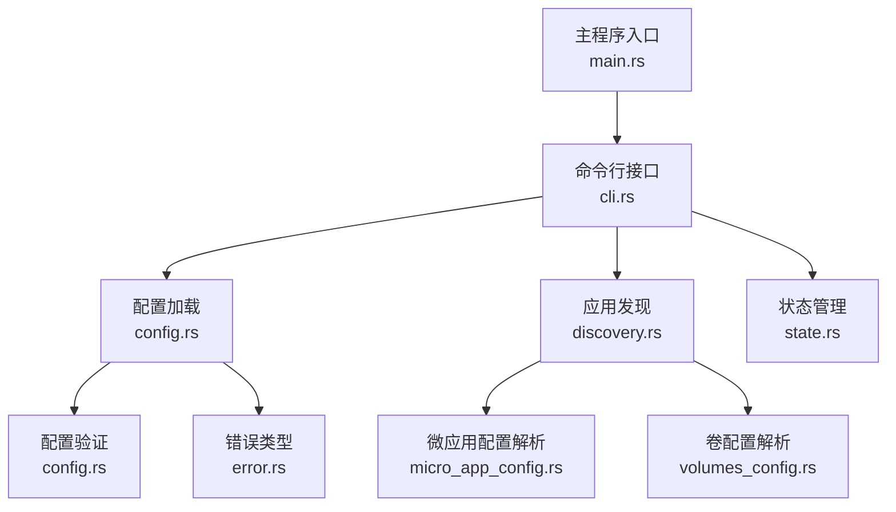
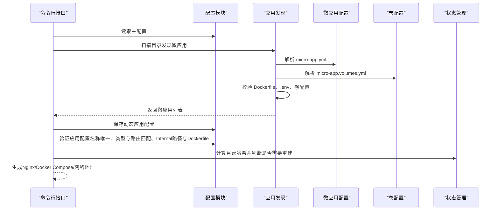
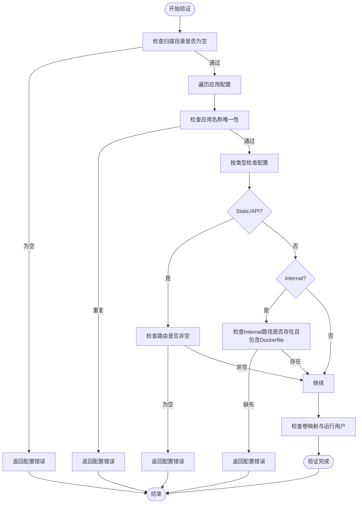
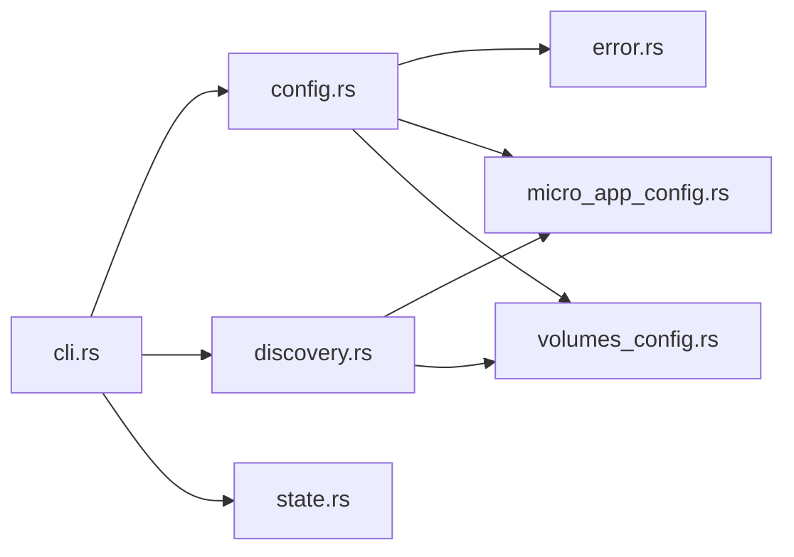

# 配置验证与错误处理

<cite>
**本文引用的文件**
- [config.rs](file://src/config.rs)
- [error.rs](file://src/error.rs)
- [cli.rs](file://src/cli.rs)
- [discovery.rs](file://src/discovery.rs)
- [micro_app_config.rs](file://src/micro_app_config.rs)
- [volumes_config.rs](file://src/volumes_config.rs)
- [state.rs](file://src/state.rs)
- [proxy-config.yml.example](file://proxy-config.yml.example)
- [Cargo.toml](file://Cargo.toml)
- [README.md](file://README.md)
</cite>

## 目录
1. [引言](#引言)
2. [项目结构](#项目结构)
3. [核心组件](#核心组件)
4. [架构总览](#架构总览)
5. [详细组件分析](#详细组件分析)
6. [依赖关系分析](#依赖关系分析)
7. [性能考量](#性能考量)
8. [故障排查指南](#故障排查指南)
9. [结论](#结论)
10. [附录](#附录)

## 引言
本文件聚焦于配置验证与错误处理机制，系统性阐述配置验证流程、规则与错误类型，提供常见问题诊断与修复建议，并说明配置文件解析顺序与优先级、最佳实践与调试技巧，以及版本兼容与迁移要点。读者可据此快速定位配置问题、优化配置质量并提升运维效率。

## 项目结构
本项目围绕“配置—发现—验证—生成”的闭环展开，关键模块如下：
- 配置管理：主配置与应用配置的结构定义、加载与保存、验证
- 应用发现：扫描目录、解析微应用配置、校验必要文件
- 错误体系：统一错误类型与错误传播
- 状态管理：基于目录哈希判断是否需要重建
- CLI：命令入口、日志初始化、调用链组织

图表来源
- [main.rs:1-25](file://src/main.rs#L1-L25)
- [cli.rs:78-116](file://src/cli.rs#L78-L116)
- [config.rs:178-220](file://src/config.rs#L178-L220)
- [discovery.rs:235-352](file://src/discovery.rs#L235-L352)
- [micro_app_config.rs:35-54](file://src/micro_app_config.rs#L35-L54)
- [volumes_config.rs:55-82](file://src/volumes_config.rs#L55-L82)
- [state.rs:40-90](file://src/state.rs#L40-L90)
- [error.rs:5-46](file://src/error.rs#L5-L46)

章节来源
- [main.rs:1-25](file://src/main.rs#L1-L25)
- [cli.rs:78-116](file://src/cli.rs#L78-L116)
- [config.rs:178-220](file://src/config.rs#L178-L220)
- [discovery.rs:235-352](file://src/discovery.rs#L235-L352)
- [micro_app_config.rs:35-54](file://src/micro_app_config.rs#L35-L54)
- [volumes_config.rs:55-82](file://src/volumes_config.rs#L55-L82)
- [state.rs:40-90](file://src/state.rs#L40-L90)
- [error.rs:5-46](file://src/error.rs#L5-L46)

## 核心组件
- 配置模型与验证
  - 主配置结构：包含扫描目录、输出路径、网络名、端口、Web根目录、证书目录、域名等
  - 应用配置结构：包含应用名、路由、容器名、容器端口、应用类型、描述、额外Nginx配置、路径、卷映射、运行用户等
  - 验证规则：必填项检查、格式验证、逻辑一致性检查（如静态/API类型必须配置路由；Internal类型必须提供路径且包含Dockerfile；路由与类型匹配等）

- 应用发现与解析
  - 发现规则：扫描目录列表，仅一级子目录视为微应用；目录需同时包含微应用配置与Dockerfile
  - 名称唯一性：微应用名称与容器名称均需全局唯一
  - 微应用配置验证：容器名非空、容器端口非零、应用类型合法、静态/API类型必须配置路由、Internal类型不应配置路由
  - 卷配置验证：源路径与目标路径非空、权限配置合理（UID/GID非0时给出安全告警）、运行用户格式校验

- 错误类型与传播
  - 统一错误类型：配置、IO、YAML、Docker、脚本、网络、发现、构建、容器、状态、Dockerfile、Nginx、Compose等
  - 错误传播：从解析到验证再到CLI调用链，错误携带上下文信息并终止流程

- 状态与重建策略
  - 基于目录哈希判断是否需要重建，避免不必要的镜像构建
  - 状态文件持久化，支持加载/保存

章节来源
- [config.rs:125-220](file://src/config.rs#L125-L220)
- [config.rs:220-347](file://src/config.rs#L220-L347)
- [discovery.rs:235-352](file://src/discovery.rs#L235-L352)
- [micro_app_config.rs:55-106](file://src/micro_app_config.rs#L55-L106)
- [volumes_config.rs:84-143](file://src/volumes_config.rs#L84-L143)
- [error.rs:5-46](file://src/error.rs#L5-L46)
- [state.rs:195-233](file://src/state.rs#L195-L233)

## 架构总览
配置验证贯穿“发现—解析—验证—生成”全流程，CLI负责组织调用，配置模块负责加载与验证，发现模块负责扫描与校验，错误模块统一错误类型，状态模块辅助判断重建。

图表来源
- [cli.rs:296-463](file://src/cli.rs#L296-L463)
- [config.rs:178-220](file://src/config.rs#L178-L220)
- [discovery.rs:235-352](file://src/discovery.rs#L235-L352)
- [micro_app_config.rs:35-54](file://src/micro_app_config.rs#L35-L54)
- [volumes_config.rs:55-82](file://src/volumes_config.rs#L55-L82)
- [state.rs:195-233](file://src/state.rs#L195-L233)

## 详细组件分析

### 配置验证流程与规则
- 主配置验证
  - 必填项：扫描目录列表不能为空
  - 输出路径：apps_config_path、nginx_config_path、compose_config_path、state_file_path、network_list_path、network_name、nginx_host_port、web_root、cert_dir、domain（可选）
  - 默认值：web_root、cert_dir提供默认值，domain可选
- 应用配置验证
  - 名称唯一性：所有应用名称必须唯一
  - 类型与路由匹配：
    - Static/API：必须配置至少一条路由
    - Internal：路由应为空，且必须提供路径
  - Internal类型约束：
    - 路径存在且包含Dockerfile
    - 路由与额外Nginx配置会被忽略
  - 卷与运行用户：若配置卷映射，将被转换为Docker Compose格式；运行用户格式校验
- 微应用配置验证
  - 容器名非空、容器端口非零、应用类型合法（static/api/internal）
  - Static/API类型必须配置路由；Internal类型不应配置路由
- 卷配置验证
  - 源路径与目标路径非空
  - 权限配置：UID/GID非0时发出安全告警
  - 运行用户格式校验（非空字符串）

图表来源
- [config.rs:220-347](file://src/config.rs#L220-L347)
- [micro_app_config.rs:55-106](file://src/micro_app_config.rs#L55-L106)
- [volumes_config.rs:84-143](file://src/volumes_config.rs#L84-L143)

章节来源
- [config.rs:220-347](file://src/config.rs#L220-L347)
- [micro_app_config.rs:55-106](file://src/micro_app_config.rs#L55-L106)
- [volumes_config.rs:84-143](file://src/volumes_config.rs#L84-L143)

### 错误类型与错误信息含义
- 配置错误：配置文件读取/解析失败、必填项缺失、格式非法、逻辑不一致
- IO错误：文件读取/写入失败
- YAML解析错误：YAML语法或结构异常
- Docker错误：容器/镜像相关操作失败
- 脚本执行错误：setup/clean脚本执行失败
- 网络错误：网络相关操作失败
- 发现错误：应用发现阶段失败（如重复名称、缺少Dockerfile）
- 构建错误：镜像构建失败
- 容器错误：容器生命周期管理失败
- 状态错误：状态文件读取/解析失败
- Dockerfile解析错误：Dockerfile解析失败
- Nginx配置错误：Nginx配置生成/校验失败
- Compose配置错误：Docker Compose配置生成/校验失败

章节来源
- [error.rs:5-46](file://src/error.rs#L5-L46)

### 配置文件解析顺序与优先级
- 主配置文件（proxy-config.yml）
  - 读取与解析：顺序为“读取文件→YAML解析→结构化对象”
  - 优先级：命令行参数覆盖默认配置文件路径；随后按配置文件字段生效
- 动态应用配置（apps-config.yml）
  - 生成时机：应用发现后，将发现结果转换为应用配置并保存
  - 读取时机：启动/网络命令等场景加载动态配置
- 微应用配置（micro-app.yml）
  - 生成时机：应用发现时解析每个微应用目录下的配置
  - 优先级：严格遵循字段约束（容器名唯一、端口非零、类型与路由匹配等）
- 卷配置（micro-app.volumes.yml）
  - 生成时机：Internal类型应用加载时解析
  - 优先级：卷映射与运行用户参与最终Compose生成

章节来源
- [config.rs:76-123](file://src/config.rs#L76-L123)
- [cli.rs:296-463](file://src/cli.rs#L296-L463)
- [discovery.rs:235-352](file://src/discovery.rs#L235-L352)
- [micro_app_config.rs:35-54](file://src/micro_app_config.rs#L35-L54)
- [volumes_config.rs:55-82](file://src/volumes_config.rs#L55-L82)

### 常见配置错误与诊断修复
- 扫描目录为空
  - 现象：启动时报“scan_dirs 不能为空”
  - 诊断：检查主配置文件中scan_dirs字段
  - 修复：至少配置一个扫描目录
- 应用名称重复
  - 现象：启动时报“发现重复的应用名称”
  - 诊断：检查所有应用的name字段是否唯一
  - 修复：调整重复名称或合并配置
- Static/API类型缺少路由
  - 现象：启动时报“应用的 routes 不能为空”
  - 诊断：检查对应应用的routes字段
  - 修复：为Static/API类型配置至少一条路由
- Internal类型配置了路由或缺少路径
  - 现象：启动时报“Internal 应用缺少 path 字段”或“Internal 应用的路径不存在”
  - 诊断：检查Internal应用的path字段及Dockerfile是否存在
  - 修复：提供有效路径并确保包含Dockerfile
- 微应用容器名重复
  - 现象：发现阶段报“重复的容器名称”
  - 诊断：检查所有微应用的container_name
  - 修复：确保容器名全局唯一
- 微应用缺少Dockerfile
  - 现象：发现阶段报“缺少 Dockerfile”
  - 诊断：检查微应用目录是否包含Dockerfile
  - 修复：添加Dockerfile或排除该目录
- 卷配置源/目标路径为空
  - 现象：卷配置验证报“source/target 不能为空”
  - 诊断：检查micro-app.volumes.yml中的卷映射
  - 修复：补齐源路径与目标路径
- 运行用户格式非法
  - 现象：卷配置验证报“run_as_user 不能为空字符串”
  - 诊断：检查run_as_user字段
  - 修复：提供合法的uid:gid或用户名格式

章节来源
- [config.rs:220-347](file://src/config.rs#L220-L347)
- [discovery.rs:93-119](file://src/discovery.rs#L93-L119)
- [micro_app_config.rs:55-106](file://src/micro_app_config.rs#L55-L106)
- [volumes_config.rs:84-143](file://src/volumes_config.rs#L84-L143)

### 配置验证最佳实践与调试技巧
- 最佳实践
  - 为每个应用提供明确的name与container_name，避免重复
  - Static/API类型务必配置routes；Internal类型不要配置routes
  - Internal类型必须提供有效路径并包含Dockerfile
  - 卷映射尽量使用相对路径，确保跨平台兼容
  - 使用默认值（web_root、cert_dir）时注意目录权限与挂载
- 调试技巧
  - 使用详细日志：启动时加上-v参数查看详细日志
  - 生成网络地址列表：使用network命令生成并查看网络地址文件
  - 检查状态文件：查看状态文件决定是否需要重建
  - 分步验证：先验证主配置，再验证应用配置，最后验证微应用与卷配置

章节来源
- [cli.rs:78-116](file://src/cli.rs#L78-L116)
- [cli.rs:586-636](file://src/cli.rs#L586-L636)
- [state.rs:58-90](file://src/state.rs#L58-L90)
- [README.md:328-420](file://README.md#L328-L420)

### 配置文件版本兼容与迁移
- 版本兼容
  - 主配置字段：新增字段通常具备默认值，旧版本配置仍可运行
  - 应用配置：新增字段可选，不影响既有配置
  - 微应用配置：新增字段可选，类型与端口等核心字段保持不变
- 迁移建议
  - 新增字段：逐步引入，保持默认值兼容
  - 字段变更：如需变更，提供迁移脚本或升级指引
  - 测试验证：迁移后运行一次完整的验证流程（发现→解析→验证→生成）

章节来源
- [proxy-config.yml.example:1-53](file://proxy-config.yml.example#L1-L53)
- [config.rs:166-176](file://src/config.rs#L166-L176)
- [Cargo.toml:1-55](file://Cargo.toml#L1-L55)

## 依赖关系分析
- 模块耦合
  - CLI依赖配置模块进行配置加载与验证
  - CLI依赖发现模块进行应用发现与校验
  - 发现模块依赖微应用配置与卷配置模块进行解析与验证
  - 配置模块依赖错误模块进行错误传播
  - 状态模块独立，但被CLI用于判断是否需要重建
- 外部依赖
  - YAML解析：serde_yaml
  - 日志：log/dumbo_log
  - 哈希计算：sha2
  - 路径差异：pathdiff
  - 目录遍历：walkdir

图表来源
- [cli.rs:6-18](file://src/cli.rs#L6-L18)
- [config.rs:6-9](file://src/config.rs#L6-L9)
- [discovery.rs:6-9](file://src/discovery.rs#L6-L9)
- [micro_app_config.rs:6-9](file://src/micro_app_config.rs#L6-L9)
- [volumes_config.rs:6-9](file://src/volumes_config.rs#L6-L9)
- [error.rs:3-4](file://src/error.rs#L3-L4)
- [state.rs:5-12](file://src/state.rs#L5-L12)

章节来源
- [Cargo.toml:13-52](file://Cargo.toml#L13-L52)

## 性能考量
- 验证复杂度
  - 应用名称唯一性检查：O(n)
  - 类型与路由匹配：O(n)
  - Internal路径与Dockerfile校验：O(n)
  - 微应用配置与卷配置验证：O(n*m)，m为每个应用的卷数量
- I/O与解析
  - YAML读取与解析：I/O开销主要取决于文件大小
  - 目录遍历与哈希计算：受项目规模影响，建议限制扫描目录范围
- 建议
  - 控制扫描目录数量与深度
  - 合理使用状态文件避免重复构建
  - 将大型静态资源放在外部存储，减少容器层体积

[本节为通用指导，不直接分析具体文件]

## 故障排查指南
- 启动失败
  - 检查主配置文件路径与字段
  - 查看详细日志定位具体错误类型
- 端口冲突
  - 修改nginx_host_port
  - 检查宿主机端口占用
- 卷挂载失败
  - 检查宿主机路径是否存在
  - 检查容器内挂载点
- SSL证书问题
  - 检查证书文件是否存在
  - 验证Nginx配置并查看错误日志
- 微应用配置问题
  - 检查micro-app.yml与Dockerfile是否存在
  - 校验container_name是否重复

章节来源
- [cli.rs:78-116](file://src/cli.rs#L78-L116)
- [README.md:328-420](file://README.md#L328-L420)

## 结论
本项目通过严格的配置验证与完善的错误处理机制，确保配置正确性与运行稳定性。建议在日常使用中遵循最佳实践，结合调试技巧与故障排查指南，快速定位并解决问题，持续优化配置质量与运维效率。

[本节为总结性内容，不直接分析具体文件]

## 附录
- 配置文件示例与字段说明
  - 主配置：scan_dirs、apps_config_path、nginx_config_path、compose_config_path、state_file_path、network_list_path、network_name、nginx_host_port、web_root、cert_dir、domain
  - 应用配置：name、routes、container_name、container_port、app_type、description、nginx_extra_config、path、docker_volumes、run_as_user
  - 微应用配置：routes、container_name、container_port、app_type、description、nginx_extra_config
  - 卷配置：volumes（source、target、permissions）、run_as_user

章节来源
- [proxy-config.yml.example:1-53](file://proxy-config.yml.example#L1-L53)
- [config.rs:23-74](file://src/config.rs#L23-L74)
- [micro_app_config.rs:10-33](file://src/micro_app_config.rs#L10-L33)
- [volumes_config.rs:43-53](file://src/volumes_config.rs#L43-L53)