# 功能特性

<cite>
**本文引用的文件**
- [src/main.rs](file://src/main.rs)
- [src/lib.rs](file://src/lib.rs)
- [src/cli.rs](file://src/cli.rs)
- [src/config.rs](file://src/config.rs)
- [src/discovery.rs](file://src/discovery.rs)
- [src/builder.rs](file://src/builder.rs)
- [src/container.rs](file://src/container.rs)
- [src/network.rs](file://src/network.rs)
- [src/nginx.rs](file://src/nginx.rs)
- [src/compose.rs](file://src/compose.rs)
- [src/state.rs](file://src/state.rs)
- [src/volumes_config.rs](file://src/volumes_config.rs)
- [src/script.rs](file://src/script.rs)
- [src/dockerfile.rs](file://src/dockerfile.rs)
- [README.md](file://README.md)
</cite>

## 目录
1. [简介](#简介)
2. [项目结构](#项目结构)
3. [核心组件](#核心组件)
4. [架构总览](#架构总览)
5. [详细组件分析](#详细组件分析)
6. [依赖关系分析](#依赖关系分析)
7. [性能考虑](#性能考虑)
8. [故障排查指南](#故障排查指南)
9. [结论](#结论)
10. [附录](#附录)

## 简介
micro_proxy 是一个用于管理微应用的自动化工具，围绕“自动发现微应用、Docker 镜像构建、容器生命周期管理、Nginx 反向代理配置、Docker Compose 集成、状态管理、网络管理、脚本支持、网络地址列表、内部服务支持、SSL 证书支持、Volumes 映射支持”等能力，形成一套端到端的微应用编排与发布流水线。其设计目标是在本地或开发环境中，通过少量配置与命令，即可完成多微应用的统一入口、网络互通、持久化与证书支持。

## 项目结构
项目采用模块化 Rust 结构，核心模块职责清晰：
- CLI 层：命令行入口与子命令解析
- 配置层：主配置与应用配置模型
- 发现层：扫描目录、解析微应用配置与卷配置
- 构建层：镜像构建与缓存策略
- 容器层：容器生命周期管理
- 网络层：Docker 网络与地址列表
- Nginx 层：反向代理配置生成与 SSL 支持
- Compose 层：docker-compose.yml 生成与集成
- 状态层：基于目录哈希的状态跟踪
- 脚本层：setup.sh/clean.sh 执行
- Dockerfile 解析层：EXPOSE 端口提取

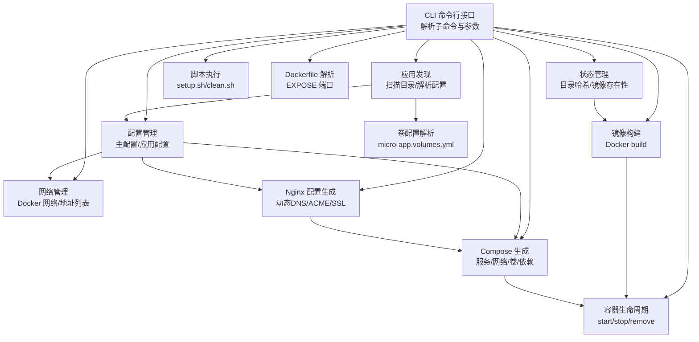

图表来源
- [src/cli.rs:71-116](file://src/cli.rs#L71-L116)
- [src/discovery.rs:224-352](file://src/discovery.rs#L224-L352)
- [src/config.rs:125-164](file://src/config.rs#L125-L164)
- [src/state.rs:40-186](file://src/state.rs#L40-L186)
- [src/network.rs:8-47](file://src/network.rs#L8-L47)
- [src/nginx.rs:26-92](file://src/nginx.rs#L26-L92)
- [src/compose.rs:31-119](file://src/compose.rs#L31-L119)
- [src/builder.rs:20-120](file://src/builder.rs#L20-L120)
- [src/container.rs:9-77](file://src/container.rs#L9-L77)
- [src/script.rs:9-62](file://src/script.rs#L9-L62)
- [src/dockerfile.rs:23-67](file://src/dockerfile.rs#L23-L67)
- [src/volumes_config.rs:55-82](file://src/volumes_config.rs#L55-L82)

章节来源
- [src/lib.rs:6-25](file://src/lib.rs#L6-L25)
- [src/main.rs:3-24](file://src/main.rs#L3-L24)
- [README.md:33-47](file://README.md#L33-L47)

## 核心组件
- 自动发现微应用：扫描配置的目录，发现包含 micro-app.yml 与 Dockerfile 的微应用，生成唯一名称并校验重复。
- Docker 镜像构建：基于 Dockerfile 与 .env 构建镜像，支持禁用缓存与构建参数注入。
- 容器生命周期管理：封装 create/start/stop/remove/状态查询，支持依赖关系与健康检查。
- Nginx 反向代理：生成统一入口的 nginx.conf，支持 HTTP/HTTPS、ACME 验证、动态 DNS 解析、location 排序与静态/API 适配。
- Docker Compose 集成：生成 docker-compose.yml，包含网络（外部）、服务、卷、环境变量、健康检查与依赖。
- 状态管理：基于目录哈希判断是否需要重新构建，记录镜像存在性，提升增量效率。
- 网络管理：统一 Docker 网络，生成网络地址列表，支持 Internal 类型内部服务。
- 脚本支持：支持预构建与清理脚本，增强构建前准备与环境清理。
- 网络地址列表：生成可读的网络地址清单，便于调试与微服务间通信。
- 内部服务支持：Internal 类型应用不参与 Nginx 代理，仅参与网络互通。
- SSL 证书支持：检测证书与密钥存在，自动生成 HTTPS 块与 ACME 验证。
- Volumes 映射支持：解析 micro-app.volumes.yml，生成 Docker Compose volumes 与权限初始化脚本。

章节来源
- [src/discovery.rs:224-352](file://src/discovery.rs#L224-L352)
- [src/builder.rs:20-120](file://src/builder.rs#L20-L120)
- [src/container.rs:9-77](file://src/container.rs#L9-L77)
- [src/nginx.rs:26-92](file://src/nginx.rs#L26-L92)
- [src/compose.rs:31-119](file://src/compose.rs#L31-L119)
- [src/state.rs:40-186](file://src/state.rs#L40-L186)
- [src/network.rs:8-47](file://src/network.rs#L8-L47)
- [src/script.rs:9-62](file://src/script.rs#L9-L62)
- [src/volumes_config.rs:55-82](file://src/volumes_config.rs#L55-L82)

## 架构总览
下面的序列图展示了“启动”流程的关键调用链：从 CLI 解析到应用发现、配置生成、Nginx/Compose 生成、镜像构建、容器编排与网络地址输出。

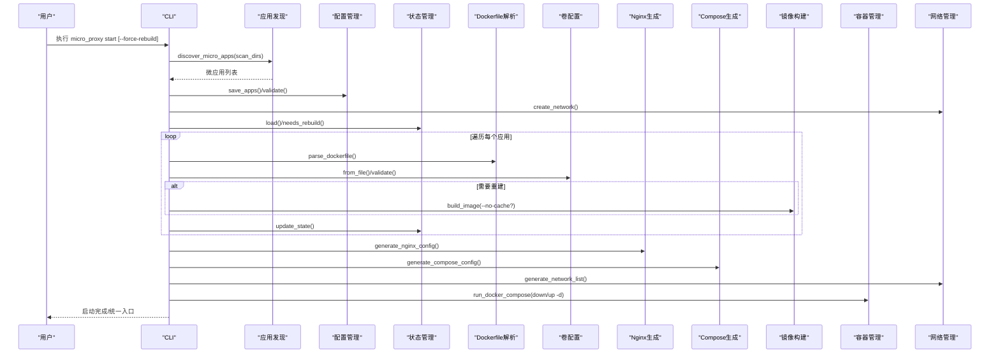

图表来源
- [src/cli.rs:296-463](file://src/cli.rs#L296-L463)
- [src/discovery.rs:224-352](file://src/discovery.rs#L224-L352)
- [src/config.rs:178-219](file://src/config.rs#L178-L219)
- [src/state.rs:62-143](file://src/state.rs#L62-L143)
- [src/dockerfile.rs:23-67](file://src/dockerfile.rs#L23-L67)
- [src/volumes_config.rs:55-82](file://src/volumes_config.rs#L55-L82)
- [src/nginx.rs:26-92](file://src/nginx.rs#L26-L92)
- [src/compose.rs:31-119](file://src/compose.rs#L31-L119)
- [src/network.rs:209-274](file://src/network.rs#L209-L274)
- [src/container.rs:113-176](file://src/container.rs#L113-L176)

章节来源
- [src/cli.rs:71-116](file://src/cli.rs#L71-L116)

## 详细组件分析

### 自动发现微应用
- 扫描策略：遍历 scan_dirs，仅接受同时包含 micro-app.yml 与 Dockerfile 的目录；生成唯一名称（基于相对路径），避免重复。
- 验证规则：应用名称全局唯一；Static/API 类型必须包含 routes；Internal 类型必须提供 path，且该路径存在 Dockerfile。
- 转换为 AppConfig：将 MicroApp 转换为 AppConfig，填充 docker_volumes 与 run_as_user。

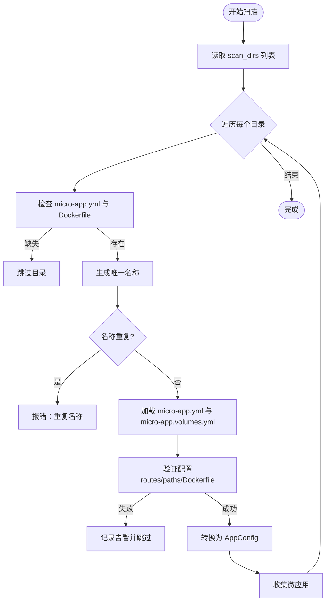

图表来源
- [src/discovery.rs:224-352](file://src/discovery.rs#L224-L352)
- [src/config.rs:23-68](file://src/config.rs#L23-L68)

章节来源
- [src/discovery.rs:224-352](file://src/discovery.rs#L224-L352)
- [src/config.rs:23-68](file://src/config.rs#L23-L68)

### Docker 镜像构建
- 构建流程：检查 Dockerfile 与构建上下文，解析 .env 为构建参数，支持 --no-cache。
- 缓存策略：结合状态管理的目录哈希，避免不必要的重建。
- 辅助能力：镜像存在性检查与删除。

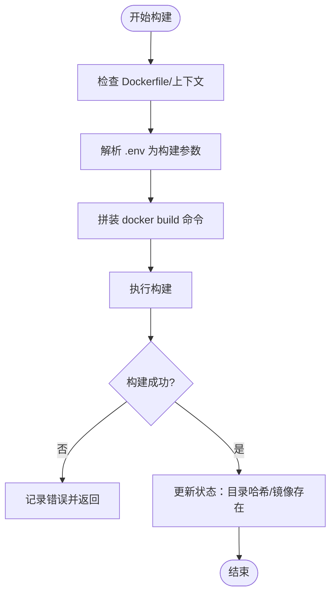

图表来源
- [src/builder.rs:20-120](file://src/builder.rs#L20-L120)
- [src/state.rs:162-177](file://src/state.rs#L162-L177)

章节来源
- [src/builder.rs:20-120](file://src/builder.rs#L20-L120)
- [src/state.rs:162-177](file://src/state.rs#L162-L177)

### 容器生命周期管理
- 能力范围：创建、启动、停止、删除、状态查询、运行中判断。
- 依赖关系：通过 docker-compose 的 depends_on 实现服务启动顺序（仅对非 Internal 类型应用生效）。

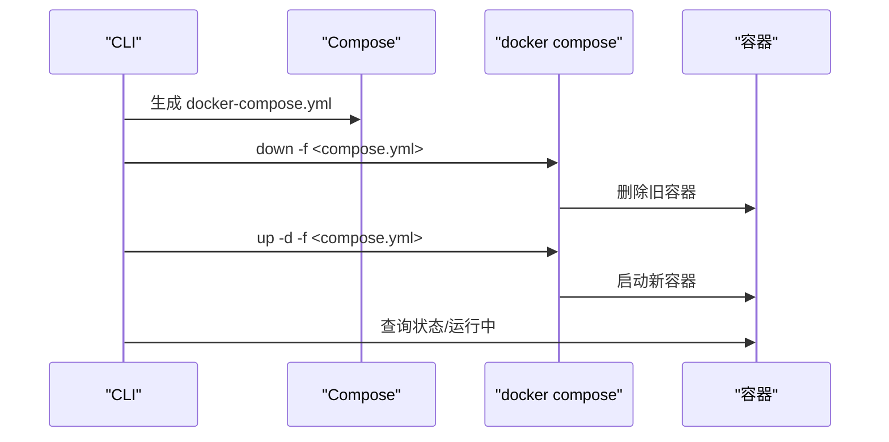

图表来源
- [src/cli.rs:448-458](file://src/cli.rs#L448-L458)
- [src/compose.rs:426-448](file://src/compose.rs#L426-L448)

章节来源
- [src/container.rs:9-77](file://src/container.rs#L9-L77)
- [src/cli.rs:448-458](file://src/cli.rs#L448-L458)

### Nginx 反向代理配置
- 动态 DNS：使用 Docker 内部 DNS（127.0.0.11）与 resolver，支持动态解析容器名称。
- ACME 验证：HTTP 场景下提供 /.well-known/acme-challenge/ 路由；HTTPS 场景由 HTTP server 块重定向至 HTTPS。
- 路由排序：location 按路径长度降序，保证具体路径优先。
- 静态/API 适配：静态应用支持子路径 rewrite；API 应用透传完整 URI。
- SSL 支持：检测证书与密钥，自动生成 HTTPS 块与证书路径。

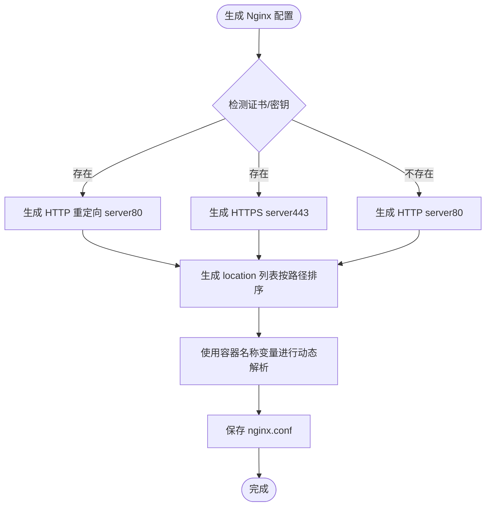

图表来源
- [src/nginx.rs:26-92](file://src/nginx.rs#L26-L92)
- [src/nginx.rs:284-416](file://src/nginx.rs#L284-L416)

章节来源
- [src/nginx.rs:26-92](file://src/nginx.rs#L26-L92)
- [src/nginx.rs:284-416](file://src/nginx.rs#L284-L416)

### Docker Compose 集成
- 网络：外部网络（external=true），名称固定，避免 docker-compose 默认项目前缀。
- 服务：nginx 服务依赖非 Internal 类型应用；各应用服务包含 env_file、user、volumes、healthcheck。
- 端口映射：HTTP 80；HTTPS 443（若启用）。
- 证书与 Web 根：挂载 web_root 与 cert_dir。

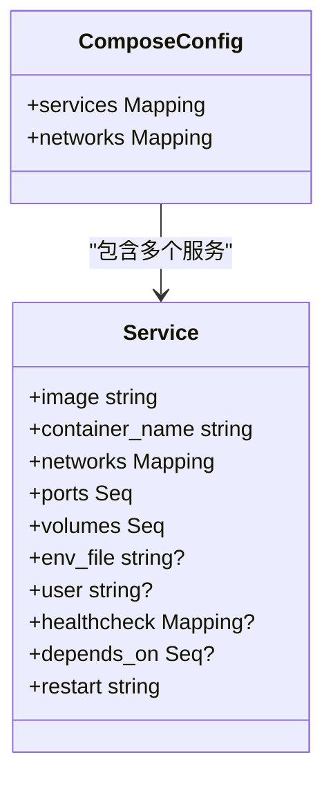

图表来源
- [src/compose.rs:11-16](file://src/compose.rs#L11-L16)
- [src/compose.rs:172-266](file://src/compose.rs#L172-L266)
- [src/compose.rs:277-424](file://src/compose.rs#L277-L424)

章节来源
- [src/compose.rs:31-119](file://src/compose.rs#L31-L119)
- [src/compose.rs:172-266](file://src/compose.rs#L172-L266)
- [src/compose.rs:277-424](file://src/compose.rs#L277-L424)

### 状态管理
- 目录哈希：walkdir 遍历目录（排除 .git），对文件内容进行 SHA-256，作为变更依据。
- 状态字段：应用名、目录哈希、最后构建时间、镜像是否存在。
- 增量策略：needs_rebuild 比较哈希决定是否重建。

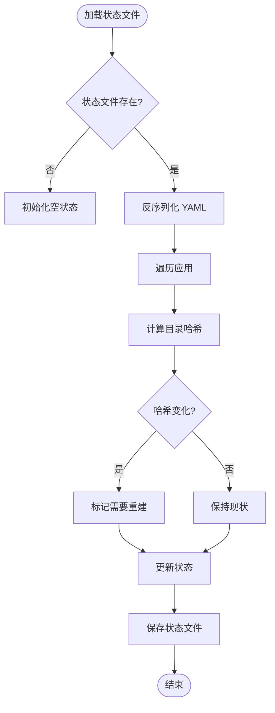

图表来源
- [src/state.rs:62-113](file://src/state.rs#L62-L113)
- [src/state.rs:162-177](file://src/state.rs#L162-L177)
- [src/state.rs:195-233](file://src/state.rs#L195-L233)

章节来源
- [src/state.rs:40-186](file://src/state.rs#L40-L186)
- [src/state.rs:195-233](file://src/state.rs#L195-L233)

### 网络管理与网络地址列表
- Docker 网络：创建/删除外部网络；存在性检查。
- 地址信息：生成 NetworkAddressInfo，包含应用名、容器名、网络地址（容器名）、容器端口、可访问 URL（Internal 类型为空）。
- 地址列表：生成可读文本，包含微应用间通信示例。

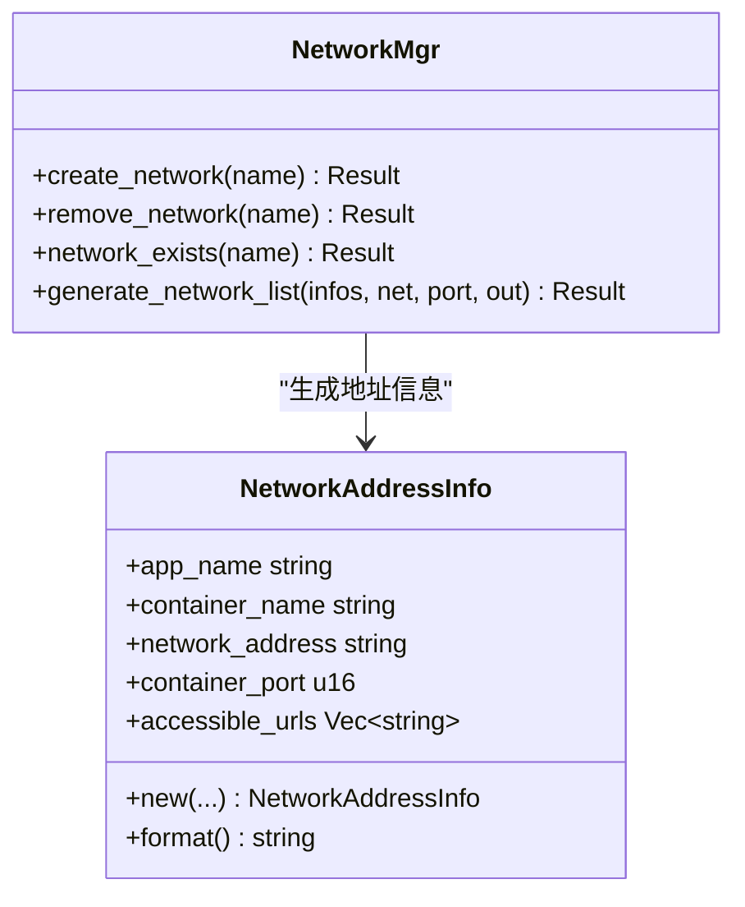

图表来源
- [src/network.rs:121-207](file://src/network.rs#L121-L207)
- [src/network.rs:209-274](file://src/network.rs#L209-L274)

章节来源
- [src/network.rs:8-47](file://src/network.rs#L8-L47)
- [src/network.rs:121-207](file://src/network.rs#L121-L207)
- [src/network.rs:209-274](file://src/network.rs#L209-L274)

### 脚本支持
- setup.sh：构建前执行，用于准备构建环境。
- clean.sh：清理阶段执行，用于回收资源。
- 执行方式：bash 脚本，工作目录为微应用目录。

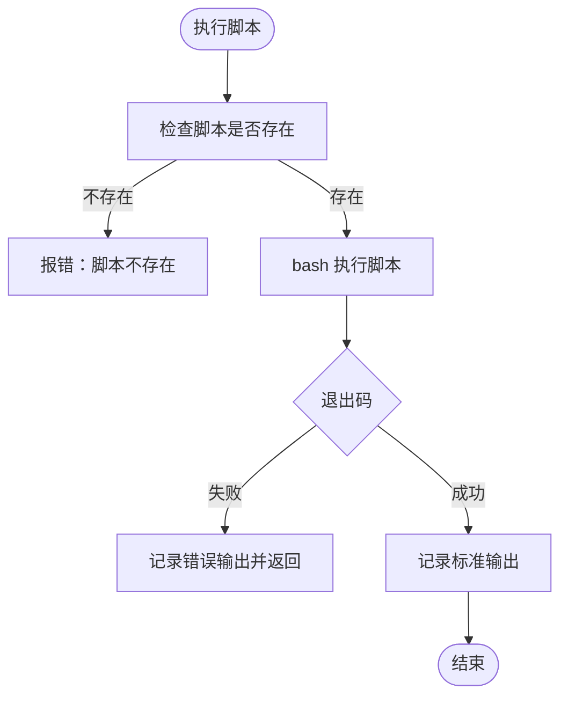

图表来源
- [src/script.rs:9-62](file://src/script.rs#L9-L62)

章节来源
- [src/script.rs:9-62](file://src/script.rs#L9-L62)

### Volumes 映射支持
- 配置文件：micro-app.volumes.yml，支持 volumes 列表与 run_as_user。
- 校验规则：source/target 非空；权限 uid/gid 合法；root 权限给出安全告警。
- 转换：生成 Docker Compose volumes 字符串；可生成权限初始化脚本（chown）。

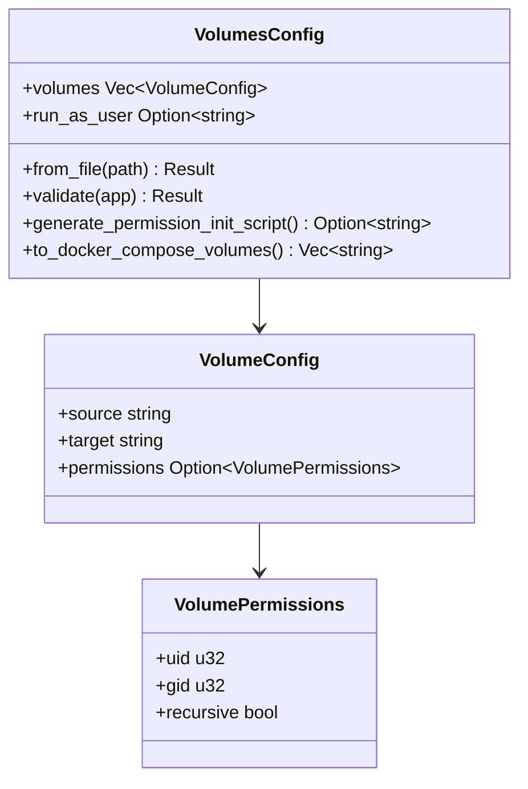

图表来源
- [src/volumes_config.rs:43-53](file://src/volumes_config.rs#L43-L53)
- [src/volumes_config.rs:29-41](file://src/volumes_config.rs#L29-L41)
- [src/volumes_config.rs:10-22](file://src/volumes_config.rs#L10-L22)

章节来源
- [src/volumes_config.rs:55-82](file://src/volumes_config.rs#L55-L82)
- [src/volumes_config.rs:198-205](file://src/volumes_config.rs#L198-L205)

### Dockerfile 解析
- 能力：解析 EXPOSE 指令，提取暴露端口列表。
- 用途：辅助健康检查与端口映射策略。

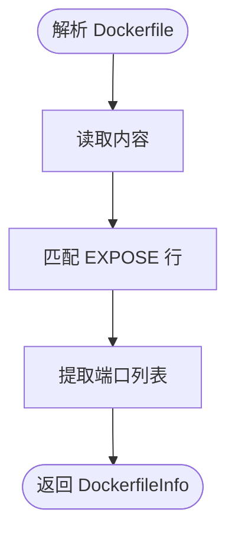

图表来源
- [src/dockerfile.rs:23-67](file://src/dockerfile.rs#L23-L67)

章节来源
- [src/dockerfile.rs:23-67](file://src/dockerfile.rs#L23-L67)

## 依赖关系分析
- 模块耦合：CLI 作为编排者，协调 discovery/config/state/network/nginx/compose/builder/container/script/dockerfile/volumes_config。
- 外部依赖：Docker、docker compose、Nginx 配置文件与证书目录。
- 关键接口契约：
  - AppConfig/AppType 作为核心数据模型贯穿 Nginx/Compose/Container。
  - 外部网络 external=true 的约定，确保跨进程复用网络。
  - Internal 类型不生成 Nginx location，但参与网络互通。

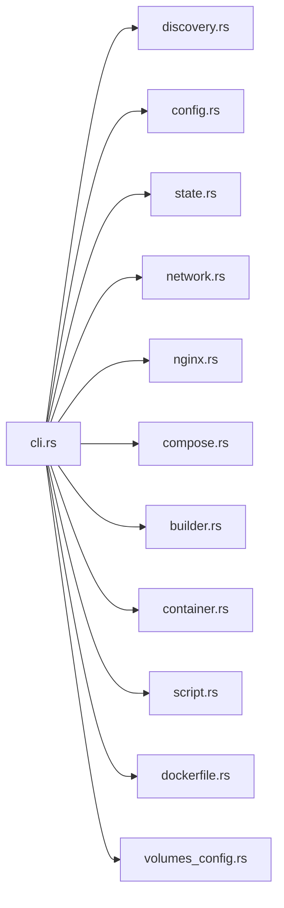

图表来源
- [src/cli.rs:6-18](file://src/cli.rs#L6-L18)
- [src/lib.rs:6-25](file://src/lib.rs#L6-L25)

章节来源
- [src/lib.rs:6-25](file://src/lib.rs#L6-L25)
- [src/cli.rs:6-18](file://src/cli.rs#L6-L18)

## 性能考虑
- 增量构建：基于目录哈希判断是否需要重建，减少不必要的 docker build。
- 端口与 DNS：使用 Docker 内部 DNS 与固定容器端口（80/443），降低解析与映射开销。
- Compose 依赖：仅对非 Internal 类型应用建立依赖，缩短启动时间。
- 健康检查：Static/API 类型自动添加健康检查，提升容器可用性与编排稳定性。

## 故障排查指南
- 日志定位：使用 -v 查看详细日志，关注 CLI、Nginx、Compose、Builder、Container 各模块输出。
- 网络连通：使用 network 命令生成网络地址列表，核对容器名称、端口与可访问 URL。
- 端口冲突：检查宿主机端口占用，调整 nginx_host_port。
- Volumes 挂载：确认宿主机路径存在、权限正确，容器内挂载点可见。
- SSL 证书：确认证书与密钥文件存在，Nginx 配置语法正确，必要时使用 docker exec proxy-nginx nginx -t 检查。
- 容器状态：使用 status 命令或 docker ps -a 检查容器运行状态与日志。

章节来源
- [README.md:328-420](file://README.md#L328-L420)

## 结论
micro_proxy 通过“自动发现 + 镜像构建 + Nginx 代理 + Compose 编排 + 网络管理 + 状态跟踪”的组合拳，实现了微应用在本地/开发环境的一站式管理。其模块化设计与清晰的数据流（AppConfig/AppType）使得功能扩展与维护具备良好可塑性。对于不同技术背景的用户，既能通过简单命令快速上手，也能深入理解各模块实现细节以满足定制化需求。

## 附录
- 使用示例与配置要点可参考 README 的“功能特性”“命令说明”“配置说明”“SSL 证书配置（可选）”等章节。

章节来源
- [README.md:33-47](file://README.md#L33-L47)
- [README.md:113-163](file://README.md#L113-L163)
- [README.md:164-236](file://README.md#L164-L236)
- [README.md:237-276](file://README.md#L237-L276)
- [README.md:277-290](file://README.md#L277-L290)
- [README.md:291-299](file://README.md#L291-L299)