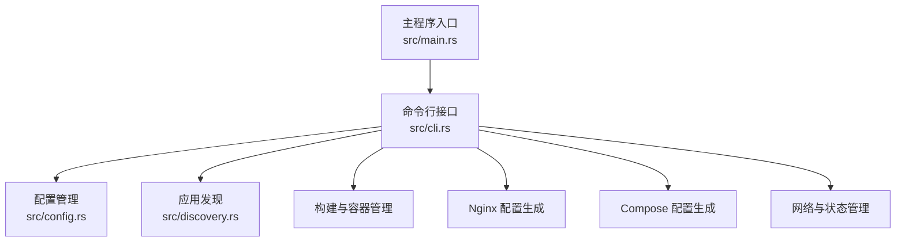
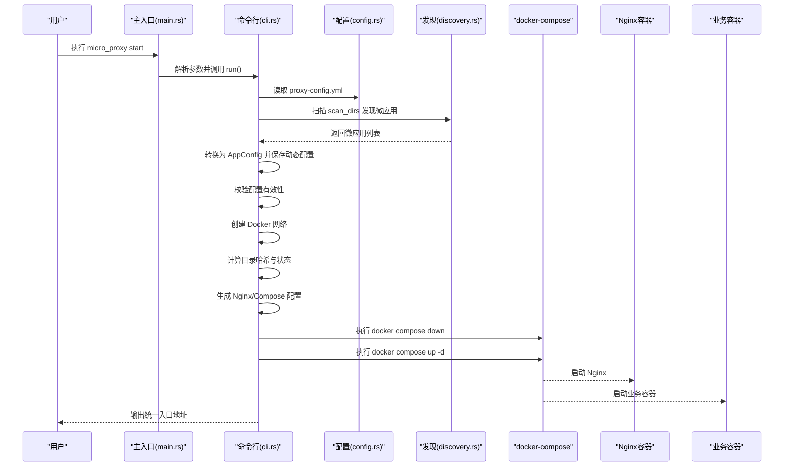
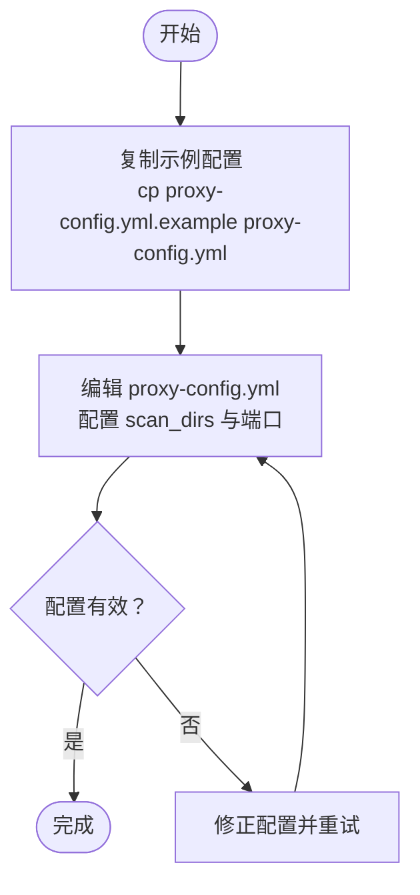
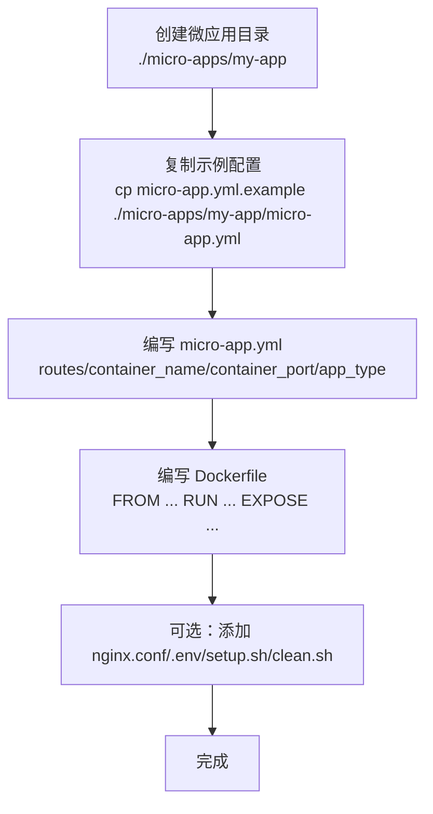
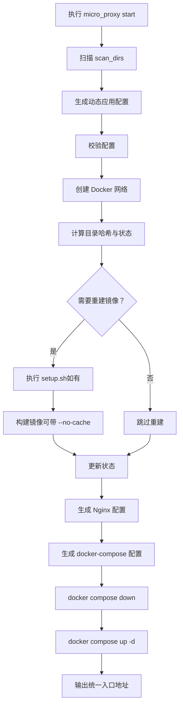
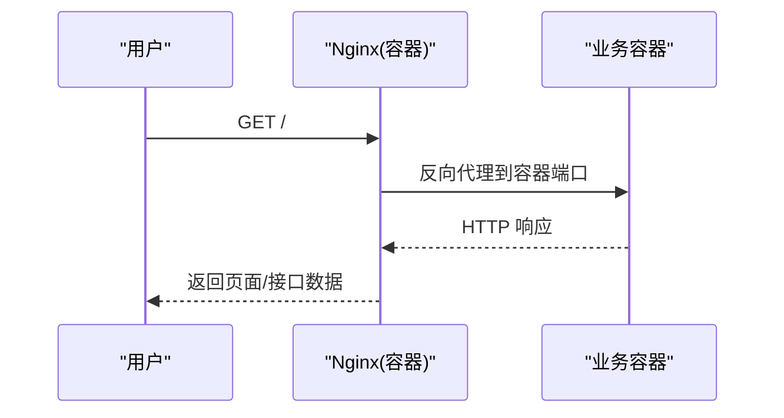
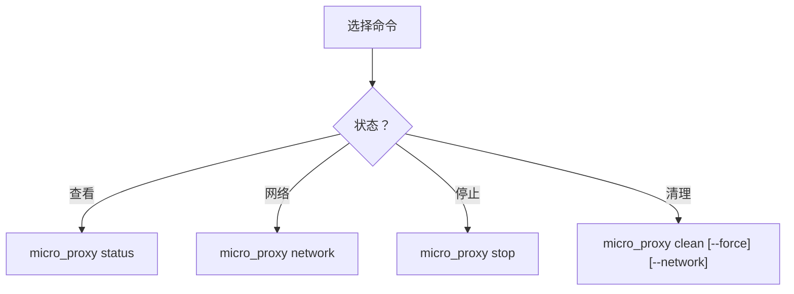
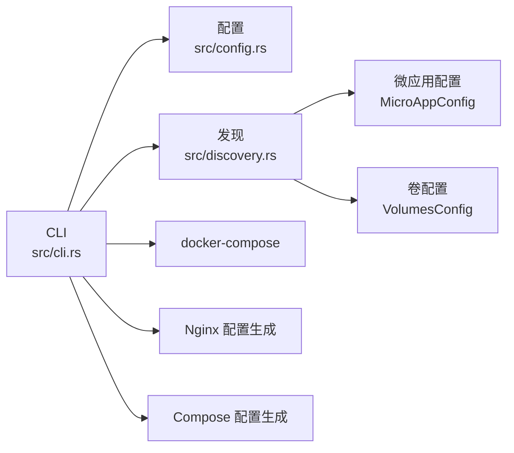

# 快速开始

<cite>
**本文引用的文件**   
- [README.md](file://README.md)
- [proxy-config.yml.example](file://proxy-config.yml.example)
- [src/main.rs](file://src/main.rs)
- [src/lib.rs](file://src/lib.rs)
- [src/cli.rs](file://src/cli.rs)
- [src/config.rs](file://src/config.rs)
- [src/discovery.rs](file://src/discovery.rs)
- [Cargo.toml](file://Cargo.toml)
</cite>

## 目录
1. [简介](#简介)
2. [项目结构](#项目结构)
3. [核心组件](#核心组件)
4. [架构总览](#架构总览)
5. [详细组件分析](#详细组件分析)
6. [依赖关系分析](#依赖关系分析)
7. [性能考虑](#性能考虑)
8. [故障排查指南](#故障排查指南)
9. [结论](#结论)
10. [附录](#附录)

## 简介
本教程面向初学者，帮助你在 5 分钟内从零开始运行第一个微应用。你将完成以下关键步骤：
- 准备主配置文件
- 创建微应用目录与配置
- 启动微应用并生成 Nginx/Docker Compose 配置
- 访问统一入口，验证服务正常运行
- 了解常见问题的预防与解决方法

本教程严格依据仓库中的官方文档与源码实现，确保每一步都可复现。

## 项目结构
micro_proxy 是一个 Rust 工具，负责：
- 自动发现微应用（扫描包含 micro-app.yml 与 Dockerfile 的目录）
- 构建镜像、管理容器生命周期
- 生成 Nginx 反向代理与 docker-compose 配置
- 统一网络管理与状态追踪

**图示来源**
- [src/main.rs:1-25](file://src/main.rs#L1-L25)
- [src/cli.rs:1-120](file://src/cli.rs#L1-L120)
- [src/config.rs:125-164](file://src/config.rs#L125-L164)
- [src/discovery.rs:224-352](file://src/discovery.rs#L224-L352)

**章节来源**
- [README.md:421-441](file://README.md#L421-L441)
- [Cargo.toml:1-55](file://Cargo.toml#L1-L55)

## 核心组件
- 主入口：解析命令行参数并调用 CLI 执行器
- CLI：定义 start/stop/clean/status/network 等子命令
- 配置管理：读取主配置与动态生成的应用配置
- 应用发现：扫描目录，收集微应用元信息
- 构建与容器：镜像构建、状态管理、docker-compose 控制
- Nginx/Compose：生成统一入口与编排配置
- 网络与状态：统一 Docker 网络与目录哈希状态

**章节来源**
- [src/main.rs:6-24](file://src/main.rs#L6-L24)
- [src/cli.rs:21-116](file://src/cli.rs#L21-L116)
- [src/config.rs:125-367](file://src/config.rs#L125-L367)
- [src/discovery.rs:12-145](file://src/discovery.rs#L12-L145)

## 架构总览
下面的时序图展示了“启动微应用”的完整流程，从命令行到容器运行的全过程。

**图示来源**
- [src/main.rs:6-24](file://src/main.rs#L6-L24)
- [src/cli.rs:78-463](file://src/cli.rs#L78-L463)
- [src/config.rs:178-347](file://src/config.rs#L178-L347)
- [src/discovery.rs:235-352](file://src/discovery.rs#L235-L352)

## 详细组件分析

### 步骤一：准备主配置文件
- 复制示例配置文件为运行配置
- 关键字段说明
  - scan_dirs：扫描目录列表，用于自动发现微应用
  - apps_config_path：动态生成的应用配置保存路径
  - nginx_config_path/compose_config_path/state_file_path/network_list_path：生成文件路径
  - network_name：统一 Docker 网络名称
  - nginx_host_port：宿主机统一入口端口（默认 80）
  - web_root/cert_dir/domain：HTTPS 证书相关（可选）

**图示来源**
- [README.md:70-112](file://README.md#L70-L112)
- [proxy-config.yml.example:1-53](file://proxy-config.yml.example#L1-L53)

**章节来源**
- [README.md:70-112](file://README.md#L70-L112)
- [proxy-config.yml.example:5-31](file://proxy-config.yml.example#L5-L31)

### 步骤二：准备微应用
- 在每个微应用目录下创建 micro-app.yml
- 目录结构建议
  - micro-app.yml：微应用配置（必填）
  - Dockerfile：镜像构建（必填）
  - nginx.conf（SPA 应用可选）
  - setup.sh/clean.sh/.env（可选）
  - src/：源代码目录

**图示来源**
- [README.md:80-87](file://README.md#L80-L87)
- [README.md:314-326](file://README.md#L314-L326)

**章节来源**
- [README.md:80-87](file://README.md#L80-L87)
- [README.md:314-326](file://README.md#L314-L326)

### 步骤三：启动微应用
- 基本启动
  - micro_proxy start
  - 详细日志：micro_proxy start -v
  - 强制重建：micro_proxy start --force-rebuild
- 启动流程要点
  - 扫描 scan_dirs，发现包含 micro-app.yml 与 Dockerfile 的目录
  - 生成动态应用配置并校验
  - 创建统一 Docker 网络
  - 计算目录哈希决定是否重建镜像
  - 生成 Nginx 与 docker-compose 配置
  - down 再 up，确保使用最新配置
  - 输出统一入口地址（默认 http://localhost:80）

**图示来源**
- [src/cli.rs:296-463](file://src/cli.rs#L296-L463)
- [src/discovery.rs:235-352](file://src/discovery.rs#L235-L352)
- [src/config.rs:220-347](file://src/config.rs#L220-L347)

**章节来源**
- [README.md:88-99](file://README.md#L88-L99)
- [src/cli.rs:296-463](file://src/cli.rs#L296-L463)

### 步骤四：访问应用
- 默认统一入口：http://localhost:80
- 可在 proxy-config.yml 中修改 nginx_host_port
- curl 验证
  - curl http://localhost/
  - curl http://localhost/api

**图示来源**
- [README.md:101-111](file://README.md#L101-L111)
- [src/cli.rs:454-462](file://src/cli.rs#L454-L462)

**章节来源**
- [README.md:101-111](file://README.md#L101-L111)

### 步骤五：常用命令与状态查看
- 查看状态：micro_proxy status
- 查看网络地址：micro_proxy network
- 停止：micro_proxy stop
- 清理：micro_proxy clean（可选 --force 与 --network）

**图示来源**
- [src/cli.rs:465-584](file://src/cli.rs#L465-L584)

**章节来源**
- [src/cli.rs:465-584](file://src/cli.rs#L465-L584)

## 依赖关系分析
- CLI 依赖配置模块与发现模块
- 发现模块依赖微应用配置与卷配置
- 构建与容器管理依赖 docker-compose 命令
- Nginx/Compose 生成依赖统一网络与端口配置

**图示来源**
- [src/cli.rs:6-19](file://src/cli.rs#L6-L19)
- [src/config.rs:68-123](file://src/config.rs#L68-L123)
- [src/discovery.rs:6-38](file://src/discovery.rs#L6-L38)

**章节来源**
- [src/lib.rs:6-18](file://src/lib.rs#L6-L18)
- [Cargo.toml:13-52](file://Cargo.toml#L13-L52)

## 性能考虑
- 状态文件与目录哈希：避免不必要的镜像重建，提升启动速度
- 统一网络：减少跨网络通信延迟
- 端口映射：固定容器内部端口，简化配置与排查
- 日志级别：使用 -v 查看详细日志，便于定位性能瓶颈

[本节为通用指导，无需特定文件引用]

## 故障排查指南
- 端口冲突
  - 检查宿主机端口占用：sudo lsof -i :80
  - 修改 nginx_host_port 后重启
- 容器状态
  - 使用 micro_proxy status 查看容器与镜像状态
  - docker ps -a 验证
- 网络地址
  - micro_proxy network 生成并查看 network-addresses.txt
- 日志
  - micro_proxy start -v 查看详细日志
  - docker logs <container-name> 查看容器日志
- 证书（HTTPS）
  - 确认 web_root/cert_dir/domain 配置
  - 使用 acme.sh 申请并部署证书后重启

**章节来源**
- [README.md:330-420](file://README.md#L330-L420)

## 结论
通过以上五个步骤，你可以在 5 分钟内完成从配置到访问的全流程。建议在正式环境中：
- 使用稳定的 scan_dirs 结构
- 为每个微应用提供完整的 micro-app.yml 与 Dockerfile
- 启用状态文件与统一网络，提升可维护性
- 遇到问题时结合日志与网络地址列表进行排查

[本节为总结，无需特定文件引用]

## 附录

### A. 命令速查
- 启动：micro_proxy start [-v] [--force-rebuild]
- 停止：micro_proxy stop
- 清理：micro_proxy clean [--force] [--network]
- 状态：micro_proxy status
- 网络：micro_proxy network [-o 输出路径]

**章节来源**
- [README.md:113-163](file://README.md#L113-L163)

### B. 配置文件示例（主配置）
- 位置：proxy-config.yml
- 关键字段：scan_dirs、nginx_host_port、network_name、web_root、cert_dir、domain 等

**章节来源**
- [proxy-config.yml.example:5-53](file://proxy-config.yml.example#L5-L53)

### C. 微应用配置示例（微应用配置）
- 位置：./micro-apps/<app>/micro-app.yml
- 关键字段：routes、container_name、container_port、app_type、docker_volumes、nginx_extra_config 等

**章节来源**
- [README.md:205-235](file://README.md#L205-L235)