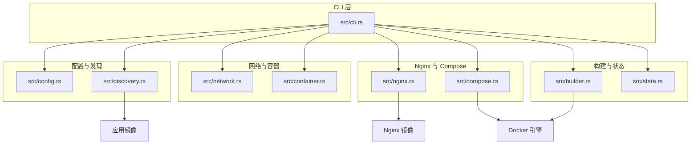
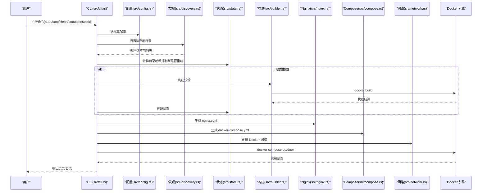
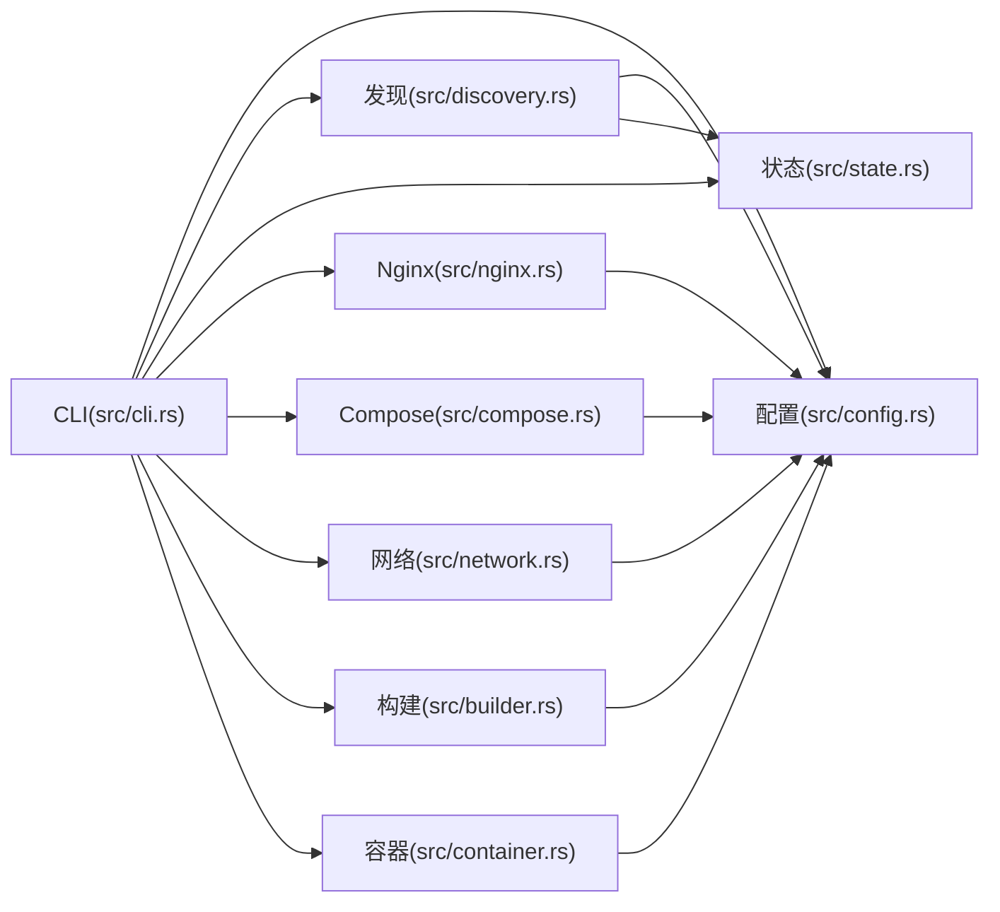

# 技术栈

<cite>
**本文引用的文件**
- [Cargo.toml](file://Cargo.toml)
- [src/main.rs](file://src/main.rs)
- [src/lib.rs](file://src/lib.rs)
- [src/cli.rs](file://src/cli.rs)
- [src/config.rs](file://src/config.rs)
- [src/discovery.rs](file://src/discovery.rs)
- [src/dockerfile.rs](file://src/dockerfile.rs)
- [src/nginx.rs](file://src/nginx.rs)
- [src/compose.rs](file://src/compose.rs)
- [src/state.rs](file://src/state.rs)
- [src/builder.rs](file://src/builder.rs)
- [src/network.rs](file://src/network.rs)
- [src/container.rs](file://src/container.rs)
- [README.md](file://README.md)
- [README.en.md](file://README.en.md)
</cite>

## 目录
1. [引言](#引言)
2. [项目结构](#项目结构)
3. [核心组件](#核心组件)
4. [架构总览](#架构总览)
5. [详细组件分析](#详细组件分析)
6. [依赖关系分析](#依赖关系分析)
7. [性能考虑](#性能考虑)
8. [故障排查指南](#故障排查指南)
9. [结论](#结论)
10. [附录](#附录)

## 引言
本文件系统性梳理 micro_proxy 的技术栈与实现要点，围绕 Rust 语言特性（内存安全、高性能）、Docker 生态系统（容器化、镜像管理）、Nginx 反向代理、Docker Compose 容器编排等核心技术展开，解释技术选型原因、在项目中的具体应用、版本要求与兼容性信息，并介绍相关第三方库与工具（Serde、Clap、Tokio 等）。文档既面向开发者提供技术背景与实现细节，也面向用户说明技术带来的价值与使用建议。

## 项目结构
micro_proxy 采用模块化设计，核心模块职责清晰：
- CLI 层：命令行解析与流程编排
- 配置层：主配置与应用配置的解析与校验
- 发现层：扫描微应用目录，收集微应用元信息
- 构建层：调用 Docker 构建镜像
- 网络层：管理 Docker 网络与网络地址清单
- Nginx 层：生成 Nginx 配置与证书集成
- Compose 层：生成 docker-compose.yml 并驱动容器编排
- 状态层：基于目录哈希的状态管理，避免不必要的重建
- 容器层：容器生命周期管理（启动、停止、清理）

图表来源
- [src/cli.rs](file://src/cli.rs)
- [src/config.rs](file://src/config.rs)
- [src/discovery.rs](file://src/discovery.rs)
- [src/builder.rs](file://src/builder.rs)
- [src/state.rs](file://src/state.rs)
- [src/network.rs](file://src/network.rs)
- [src/container.rs](file://src/container.rs)
- [src/nginx.rs](file://src/nginx.rs)
- [src/compose.rs](file://src/compose.rs)

章节来源
- [src/lib.rs](file://src/lib.rs)
- [README.md](file://README.md)

## 核心组件
- Rust 语言与生态
  - 使用 Rust 提供内存安全与高性能，适合 CLI 工具与系统级任务。
  - 关键依赖：Serde（序列化/反序列化）、Clap（命令行解析）、Tokio（异步运行时）、log/dumbo_log（日志）、chrono（时间处理）、walkdir（目录遍历）、sha2（哈希）、regex（正则）、fs_extra/pathdiff（文件系统与路径）。
- Docker 生态
  - 通过 docker 命令行与 docker-compose 驱动镜像构建、容器生命周期管理与网络编排。
- Nginx 反向代理
  - 自动生成 nginx.conf，支持 HTTP/HTTPS、ACME 验证、动态 DNS 解析与路由规则。
- Docker Compose
  - 自动生成 docker-compose.yml，统一管理网络、端口映射、卷挂载与服务依赖。

章节来源
- [Cargo.toml](file://Cargo.toml)
- [src/main.rs](file://src/main.rs)
- [src/cli.rs](file://src/cli.rs)
- [src/config.rs](file://src/config.rs)
- [src/nginx.rs](file://src/nginx.rs)
- [src/compose.rs](file://src/compose.rs)
- [src/builder.rs](file://src/builder.rs)
- [src/network.rs](file://src/network.rs)

## 架构总览
整体流程：CLI 接收命令，解析配置，扫描微应用，生成 Nginx 与 Compose 配置，创建 Docker 网络，必要时构建镜像，最后通过 docker-compose 启动服务。状态管理模块基于目录哈希决定是否重建，避免重复构建。

图表来源
- [src/cli.rs](file://src/cli.rs)
- [src/config.rs](file://src/config.rs)
- [src/discovery.rs](file://src/discovery.rs)
- [src/state.rs](file://src/state.rs)
- [src/builder.rs](file://src/builder.rs)
- [src/nginx.rs](file://src/nginx.rs)
- [src/compose.rs](file://src/compose.rs)
- [src/network.rs](file://src/network.rs)

## 详细组件分析

### CLI 与命令行接口
- 使用 Clap 提供命令解析与帮助信息；支持 start/stop/clean/status/network 子命令及常用选项（配置文件路径、详细日志、强制重建等）。
- 在启动流程中，优先尝试 docker compose（新版），失败回退 docker-compose（旧版），提升兼容性。
- 生成动态应用配置、网络地址清单，调用构建、Nginx 与 Compose 模块，并最终通过 docker-compose 启动/停止/清理。

章节来源
- [src/cli.rs](file://src/cli.rs)
- [src/main.rs](file://src/main.rs)

### 配置管理
- 主配置 ProxyConfig：扫描目录、输出路径、网络名称、端口、Web 根目录、证书目录、域名等。
- 应用配置 AppConfig：名称、路由、容器名、容器端口、应用类型（Static/Api/Internal）、描述、Nginx 额外配置、卷映射、运行用户等。
- 校验逻辑：确保扫描目录非空、应用名称唯一、Static/Api 路由非空、Internal 路径存在且包含 Dockerfile、路由与类型一致性等。

章节来源
- [src/config.rs](file://src/config.rs)
- [README.md](file://README.md)

### 应用发现与转换
- 通过扫描 scan_dirs 下的一级目录，要求同时包含 micro-app.yml 与 Dockerfile 才视为有效微应用。
- 生成唯一应用名（基于相对路径），避免重名；校验容器名唯一。
- 将 MicroApp 转换为 AppConfig，注入卷配置与运行用户信息。

章节来源
- [src/discovery.rs](file://src/discovery.rs)
- [README.md](file://README.md)

### Dockerfile 解析
- 解析 Dockerfile 中的 EXPOSE 指令，提取暴露端口，用于后续健康检查与端口映射参考。
- 支持大小写不敏感匹配与空白分隔多端口。

章节来源
- [src/dockerfile.rs](file://src/dockerfile.rs)

### 镜像构建
- 调用 docker build 构建镜像，支持禁用缓存（强制重建）、从 .env 注入构建参数。
- 提供镜像存在性检查与删除能力。

章节来源
- [src/builder.rs](file://src/builder.rs)

### 状态管理与增量构建
- 基于目录哈希判断是否需要重建，避免重复构建。
- 状态文件保存应用名、目录哈希、最后构建时间与镜像存在性。

章节来源
- [src/state.rs](file://src/state.rs)

### 网络管理与地址清单
- 创建/删除 Docker 网络，确保跨服务通信。
- 生成网络地址清单文件，包含应用名称、容器名、网络地址、容器端口与可访问 URL（Internal 类型无外部访问 URL）。

章节来源
- [src/network.rs](file://src/network.rs)

### Nginx 配置生成
- 支持 HTTP/HTTPS 自动切换：检测证书存在则启用 HTTPS，否则仅 HTTP。
- 生成 server 块与 location 规则，支持静态站点与 API 两类路由；内部服务（Internal）不生成 Nginx 配置。
- 使用 Docker 内部 DNS（127.0.0.11）进行动态解析，避免服务不可用导致 Nginx 启动失败。
- 支持 ACME 验证路径（/.well-known/acme-challenge/）与证书挂载。

章节来源
- [src/nginx.rs](file://src/nginx.rs)

### Docker Compose 生成
- 生成包含网络（外部已存在）、服务（Nginx 与各应用）、端口映射（HTTP/HTTPS）、卷挂载（nginx.conf/web_root/cert_dir）与健康检查的 compose 配置。
- Nginx 仅依赖非 Internal 类型的应用，Internal 服务不参与 Nginx 依赖链。

章节来源
- [src/compose.rs](file://src/compose.rs)

### 容器生命周期管理
- 提供容器创建、启动、停止、删除、状态查询与运行状态判断。
- 与 docker-compose 集成，统一管理容器生命周期。

章节来源
- [src/container.rs](file://src/container.rs)

## 依赖关系分析

图表来源
- [src/cli.rs](file://src/cli.rs)
- [src/config.rs](file://src/config.rs)
- [src/discovery.rs](file://src/discovery.rs)
- [src/state.rs](file://src/state.rs)
- [src/nginx.rs](file://src/nginx.rs)
- [src/compose.rs](file://src/compose.rs)
- [src/network.rs](file://src/network.rs)
- [src/builder.rs](file://src/builder.rs)
- [src/container.rs](file://src/container.rs)

章节来源
- [src/lib.rs](file://src/lib.rs)
- [Cargo.toml](file://Cargo.toml)

## 性能考虑
- 增量构建：通过目录哈希避免重复构建，显著降低构建时间。
- 并发与异步：Tokio 提供异步运行时基础，适合未来扩展异步 I/O 场景（如并发网络请求、日志写入等）。
- 镜像缓存：默认使用 Docker 构建缓存，可通过强制重建选项禁用。
- Nginx 动态解析：使用 Docker 内部 DNS，减少解析失败导致的启动阻塞风险。
- 端口映射与网络：统一网络与端口映射，减少容器间通信开销。

## 故障排查指南
- 日志与调试
  - CLI 支持 -v 输出详细日志，结合 dumbo_log 输出到文件与控制台。
  - 关键模块均记录 debug/info/warn/error 级别日志，便于定位问题。
- 端口冲突
  - 若宿主机端口被占用，调整主配置中的 nginx_host_port。
- 证书与 HTTPS
  - 确认证书与密钥文件存在，域名配置正确；Nginx 会自动启用 HTTPS。
- 卷挂载问题
  - 检查宿主机路径存在与权限；进入容器查看挂载点与详细信息。
- 容器状态与健康检查
  - 使用 status 命令查看容器状态；Static/Api 类型具备健康检查，Internal 类型不适用。
- 网络地址清单
  - 使用 network 命令生成网络地址清单，核对访问 URL 与服务间通信地址。

章节来源
- [src/cli.rs](file://src/cli.rs)
- [src/network.rs](file://src/network.rs)
- [README.md](file://README.md)

## 结论
micro_proxy 以 Rust 为核心语言，结合 Docker、Nginx 与 Compose，形成一套高效、可维护的微应用统一入口与编排方案。通过模块化设计与状态管理，实现增量构建与稳定运行；通过自动化配置生成与网络管理，简化运维复杂度。面向开发者，项目提供了清晰的模块边界与完善的错误处理；面向用户，项目提供了直观的命令与详尽的文档。

## 附录

### 技术选型与优势
- Rust
  - 内存安全、零成本抽象、高性能，适合 CLI 工具与系统级任务。
  - 依赖生态完善，Serde/Clap/Tokio 等库成熟稳定。
- Docker
  - 标准容器化平台，镜像构建与运行时隔离，便于部署与扩展。
- Nginx
  - 反向代理与负载均衡成熟稳定，支持 HTTPS 与 ACME 验证。
- Docker Compose
  - 一键编排多服务，简化网络、端口与卷管理。

章节来源
- [Cargo.toml](file://Cargo.toml)
- [README.md](file://README.md)

### 版本要求与兼容性
- Rust
  - 项目使用 2021 edition，建议使用较新的稳定版本（如 1.x）。
- Docker
  - 通过 docker 与 docker-compose 命令行进行操作；新旧版本兼容（CLI 自动回退）。
- Nginx
  - 使用标准 nginx:alpine 镜像，遵循容器内部端口约定（HTTP 80、HTTPS 443）。
- 依赖库
  - Serde/Clap/Tokio 等版本在 Cargo.toml 中明确声明，建议遵循项目锁定版本以保证兼容性。

章节来源
- [Cargo.toml](file://Cargo.toml)
- [src/cli.rs](file://src/cli.rs)
- [src/nginx.rs](file://src/nginx.rs)
- [src/compose.rs](file://src/compose.rs)