# 项目概述

<cite>
**本文档引用的文件**
- [README.md](file://README.md)
- [Cargo.toml](file://Cargo.toml)
- [src/main.rs](file://src/main.rs)
- [src/lib.rs](file://src/lib.rs)
- [src/cli.rs](file://src/cli.rs)
- [src/config.rs](file://src/config.rs)
- [src/discovery.rs](file://src/discovery.rs)
- [src/micro_app_config.rs](file://src/micro_app_config.rs)
- [src/volumes_config.rs](file://src/volumes_config.rs)
- [src/state.rs](file://src/state.rs)
- [src/network.rs](file://src/network.rs)
- [src/container.rs](file://src/container.rs)
- [src/nginx.rs](file://src/nginx.rs)
- [src/compose.rs](file://src/compose.rs)
- [src/script.rs](file://src/script.rs)
</cite>

## 目录
1. [引言](#引言)
2. [项目结构](#项目结构)
3. [核心组件](#核心组件)
4. [架构总览](#架构总览)
5. [详细组件分析](#详细组件分析)
6. [依赖关系分析](#依赖关系分析)
7. [性能考虑](#性能考虑)
8. [故障排查指南](#故障排查指南)
9. [结论](#结论)
10. [附录](#附录)

## 引言
micro_proxy 是一个面向微应用的全栈管理工具，围绕 Docker 容器化与 Nginx 反向代理展开，提供从微应用发现、镜像构建、容器生命周期管理到统一入口代理的完整链路。其设计理念是“约定优于配置”，通过扫描目录中的微应用配置文件，自动完成镜像构建、Compose 编排、Nginx 配置生成与网络管理，从而降低微服务开发与运维的复杂度。

- 核心目标
  - 自动发现与管理微应用，统一入口反向代理
  - 提供 Docker 镜像构建、容器生命周期管理、网络与卷配置
  - 支持静态站点、API 服务与内部服务（如数据库）的差异化处理
  - 通过状态管理与目录哈希实现增量构建与高效部署

- 主要特性
  - 自动发现微应用（扫描目录 + 校验配置）
  - Docker 镜像构建与缓存策略（基于目录哈希）
  - Nginx 反向代理配置生成（支持 HTTPS 与 ACME 验证）
  - Docker Compose 编排与网络管理
  - 状态文件与网络地址清单输出
  - 预构建与清理脚本支持
  - 卷映射与运行用户配置

- 适用场景
  - 开发环境多微服务聚合与统一入口
  - CI/CD 管道中的自动化构建与部署
  - 小型团队或个人项目的微服务编排与运维

**章节来源**
- [README.md:1-460](file://README.md#L1-L460)

## 项目结构
项目采用模块化设计，核心功能分布在独立模块中，入口位于 CLI 层，配置与数据模型集中在配置模块，业务流程在 CLI 中编排。

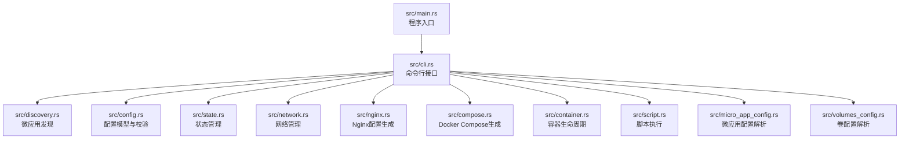

**图表来源**
- [src/main.rs:1-25](file://src/main.rs#L1-L25)
- [src/cli.rs:1-669](file://src/cli.rs#L1-L669)
- [src/lib.rs:1-26](file://src/lib.rs#L1-L26)

**章节来源**
- [src/lib.rs:1-26](file://src/lib.rs#L1-L26)
- [src/main.rs:1-25](file://src/main.rs#L1-L25)
- [src/cli.rs:1-669](file://src/cli.rs#L1-L669)

## 核心组件
- 命令行接口（CLI）
  - 解析命令与参数，初始化日志，协调各模块执行
  - 支持 start/stop/clean/status/network 等子命令
- 配置管理
  - 主配置 ProxyConfig：扫描目录、输出路径、网络名、端口、证书与域名等
  - 应用配置 AppConfig：名称、路由、容器名、端口、类型、Nginx 扩展配置、卷映射与运行用户
- 微应用发现与解析
  - discovery 模块：扫描目录，校验 micro-app.yml 与 Dockerfile，生成 MicroApp 结构
  - micro_app_config 模块：解析单个微应用的 micro-app.yml
  - volumes_config 模块：解析 micro-app.volumes.yml，支持卷权限与运行用户
- 状态管理
  - 基于目录哈希判断是否需要重新构建，减少不必要的镜像构建
- 网络管理
  - 统一 Docker 网络创建与删除，生成网络地址清单
- 容器生命周期
  - 通过 docker 命令进行容器的创建、启动、停止与删除
- Nginx 配置生成
  - 根据应用类型与路由生成 location 与 server 块，支持 HTTPS 与 ACME 验证
- Docker Compose 生成
  - 生成服务定义、网络、端口映射、卷挂载与健康检查
- 脚本支持
  - 支持预构建（setup.sh）与清理（clean.sh）脚本执行

**章节来源**
- [src/cli.rs:1-669](file://src/cli.rs#L1-L669)
- [src/config.rs:1-842](file://src/config.rs#L1-L842)
- [src/discovery.rs:1-721](file://src/discovery.rs#L1-L721)
- [src/micro_app_config.rs:1-235](file://src/micro_app_config.rs#L1-L235)
- [src/volumes_config.rs:1-426](file://src/volumes_config.rs#L1-L426)
- [src/state.rs:1-311](file://src/state.rs#L1-L311)
- [src/network.rs:1-397](file://src/network.rs#L1-L397)
- [src/container.rs:1-257](file://src/container.rs#L1-L257)
- [src/nginx.rs:1-1101](file://src/nginx.rs#L1-L1101)
- [src/compose.rs:1-905](file://src/compose.rs#L1-L905)
- [src/script.rs:1-155](file://src/script.rs#L1-L155)

## 架构总览
micro_proxy 的整体流程围绕“发现 → 校验 → 构建 → 生成配置 → 启动容器”的主线展开。CLI 作为编排中心，调用各模块完成任务；状态管理与网络管理贯穿始终，保证增量构建与网络连通性。

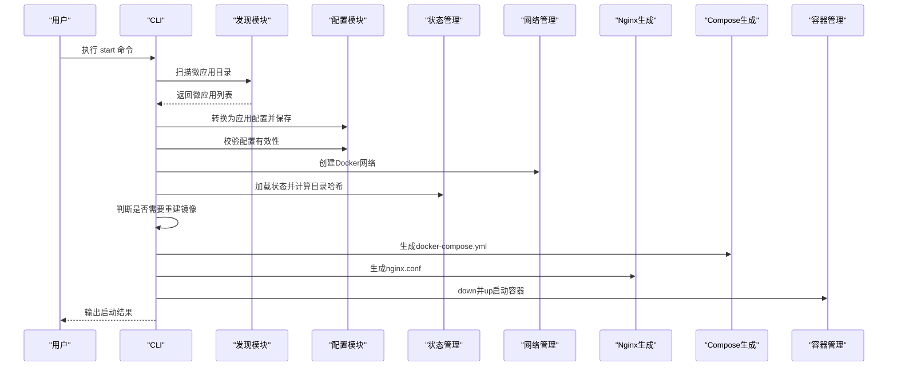

**图表来源**
- [src/cli.rs:296-463](file://src/cli.rs#L296-L463)
- [src/discovery.rs:224-352](file://src/discovery.rs#L224-L352)
- [src/config.rs:220-367](file://src/config.rs#L220-L367)
- [src/state.rs:58-186](file://src/state.rs#L58-L186)
- [src/network.rs:8-86](file://src/network.rs#L8-L86)
- [src/compose.rs:31-119](file://src/compose.rs#L31-L119)
- [src/nginx.rs:26-92](file://src/nginx.rs#L26-L92)
- [src/container.rs:145-176](file://src/container.rs#L145-L176)

## 详细组件分析

### 命令行接口（CLI）
- 负责解析参数、初始化日志、加载配置并执行子命令
- 支持 verbose 日志、配置文件路径指定
- 子命令：start（支持强制重建）、stop、clean（支持清理网络）、status、network（输出网络地址清单）

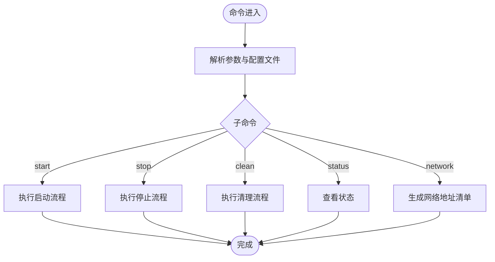

**图表来源**
- [src/cli.rs:71-116](file://src/cli.rs#L71-L116)
- [src/cli.rs:296-463](file://src/cli.rs#L296-L463)
- [src/cli.rs:465-548](file://src/cli.rs#L465-L548)
- [src/cli.rs:550-636](file://src/cli.rs#L550-L636)

**章节来源**
- [src/cli.rs:1-669](file://src/cli.rs#L1-L669)

### 配置管理（ProxyConfig 与 AppConfig）
- ProxyConfig：主配置，包含扫描目录、输出路径、网络名、端口、证书与域名等
- AppConfig：动态生成的应用配置，包含名称、路由、容器名、端口、类型、Nginx 扩展配置、卷映射与运行用户
- 校验规则：扫描目录不能为空；应用名全局唯一；Static/API 类型必须配置 routes；Internal 类型不允许配置 routes；路径存在且包含 Dockerfile

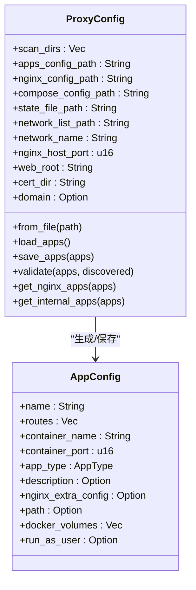

**图表来源**
- [src/config.rs:125-367](file://src/config.rs#L125-L367)

**章节来源**
- [src/config.rs:1-842](file://src/config.rs#L1-L842)

### 微应用发现与解析（discovery 与 micro_app_config）
- discovery：扫描 scan_dirs，校验 micro-app.yml 与 Dockerfile，生成 MicroApp 结构；校验应用名与容器名唯一性；支持卷配置加载与验证
- micro_app_config：解析单个微应用的 micro-app.yml，校验 container_name、container_port、app_type 与 routes

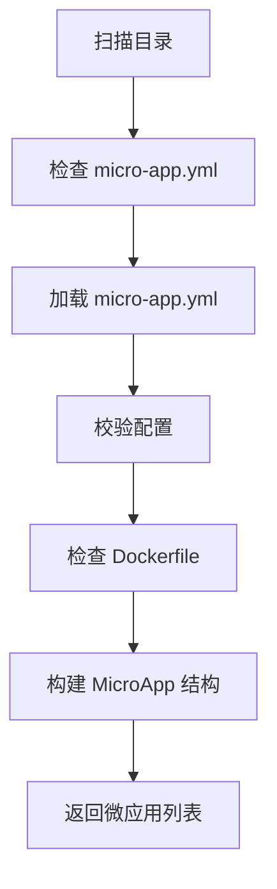

**图表来源**
- [src/discovery.rs:224-352](file://src/discovery.rs#L224-L352)
- [src/micro_app_config.rs:35-107](file://src/micro_app_config.rs#L35-L107)

**章节来源**
- [src/discovery.rs:1-721](file://src/discovery.rs#L1-L721)
- [src/micro_app_config.rs:1-235](file://src/micro_app_config.rs#L1-L235)

### 状态管理（State & Directory Hash）
- 基于目录哈希判断是否需要重建镜像，提升效率
- 状态文件保存应用名、目录哈希、最后构建时间与镜像存在状态

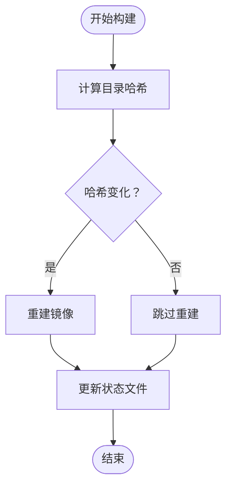

**图表来源**
- [src/state.rs:188-233](file://src/state.rs#L188-L233)
- [src/state.rs:154-177](file://src/state.rs#L154-L177)

**章节来源**
- [src/state.rs:1-311](file://src/state.rs#L1-L311)

### 网络管理（Docker Network 与地址清单）
- 创建/删除 Docker 网络，确保应用间通信
- 生成网络地址清单，包含访问地址与微应用间通信示例

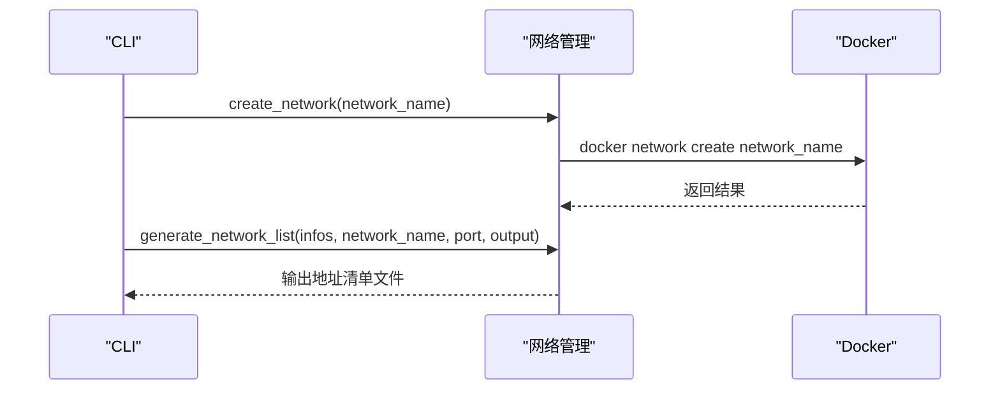

**图表来源**
- [src/network.rs:8-86](file://src/network.rs#L8-L86)
- [src/network.rs:209-274](file://src/network.rs#L209-L274)

**章节来源**
- [src/network.rs:1-397](file://src/network.rs#L1-L397)

### 容器生命周期（Docker）
- 通过 docker 命令进行容器的创建、启动、停止与删除
- 查询容器状态与运行状态

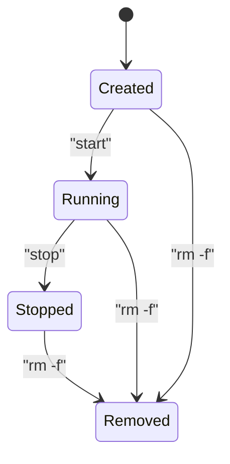

**图表来源**
- [src/container.rs:8-176](file://src/container.rs#L8-L176)

**章节来源**
- [src/container.rs:1-257](file://src/container.rs#L1-L257)

### Nginx 配置生成
- 根据应用类型与路由生成 location 与 server 块
- 支持 HTTP/HTTPS、ACME 验证、动态 DNS 解析与上游变量
- 位置匹配按路径长度降序排序，确保具体路径优先

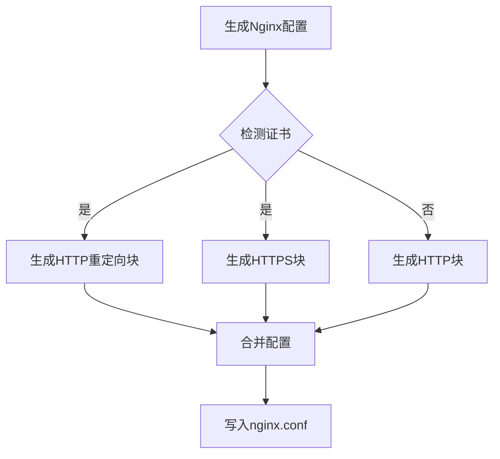

**图表来源**
- [src/nginx.rs:26-92](file://src/nginx.rs#L26-L92)
- [src/nginx.rs:272-416](file://src/nginx.rs#L272-L416)

**章节来源**
- [src/nginx.rs:1-1101](file://src/nginx.rs#L1-L1101)

### Docker Compose 生成
- 生成 services、networks、端口映射、卷挂载与健康检查
- nginx 仅依赖非 Internal 类型的应用
- 支持 HTTPS 端口映射与外部网络配置

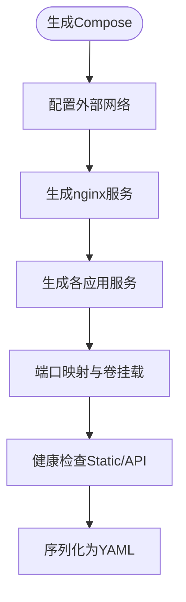

**图表来源**
- [src/compose.rs:31-119](file://src/compose.rs#L31-L119)
- [src/compose.rs:160-266](file://src/compose.rs#L160-L266)
- [src/compose.rs:268-424](file://src/compose.rs#L268-L424)

**章节来源**
- [src/compose.rs:1-905](file://src/compose.rs#L1-L905)

### 脚本支持（setup.sh / clean.sh）
- 执行预构建与清理脚本，支持 bash 执行与输出捕获

**章节来源**
- [src/script.rs:1-155](file://src/script.rs#L1-L155)

## 依赖关系分析
- 语言与生态
  - Rust 语言，使用 tokio 异步运行时、clap 命令行解析、serde/serde_yaml 序列化、log/dumbo_log 日志、walkdir 目录遍历、sha2 哈希等
  - Docker 生态：docker/docker-compose 命令调用
  - Nginx：配置生成与运行

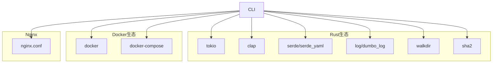

**图表来源**
- [Cargo.toml:13-55](file://Cargo.toml#L13-L55)

**章节来源**
- [Cargo.toml:1-55](file://Cargo.toml#L1-L55)

## 性能考虑
- 增量构建：通过目录哈希与状态文件避免重复构建，显著缩短开发周期
- 端口映射与容器内部监听：容器内部固定监听端口（HTTP 80/HTTPS 443），由 Compose 控制宿主机映射，简化配置与排查
- 动态 DNS 解析：使用 Docker 内部 DNS 解析器，支持服务发现与容错
- 健康检查：Static 与 API 类型应用自动添加健康检查，提升容器稳定性

[本节为通用指导，无需特定文件引用]

## 故障排查指南
- 日志与状态
  - 使用 -v 参数开启详细日志，查看启动/停止/清理过程
  - 使用 status 查看容器状态与镜像存在性
- 端口冲突
  - 检查宿主机端口占用，修改 nginx_host_port
- 网络连通性
  - 使用 network 命令生成网络地址清单，核对访问地址与内部通信示例
- 证书与 HTTPS
  - 确认证书与密钥文件存在，检查 Nginx 配置与日志
- 卷与权限
  - 检查宿主机路径与容器挂载点，必要时生成权限初始化脚本

**章节来源**
- [README.md:328-420](file://README.md#L328-L420)
- [src/cli.rs:550-584](file://src/cli.rs#L550-L584)
- [src/network.rs:209-274](file://src/network.rs#L209-L274)
- [src/nginx.rs:94-131](file://src/nginx.rs#L94-L131)

## 结论
micro_proxy 以“约定优于配置”为核心，结合 Rust 的高性能与安全性，提供从微应用发现到统一入口代理的全链路自动化能力。通过状态管理与 Compose 编排，项目在开发效率与运维稳定性之间取得平衡，适合中小型团队与个人开发者快速搭建微服务环境。

[本节为总结性内容，无需特定文件引用]

## 附录
- 技术栈概览
  - Rust（语言与运行时）
  - Docker（容器与编排）
  - Nginx（反向代理）
  - YAML（配置序列化）
- 术语说明
  - Static：静态站点，通过 Nginx 对外提供服务
  - API：后端接口服务，通过 Nginx 反向代理
  - Internal：内部服务（如数据库），仅用于微服务间通信
  - apps-config.yml：动态生成的应用配置文件
  - proxy-config.state：状态文件，记录目录哈希与构建状态

**章节来源**
- [README.md:443-460](file://README.md#L443-L460)