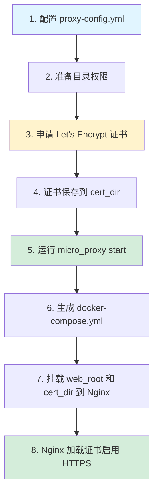

# SSL 证书配置完整指南

> **版本**: 1.0  
> **最后更新**: 2024

本文档提供 micro_proxy 工具的 SSL/TLS 证书配置的详细说明，包括配置原理、工作流程、常见问题解答和最佳实践。

---

## 目录

1. [概述](#概述)
2. [三个核心配置项详解](#三个核心配置项详解)
3. [工作流程](#工作流程)
4. [常见问题解答 (FAQ)](#常见问题解答-faq)
5. [配置示例](#配置示例)
6. [故障排查](#故障排查)
7. [安全最佳实践](#安全最佳实践)

---

## 概述

micro_proxy 支持使用 Let's Encrypt 免费证书为你的应用启用 HTTPS。通过 ACME (Automated Certificate Management Environment) 协议，可以实现证书的自动申请和续期。

### 为什么需要 SSL 证书？

- 🔒 **数据安全**：加密传输，防止中间人攻击
- ✅ **身份认证**：证明你的服务器身份
- 🔍 **SEO 优化**：搜索引擎优先索引 HTTPS 站点
- 🛡️ **浏览器信任**：现代浏览器对非 HTTPS 站点有安全警告

### Let's Encrypt 简介

Let's Encrypt 是一个免费的、开放的、自动化的证书颁发机构 (CA)，由 ISRG (Internet Security Research Group) 运营。

- ✅ 完全免费
- ✅ 自动化操作
- ✅ 广泛信任（被所有主流浏览器认可）
- ⏱️ 证书有效期 90 天（支持自动续期）

---

## 三个核心配置项详解

micro_proxy 的 SSL 配置涉及三个核心配置项：`web_root`、`cert_dir` 和 `domain`。理解它们的作用是正确配置 SSL 的关键。

### 1. web_root（Web 根目录）

#### 作用

`web_root` 主要用于 **ACME HTTP-01 挑战验证**。当 Let's Encrypt 验证你对域名的控制权时，会通过 HTTP 协议访问：

```
http://your-domain.com/.well-known/acme-challenge/<随机字符串>
```

micro_proxy 会在 Nginx 配置中添加以下 location 来处理此类请求：

```nginx
location /.well-known/acme-challenge/ {
    root /var/www/html;  # 即 web_root
    default_type "text/plain";
}
```

#### 为什么配置 web_root？

**Q1: web_root 会和我的应用文件冲突吗？**

**A: 不会。** 原因如下：

1. **精确路径匹配**：ACME 验证 location 只匹配 `/.well-known/acme-challenge/` 开头的路径
2. **路径隔离**：你的应用通常使用 `/`, `/api`, `/app` 等路径，与 ACME 验证路径完全不同
3. **互不干扰**：Nginx 会优先匹配最具体的 location，所以 `/.well-known/acme-challenge/*` 的请求永远只会走到 ACME 验证 location

**Q2: web_root 是为了映射 `/.well-known/acme-challenge/` 吗？**

**A: 是的，这就是它的主要用途。** 但它不仅仅是为了这一目的：

- 它是 ACME 验证文件在宿主机上的存储位置
- 它会挂载到 Nginx 容器中，使容器内也能访问这些文件
- 它是 acme.sh 创建验证文件的目录

#### Docker Volume 挂载

在生成的 `docker-compose.yml` 中，web_root 会被挂载到 Nginx 容器：

```yaml
volumes:
  - /var/www/html:/var/www/html:ro  # 宿主机 -> 容器（相同路径）
```

这样设计的好处：
- acme.sh 在宿主机创建的验证文件，Nginx 容器可以直接读取
- 使用相同路径，配置简单直观

### 2. cert_dir（证书目录）

#### 作用

`cert_dir` 是 SSL 证书和私钥文件在宿主机上的存储目录。acme.sh 会将申请的证书保存到该目录。

#### 为什么要配置 cert_dir？

**A: 主要目的是确保证书的持久化和可用性。**

具体原因：

1. **容器隔离**：Nginx 运行在 Docker 容器中，与宿主机文件系统隔离
2. **证书持久化**：证书保存在宿主机，不会因为容器重建而丢失
3. **易于备份**：只需备份 `cert_dir` 目录即可保存所有证书
4. **自动续期友好**：acme.sh 直接更新宿主机的证书文件，Nginx 重载后立即生效

#### 证书文件命名规则

```
cert_dir/
├── {domain}.cer    # 证书文件（或 .crt）
└── {domain}.key    # 私钥文件
```

例如，如果 `domain: "example.com"`，则：
```
/etc/nginx/certs/
├── example.com.cer
└── example.com.key
```

#### Docker Volume 挂载

```yaml
volumes:
  - /etc/nginx/certs:/etc/nginx/certs:ro  # 只读挂载，保护私钥
```

#### Nginx 配置引用

生成的 `nginx.conf` 中会包含：

```nginx
ssl_certificate /etc/nginx/certs/example.com.cer;
ssl_certificate_key /etc/nginx/certs/example.com.key;
```

### 3. domain（域名）

#### 作用

`domain` 配置有两个主要作用：

1. **推导证书文件路径**
   - 证书：`{cert_dir}/{domain}.cer` 或 `{cert_dir}/{domain}.crt`
   - 私钥：`{cert_dir}/{domain}.key`

2. **Nginx server_name 配置**
   ```nginx
   server_name example.com;  # 根据 domain 配置
   ```

#### Q3: domain 只是为了推导出 SSL 相关文件，对吧？

**A: 是的，但不止于此。** 具体来说：

1. ✅ 推导证书文件路径（主要作用）
2. ✅ 设置 Nginx 的 `server_name`（流量匹配）
3. ✅ 作为 HTTPS 功能的开关（配置了 domain 且证书存在时启用 HTTPS）
4. ✅ HTTP 自动跳转到 HTTPS（开启 HTTPS 后的行为）

#### domain 的多域名支持

目前 micro_proxy 的基础版本只支持单个 domain。如果需要支持多域名（如 `example.com` 和 `www.example.com`），需要：

1. 在申请证书时使用 `-d` 参数指定多个域名
2. 证书文件命名以第一个域名为准
3. Nginx 的 `server_name` 可以手动添加多个域名（通过 `nginx_extra_config`）

---

## 工作流程

### SSL 证书申请完整流程



### 步骤详解

#### 步骤 1: 配置 proxy-config.yml

```yaml
web_root: "/var/www/html"
cert_dir: "/etc/nginx/certs"
domain: "your-domain.com"
```

#### 步骤 2: 准备目录

```bash
# 创建目录
sudo mkdir -p /var/www/html
sudo mkdir -p /etc/nginx/certs

# 设置正确的权限
sudo chown -R $USER:$USER /var/www/html
sudo chown -R $USER:$USER /etc/nginx/certs
```

#### 步骤 3: 申请证书

```bash
# 使用 acme.sh 申请证书
acme.sh --issue -d your-domain.com --webroot /var/www/html

# 或者使用完整路径模式（推荐）
acme.sh --issue -d your-domain.com --webroot /var/www/html --force
```

#### 步骤 4: 部署证书

```bash
acme.sh --install-cert -d your-domain.com \
  --key-file /etc/nginx/certs/your-domain.com.key \
  --fullchain-file /etc/nginx/certs/your-domain.com.cer \
  --reloadcmd "docker exec proxy-nginx nginx -s reload"
```

#### 步骤 5: 启动服务

```bash
micro_proxy start
```

#### 验证结果

```bash
# 检查证书文件
ls -la /etc/nginx/certs/

# 验证 Nginx 配置
docker exec proxy-nginx nginx -t

# 测试 HTTPS 连接
curl -k https://your-domain.com
```

---

## 常见问题解答 (FAQ)

### 基础问题

#### Q: 如果不配置 SSL，会发生什么？

**A:** 如果你不配置 `web_root`、`cert_dir` 和 `domain`，或者证书文件不存在，micro_proxy 会：
- 只启用 HTTP（端口 80）
- 生成不包含 SSL 配置的 Nginx 配置
- 应用正常通过 HTTP 访问

**SSL 配置是完全可选的！**

#### Q: web_root 和 cert_dir 可以使用相对路径吗？

**A:** 理论上可以，但 **强烈建议使用绝对路径**：

```yaml
# ❌ 不推荐（可能因工作目录变化导致问题）
web_root: "./html"
cert_dir: "./certs"

# ✅ 推荐
web_root: "/var/www/html"
cert_dir: "/etc/nginx/certs"
```

原因：
- Nginx 容器需要从绝对路径挂载
- 避免工作目录变化导致的意外行为
- 更符合 Linux 系统规范

### 权限问题

#### Q: 遇到 "Permission denied" 错误怎么办？

**A:** 这通常是因为当前用户对 `web_root` 或 `cert_dir` 没有写权限。解决方法：

```bash
# 方案 1: 修改目录所有者（推荐）
sudo chown -R $USER:$USER /var/www/html
sudo chown -R $USER:$USER /etc/nginx/certs

# 方案 2: 使用 sudo 运行 acme.sh（不推荐）
sudo acme.sh --issue ...

# 方案 3: 修改目录权限
sudo chmod -R 755 /var/www/html
sudo chmod -R 755 /etc/nginx/certs
```

#### Q: acme.sh 在部署证书时报错怎么办？

**A:** 常见原因是 `cert_dir` 的权限问题。确保：

```bash
# 1. 目录存在
ls -ld /etc/nginx/certs

# 2. 当前用户有写权限
touch /etc/nginx/certs/test && rm /etc/nginx/certs/test

# 3. 如果以上都不行，修改所有者
sudo chown $USER:$USER /etc/nginx/certs
```

### 网络问题

#### Q: 为什么 Let's Encrypt 验证失败？

**A:** 可能的原因：

1. **80 端口未开放**
   ```bash
   # 检查防火墙
   sudo ufw status
   # 如果是 Ubuntu，开放 80 端口
   sudo ufw allow 80/tcp
   ```

2. **域名未解析到服务器**
   ```bash
   # 验证 DNS 解析
   dig your-domain.com
   nslookup your-domain.com
   ```

3. **Nginx 未正常运行**
   ```bash
   # 检查容器状态
   docker ps | grep proxy-nginx
   ```

4. **ACME 验证路径不可访问**
   ```bash
   # 测试 ACME 路径
   curl http://your-domain.com/.well-known/acme-challenge/
   ```

### 证书问题

#### Q: 证书过期了怎么办？

**A:** acme.sh 会自动续期（默认每天检查，到期前 30 天自动续期）。你也可以手动续期：

```bash
# 手动续期
acme.sh --renew -d your-domain.com --force

# 查看证书信息
acme.sh --info -d your-domain.com
```

#### Q: 证书文件命名不对怎么办？

**A:** micro_proxy 期望的证书命名：
- 证书：`{domain}.cer` 或 `{domain}.crt`
- 私钥：`{domain}.key`

如果使用了不同的命名，可以：
1. 创建符号链接
2. 手动修改证书文件名称

```bash
# 创建符号链接（推荐，不破坏原文件）
ln -s /etc/nginx/certs/my-cert.pem /etc/nginx/certs/domain.com.crt
ln -s /etc/nginx/certs/my-key.pem /etc/nginx/certs/domain.com.key
```

### Docker 问题

#### Q: Nginx 容器无法访问 web_root 目录？

**A:** 可能的原因：

1. **路径不一致**：确保宿主机路径和挂载路径一致
2. **SELinux 限制**（某些 Linux 发行版）
   ```bash
   # 临时禁用 SELinux 测试
   setenforce 0
   
   # 永久修复：给挂载添加 :z 或 :Z 后缀
   volumes:
     - /var/www/html:/var/www/html:ro:z
   ```

3. **AppArmor 限制**：检查 AppArmor 配置

#### Q: 如何验证卷挂载是否正常？

**A:** 

```bash
# 进入 Nginx 容器
docker exec -it proxy-nginx sh

# 检查目录内容
ls -la /var/www/html
ls -la /etc/nginx/certs

# 检查挂载信息
mount | grep /var/www/html
mount | grep /etc/nginx/certs
```

---

## 配置示例

### 最小配置（仅 HTTP）

```yaml
scan_dirs:
  - "./micro-apps"

nginx_config_path: "./nginx.conf"
compose_config_path: "./docker-compose.yml"
nginx_host_port: 80

# 不配置 SSL 相关字段
apps:
  - name: "my-app"
    routes: ["/"]
    container_name: "my-app"
    container_port: 80
    app_type: "static"
```

### 标准 HTTPS 配置

```yaml
scan_dirs:
  - "./micro-apps"

nginx_config_path: "./nginx.conf"
compose_config_path: "./docker-compose.yml"
nginx_host_port: 443  # HTTPS 通常用 443

# SSL 配置
web_root: "/var/www/html"
cert_dir: "/etc/nginx/certs"
domain: "myapp.example.com"

apps:
  - name: "my-app"
    routes: ["/"]
    container_name: "my-app"
    container_port: 80
    app_type: "static"
```

### 完整生产环境配置

```yaml
scan_dirs:
  - "./micro-apps"
  - "./additional-services"

nginx_config_path: "./nginx.conf"
compose_config_path: "./docker-compose.yml"
state_file_path: "./proxy-config.state"
network_name: "production-network"
nginx_host_port: 443

# SSL 配置
web_root: "/var/www/html"
cert_dir: "/etc/nginx/certs"
domain: "www.myapp.com"

apps:
  # 主应用
  - name: "frontend"
    routes: ["/"]
    container_name: "frontend-app"
    container_port: 80
    app_type: "static"
    docker_volumes:
      - "./frontend-data:/app/data"

  # API 服务
  - name: "api"
    routes: ["/api"]
    container_name: "api-service"
    container_port: 3000
    app_type: "api"
    nginx_extra_config: |
      add_header 'Access-Control-Allow-Origin' '*';
    
  # Redis（内部服务）
  - name: "redis"
    routes: []
    container_name: "redis-cache"
    container_port: 6379
    app_type: "internal"
    path: "./services/redis"
    docker_volumes:
      - "./redis-data:/data"
```

---

## 故障排查

### 诊断步骤

```bash
# 1. 检查证书文件是否存在
ls -la /etc/nginx/certs/

# 2. 检查 Nginx 配置语法
docker exec proxy-nginx nginx -t

# 3. 查看 Nginx 错误日志
docker logs proxy-nginx

# 4. 检查 SSL 相关配置
docker exec proxy-nginx cat /etc/nginx/nginx.conf | grep -A 5 ssl

# 5. 测试 HTTPS 连接
curl -v https://your-domain.com

# 6. 检查证书有效性
echo | openssl s_client -connect your-domain.com:443 2>/dev/null | openssl x509 -noout -dates
```

### 常见错误及解决方案

#### 错误 1: 证书文件不存在

```
错误信息：No such file or directory
```

**解决方案：**
```bash
# 确保证书已申请并部署
acme.sh --list
acme.sh --install-cert -d your-domain.com \
  --key-file /etc/nginx/certs/your-domain.com.key \
  --fullchain-file /etc/nginx/certs/your-domain.com.cer
```

#### 错误 2: SSL_CTX_use_certificate 失败

```
错误信息：SSL_CTX_use_certificate() failed
```

**解决方案：**
```bash
# 检查证书文件格式是否正确
openssl x509 -in /etc/nginx/certs/domain.com.cer -text -noout

# 检查密钥文件格式
openssl rsa -in /etc/nginx/certs/domain.com.key -check
```

#### 错误 3: 502 Bad Gateway

```
错误信息：502 Bad Gateway
```

**解决方案：**
```bash
# 这不是 SSL 问题，而是应用本身的问题
# 1. 检查应用容器是否运行
docker ps | grep your-app

# 2. 查看应用日志
docker logs your-app

# 3. 检查网络连通性
docker exec proxy-nginx ping your-app
```

#### 错误 4: 证书链不完整

```
错误信息：unable to get local issuer certificate
```

**解决方案：**
```bash
# 使用 fullchain 而不是单独的 cert
acme.sh --install-cert -d your-domain.com \
  --key-file /etc/nginx/certs/domain.com.key \
  --fullchain-file /etc/nginx/certs/domain.com.cer

# 确保 nginx.conf 使用的是 fullchain 文件
ssl_certificate /etc/nginx/certs/domain.com.cer;  # 不是 cer + ca
```

### 日志分析技巧

```bash
# 实时监控 Nginx 错误日志
docker logs -f proxy-nginx 2>&1 | grep -i ssl

# 搜索特定错误
docker logs proxy-nginx | grep -E "(error|warn)" | tail -50

# 查看访问日志中的 HTTPS 请求
docker exec proxy-nginx cat /var/log/nginx/access.log | grep ":443"
```

---

## 安全最佳实践

### 1. 私钥保护

- 使用只读挂载 (`:ro`) 保护私钥文件
- 限制 `cert_dir` 的访问权限（建议 600 或 644）
- 不要将证书文件提交到代码仓库

### 2. Nginx SSL 配置优化

micro_proxy 生成的 HTTPS 配置已经包含了基本的安全设置：

```nginx
ssl_protocols TLSv1.2 TLSv1.3;
ssl_ciphers HIGH:!aNULL:!MD5;
ssl_prefer_server_ciphers on;
ssl_session_cache shared:SSL:10m;
ssl_session_timeout 10m;
```

### 3. HTTP 到 HTTPS 重定向

启用 HTTPS 后，HTTP 请求会自动重定向到 HTTPS：

```nginx
location / {
    return 301 https://$host$request_uri;
}
```

### 4. 定期续期监控

```bash
# 设置监控任务（添加到 crontab）
0 0 * * * acme.sh --renew -d your-domain.com --force >/dev/null 2>&1

# 或使用 acme.sh 内置的监控
acme.sh --cron --home ~/.acme.sh
```

### 5. 证书透明度监控

可以考虑使用以下工具监控证书变更：

- [crt.sh](https://crt.sh/) - 查询证书透明度日志
- [CertSpotter](https://sslmate.com/certspotter/) - 证书监控服务

---

## 附录

### A. 相关文档

- [ACME.sh 安装指南](acme-installation.md)
- [证书申请指南](certificate-application.md)
- [微应用开发专题](micro-app-development.md)

### B. 参考资源

- [Let's Encrypt 官方文档](https://letsencrypt.org/docs/)
- [ACME 协议规范 RFC 8555](https://tools.ietf.org/html/rfc8555)
- [Nginx SSL 配置最佳实践](https://www.ssllabs.com/projects/ssllabs-server-test/)
- [Mozilla SSL 配置生成器](https://ssl-config.mozilla.org/)

### C. 术语表

| 术语 | 含义 |
|------|------|
| ACME | Automated Certificate Management Environment |
| CA | Certificate Authority（证书颁发机构） |
| HTTP-01 Challenge | Let's Encrypt 的一种域名验证方式 |
| TLS | Transport Layer Security（传输层安全协议） |
| SSL | Secure Sockets Layer（旧版 TLS） |

---

*本文档由 micro_proxy 团队编写和维护，如有问题请提交 Issue 或 PR。*
